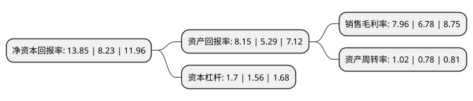

> 本页面由自动化程序生成于 2022年5月20日 01:32
> 内容可能存在错误，如有bug请提交issue至：https://github.com/Eroleice/doc-pi/issues
{.is-warning}

# 上市公司基本情况

## 基本资料

神驰机电股份有限公司（以下简称“神驰机电”）成立于1993年04月07日，重庆市。于2019年12月31日在上交所主板上市。

神驰机电注册资本14,970.11万元，小型发电机，通用汽油机及其终端类产品的研发，制造和销售以下是详细信息：

- 公司名称: 神驰机电股份有限公司
- 股票代码: 603109.SH
- 所在地: 重庆 - 重庆市
- 成立日期: 1993年04月07日
- 注册资本: 14,970.11万元
- 法定代表人: 艾纯
- 主营业务: 小型发电机，通用汽油机及其终端类产品的研发，制造和销售
- 公司官网: www.senci.cn
- 公司介绍: 公司依托小型电机、通用汽油机等核心零部件的研发、制造优势，向通用动力机械行业终端应用领域延伸，形成了从零部件到终端产品的完整产业链。公司起步于小型发电机业务，经过20余年的积累，产销规模多年位居行业前列，主要客户包括本田、雅马哈、意大利Pramac、隆鑫通用、润通动力、力帆股份、泰豪科技等国内外知名通机生产厂商。下游厂商采购本公司生产的小型发电机主要用于组装通用汽油发电机组。小型发电机是通用汽油发电机组最为核心的零部件之一，在通用汽油发电机组成本构成中约占30%的比重。公司目前具备年产120万台小型发电机的生产能力，所生产的小型发电机中，约15%用于本公司通用汽油发电机组整机配套，其余用于对外销售。经过多年的持续投入，公司在通用汽油机产品研发、设计和生产能力方面得到显著提升，掌握了一系列核心技术与工艺，如热管理技术、排放控制技术、噪音控制技术、振动控制技术等。截至2018年末，公司已取得通用汽油机及终端类产品相关专利100余项，相关产品通过欧美主要尾气排放认证，如欧V、EPA、CARB等认证。主要动力产品的功率、温升、缸头温度、机油温度等综合指标达到同行业先进水平。

## 股东及高管情况

上市公司第一大股东为艾纯，持股52,500,000股，占比35.07%，为上市公司实际控制人。

截至2022年03月31日，上市公司的前十大股东中，共有2名自然人股东，4名机构股东，4个产品账户，其中5%以上大股东共有4名。上市公司前十大股东明细如下：

> 截至2022年03月31日，上市公司前十大股东信息如下：

| 股东名称 | 持股数量（股） | 持股比例 |
| --- | --- | --- |
| 艾纯 | 52,500,000 | 35.07% |
| 重庆神驰投资有限公司 | 20,000,000 | 13.36% |
| 重庆神驰实业集团有限公司 | 19,444,400 | 12.99% |
| 艾利 | 8,055,600 | 5.38% |
| 中国工商银行股份有限公司-交银施罗德趋势优先混合型证券投资基金 | 5,857,019 | 3.91% |
| 四川和邦投资集团有限公司 | 5,000,000 | 3.34% |
| 中国建设银行股份有限公司-宝盈新兴产业灵活配置混合型证券投资基金 | 1,849,377 | 1.24% |
| 海创(上海)私募基金管理有限公司-海创价值成长精选壹号私募证券投资基金 | 1,676,000 | 1.12% |
| 重庆曜业投资合伙企业(有限合伙) | 1,560,000 | 1.04% |
| 中国工商银行股份有限公司-宝盈优势产业灵活配置混合型证券投资基金 | 1,517,800 | 1.01% |

## 利润表分析

上市公司2021年总收入为24.37亿元，净利润为1.94亿元，实现盈利。

## 杜邦分析

> 数据列示周期：2021年 | 2020年 | 2019年
{.is-info}

上市公司的净资产收益率在近一年有所上升，上升幅度为68.29%，其变化情况分解如下：
- 上市公司的销售毛利率在近一年上升了17.4%，可能是生产效率的提升、商品原材料价格下跌或商品价格的上涨所致。
- 上市公司的资产周转率在近一年上升了30.77%，可能是源自于更快的销售回款或库存管理效果提升。
- 上市公司的财务杠杆比率在近一年上升了8.97%，可能是增加负债扩大生产规模。

