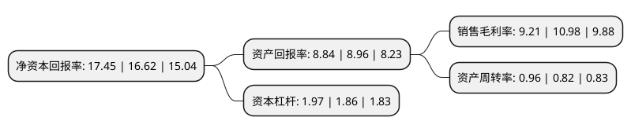

> 本页面由自动化程序生成于 2022年5月20日 01:33
> 内容可能存在错误，如有bug请提交issue至：https://github.com/Eroleice/doc-pi/issues
{.is-warning}

# 上市公司基本情况

## 基本资料

重庆望变电气(集团)股份有限公司（以下简称“望变电气”）成立于1994年08月16日，重庆市。于2022年04月28日在上交所主板上市。

望变电气注册资本24,987.556万元，主要产品分为输配电及控制设备和取向硅钢两大类。主营业务为输配电及控制设备和取向硅钢的研发，生产与销售。以下是详细信息：

- 公司名称: 重庆望变电气(集团)股份有限公司
- 股票代码: 603191.SH
- 所在地: 重庆 - 重庆市
- 成立日期: 1994年08月16日
- 注册资本: 24,987.556万元
- 法定代表人: 杨泽民
- 主营业务: 主要产品分为输配电及控制设备和取向硅钢两大类主营业务为输配电及控制设备和取向硅钢的研发，生产与销售
- 公司官网: www.cqwjbyq.com
- 公司介绍: 公司秉承“铸望变品牌，创行业先锋，做百年企业”愿景，深耕输配电及控制设备行业近三十年。通过长期生产实践和技术创新，公司掌握了输配电及控制设备领域关键生产工艺及多项核心技术，建立了完整的销售体系和销售网络，在行业内积累了广泛的客户基础。公司输配电及控制设备业务逐步建立了以重庆、四川、贵州、云南等西南地区为核心，华中地区(湖北、湖南、河南、江西)、华南地区(福建、广东、广西、海南)等快速增长区域相结合的销售区域布局，与国家电网、南方电网旗下多省市电力公司建立长期稳定的合作关系。公司取向硅钢产品被中国金属学会评审认为性能国内领先，在国内享有良好知名度。公司取向硅钢在满足自用基础上，主要销往四川、湖南、湖北、安徽、江苏、上海、山东、广东、广西、海南等境内省市，并积极开拓新加坡、印度、马来西亚、土耳其等境外市场。

## 股东及高管情况

上市公司第一大股东为杨泽民，持股52,618,391股，占比15.7934%，**疑似为**上市公司实际控制人。

截至2022年04月28日，上市公司的前十大股东中，共有5名自然人股东，4名机构股东，1个产品账户，其中5%以上大股东共有5名。上市公司前十大股东明细如下：

> 未能通过持股比例判定出上市公司实际控制人（持股30%以上）
> 可能存在通过间接持股、联合持股、协议控制等方式拥有实际控制权的主体，具体请参考上市公司定期公告！
{.is-warning}

> 截至2022年04月28日，上市公司前十大股东信息如下：

| 股东名称 | 持股数量（股） | 持股比例 |
| --- | --- | --- |
| 杨泽民 | 52,618,391 | 15.7934% |
| 秦惠兰 | 40,172,100 | 12.0576% |
| 天津普思资产管理有限公司-平潭普思广和一号股权投资合伙企业(有限合伙) | 22,222,222 | 6.67% |
| 杨耀 | 18,000,050 | 5.4027% |
| 杨秦 | 18,000,000 | 5.4027% |
| 扬州尚颀并购成长产业基金合伙企业(有限合伙) | 8,333,333 | 2.5012% |
| 杨厚群 | 7,500,000 | 2.2511% |
| 重庆长寿经济技术开发区开发投资集团有限公司 | 5,555,556 | 1.6675% |
| 长兴浦京湾股权投资合伙企业(有限合伙) | 5,555,556 | 1.6675% |
| 上海灏意投资管理咨询合伙企业(有限合伙) | 5,555,556 | 1.6675% |

## 利润表分析

上市公司2020年总收入为12.96亿元，净利润为1.42亿元，实现盈利。

## 杜邦分析

> 数据列示周期：2021年 | 2020年 | 2019年
{.is-info}

上市公司的净资产收益率在近一年有所上升，上升幅度为4.99%，其变化情况分解如下：
- 上市公司的销售毛利率在近一年下降了-16.12%，可能是生产效率的下降、商品原材料价格上涨或商品价格的下跌所致。
- 上市公司的资产周转率在近一年上升了17.07%，可能是源自于更快的销售回款或库存管理效果提升。
- 上市公司的财务杠杆比率在近一年上升了5.91%，可能是增加负债扩大生产规模。

