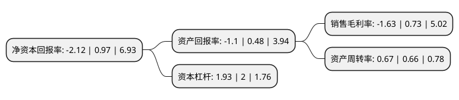

> 本页面由自动化程序生成于 2022年5月20日 01:33
> 内容可能存在错误，如有bug请提交issue至：https://github.com/Eroleice/doc-pi/issues
{.is-warning}

# 上市公司基本情况

## 基本资料

尚纬股份有限公司（以下简称“尚纬股份”）成立于2003年07月07日，乐山市。于2012年05月07日在上交所主板上市。

尚纬股份注册资本62,152.759万元，主营业务为专业从事特种电线电缆的研发，生产，销售，公司主导产品是氟聚合物绝缘防火电缆，本安防爆电缆，耐高温氟塑料电缆，耐热硅橡胶电缆，变频器专用电缆，船用电缆，水电站用特种电缆，低烟无卤阻燃电缆，绿色环保电缆，扁电缆，射频电缆，补偿电缆，特种橡套电缆，矿用电缆，核电站用1E级K3类电缆，太阳能光伏电缆，加热电缆，城市轨道交通电缆，预分支电缆，通信电缆，防火电缆等三十八个系列数千个种类的特种电线电缆。以下是详细信息：

- 公司名称: 尚纬股份有限公司
- 股票代码: 603333.SH
- 所在地: 四川 - 乐山市
- 成立日期: 2003年07月07日
- 注册资本: 62,152.759万元
- 法定代表人: 李广胜
- 主营业务: 主营业务为专业从事特种电线电缆的研发，生产，销售，公司主导产品是氟聚合物绝缘防火电缆，本安防爆电缆，耐高温氟塑料电缆，耐热硅橡胶电缆，变频器专用电缆，船用电缆，水电站用特种电缆，低烟无卤阻燃电缆，绿色环保电缆，扁电缆，射频电缆，补偿电缆，特种橡套电缆，矿用电缆，核电站用1E级K3类电缆，太阳能光伏电缆，加热电缆，城市轨道交通电缆，预分支电缆，通信电缆，防火电缆等三十八个系列数千个种类的特种电线电缆
- 公司官网: www.sunwayint.com
- 公司介绍: 公司是专业从事特种电线电缆的研发、生产、销售和服务于一体的高新技术企业。公司定位于为石油石化、发电、新能源、冶金等目标行业提供专业化、高品质的特种电缆产品。公司自主研发多项产品和工艺方法先后获得多项专利，多个研发产品被列为国家、省、市重点科技攻关项目，并多次获得省市级科技进步奖，其中核电站用1E级电缆被列入国家级火炬计划项目。公司是国家级高新技术企业、国家创新型试点企业、国家标准化良好行为AAAA级企业、全国企事业知识产权试点单位、四川省高新技术产业发展(成长类)示范企业等。

## 股东及高管情况

上市公司第一大股东为李广元，持股145,550,500股，占比23.42%，**疑似为**上市公司实际控制人。

截至2022年03月31日，上市公司的前十大股东中，共有4名自然人股东，2名机构股东，3个产品账户，1个海外主体，其中5%以上大股东共有3名。上市公司前十大股东明细如下：

> 未能通过持股比例判定出上市公司实际控制人（持股30%以上）
> 可能存在通过间接持股、联合持股、协议控制等方式拥有实际控制权的主体，具体请参考上市公司定期公告！
{.is-warning}

> 截至2022年03月31日，上市公司前十大股东信息如下：

| 股东名称 | 持股数量（股） | 持股比例 |
| --- | --- | --- |
| 李广元 | 145,550,500 | 23.42% |
| 李广胜 | 87,721,594 | 14.11% |
| 乐山高新投资发展(集团)有限公司 | 68,227,906 | 10.98% |
| 西藏瑞华资本管理有限公司 | 17,006,802 | 2.74% |
| 刘斯达 | 15,122,849 | 2.43% |
| 罗文利 | 12,225,602 | 1.97% |
| 尚纬股份有限公司-2021年员工持股计划 | 10,772,689 | 1.73% |
| UBS AG | 10,574,420 | 1.7% |
| 四川发展证券投资基金管理有限公司-四川资本市场纾困发展证券投资基金合伙企业(有限合伙) | 10,204,081 | 1.64% |
| 北京泰德圣投资有限公司-泰德圣投资泰来1号私募证券投资基金 | 8,503,401 | 1.37% |

## 利润表分析

上市公司2021年总收入为23.43亿元，净利润为-0.39亿元，**未实现盈利**。

## 杜邦分析

> 数据列示周期：2021年 | 2020年 | 2019年
{.is-info}

上市公司的净资产收益率在近一年有所下降，下降幅度为-318.56%，其变化情况分解如下：
- 上市公司的销售毛利率在近一年下降了-323.29%，可能是生产效率的下降、商品原材料价格上涨或商品价格的下跌所致。
- 上市公司的资产周转率在近一年上升了1.52%，可能是源自于更快的销售回款或库存管理效果提升。
- 上市公司的财务杠杆比率在近一年下降了-3.5%，可能是减少负债降低财务费用。

