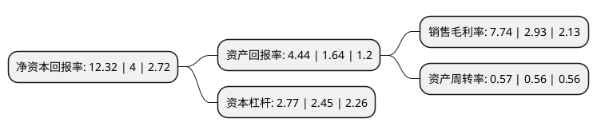

> 本页面由自动化程序生成于 2022年5月20日 01:34
> 内容可能存在错误，如有bug请提交issue至：https://github.com/Eroleice/doc-pi/issues
{.is-warning}

# 上市公司基本情况

## 基本资料

江苏振江新能源装备股份有限公司（以下简称“振江股份”）成立于2004年03月01日，无锡市。于2017年11月06日在上交所主板上市。

振江股份注册资本12,563.14万元，主营业务为风电设备和光伏设备零部件的设计，加工与销售，主要产品包括机舱罩，转子房等风电设备产品，以及固定/可调式光伏支架，追踪式光伏支架等光伏设备产品。以下是详细信息：

- 公司名称: 江苏振江新能源装备股份有限公司
- 股票代码: 603507.SH
- 所在地: 江苏 - 无锡市
- 成立日期: 2004年03月01日
- 注册资本: 12,563.14万元
- 法定代表人: 胡震
- 主营业务: 主营业务为风电设备和光伏设备零部件的设计，加工与销售，主要产品包括机舱罩，转子房等风电设备产品，以及固定/可调式光伏支架，追踪式光伏支架等光伏设备产品
- 公司官网: www.zjavim.com
- 公司介绍: 公司主营业务为风电设备和光伏设备零部件的设计、加工与销售，主要产品包括机舱罩、转子房等风电设备产品，以及固定/可调式光伏支架、追踪式光伏支架等光伏设备产品。公司是国内专业从事新能源发电设备钢结构件的领先企业，生产工序完整，覆盖风电和光伏设备钢结构件设计开发、焊接、机加工和表面处理等生产全过程。公司是经江苏省科学技术厅、江苏省财政局、江苏省国家税务局和江苏省地方税务局联合认定的高新技术企业，是经江苏省经济和信息化委员会认定的江苏省两化融合转型升级示范试点企业，并被评为江苏省科技型中小企业、江苏省民营科技企业。公司的技术中心被江苏省经济与信息化委员会等部门认定为江苏省企业技术中心。公司通过了ISO：2008质量管理体系认证、ISO14001：2004环境管理体系认证、GB/T28001：2001职业健康安全管理体系认证，并通过欧盟焊接质量管理体系EN1090和国际焊接质量管理体系ISO3834的认证。

## 股东及高管情况

上市公司第一大股东为胡震，持股32,277,042股，占比25.6919%，**疑似为**上市公司实际控制人。

截至2022年04月14日，上市公司的前十大股东中，共有4名自然人股东，3名机构股东，3个产品账户，其中5%以上大股东共有4名。上市公司前十大股东明细如下：

> 未能通过持股比例判定出上市公司实际控制人（持股30%以上）
> 可能存在通过间接持股、联合持股、协议控制等方式拥有实际控制权的主体，具体请参考上市公司定期公告！
{.is-warning}

> 截至2022年04月14日，上市公司前十大股东信息如下：

| 股东名称 | 持股数量（股） | 持股比例 |
| --- | --- | --- |
| 胡震 | 32,277,042 | 25.6919% |
| 胡震 | 32,277,042 | 25.69% |
| 江阴振江朗维投资企业(有限合伙) | 6,964,698 | 5.54% |
| 江阴振江朗维投资企业(有限合伙) | 6,964,698 | 5.54% |
| 东方证券股份有限公司-中庚价值先锋股票型证券投资基金 | 5,966,586 | 4.75% |
| 袁桢骁 | 2,512,600 | 2% |
| 佘笑新 | 2,510,000 | 2% |
| 海南博远新轩股权投资合伙企业(有限合伙) | 2,339,251 | 1.86% |
| 广发证券股份有限公司-中庚小盘价值股票型证券投资基金 | 2,174,200 | 1.73% |
| 中国太平洋人寿保险股份有限公司-传统-普通保险产品 | 1,923,022 | 1.53% |

## 利润表分析

上市公司2021年总收入为24.24亿元，净利润为1.87亿元，实现盈利。

## 杜邦分析

> 数据列示周期：2021年 | 2020年 | 2019年
{.is-info}

上市公司的净资产收益率在近一年有所上升，上升幅度为208%，其变化情况分解如下：
- 上市公司的销售毛利率在近一年上升了164.16%，可能是生产效率的提升、商品原材料价格下跌或商品价格的上涨所致。
- 上市公司的资产周转率在近一年上升了1.79%，可能是源自于更快的销售回款或库存管理效果提升。
- 上市公司的财务杠杆比率在近一年上升了13.06%，可能是增加负债扩大生产规模。

