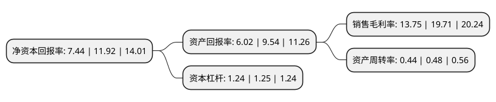

> 本页面由自动化程序生成于 2022年5月20日 01:34
> 内容可能存在错误，如有bug请提交issue至：https://github.com/Eroleice/doc-pi/issues
{.is-warning}

# 上市公司基本情况

## 基本资料

江苏神马电力股份有限公司（以下简称“神马电力”）成立于1996年08月29日，南通市。于2019年08月05日在上交所主板上市。

神马电力注册资本43,226.333万元，电力系统变电站复合外绝缘，输配电线路复合外绝缘和橡胶密封件等产品的研发，生产与销售以下是详细信息：

- 公司名称: 江苏神马电力股份有限公司
- 股票代码: 603530.SH
- 所在地: 江苏 - 南通市
- 成立日期: 1996年08月29日
- 注册资本: 43,226.333万元
- 法定代表人: 马斌
- 主营业务: 电力系统变电站复合外绝缘，输配电线路复合外绝缘和橡胶密封件等产品的研发，生产与销售
- 公司官网: shemar.com.cn
- 公司介绍: 公司主要从事电力系统变电站复合外绝缘、输配电线路复合外绝缘和橡胶密封件等产品的研发、生产与销售。目前，公司是国际知名的电力系统复合外绝缘产品研制企业与国内电力设备用橡胶密封件龙头企业。2012年，公司董事长马斌作为“特高压交流输电关键技术、成套设备及工程应用”项目的主要完成人之一，获得2012年度国家科技进步特等奖。2017年12月6日，公司作为主要完成单位之一、公司董事长马斌作为主要完成人之一参与的“特高压±800kV直流输电工程”项目获得2017年度国家科技进步特等奖。

## 股东及高管情况

上市公司第一大股东为上海神马电力控股有限公司，持股270,000,000股，占比62.46%，为上市公司实际控制人。

截至2022年03月31日，上市公司的前十大股东中，共有5名自然人股东，2名机构股东，2个产品账户，1个海外主体，其中5%以上大股东共有2名。上市公司前十大股东明细如下：

> 截至2022年03月31日，上市公司前十大股东信息如下：

| 股东名称 | 持股数量（股） | 持股比例 |
| --- | --- | --- |
| 上海神马电力控股有限公司 | 270,000,000 | 62.46% |
| 陈小琴 | 90,000,000 | 20.82% |
| 南通苏通集成电路重大产业项目投资基金合伙企业(有限合伙) | 7,598,784 | 1.76% |
| 南通产业控股集团有限公司 | 3,799,392 | 0.88% |
| 国网英大产业投资基金管理有限公司-龙岩鑫达股权投资中心(有限合伙) | 2,279,635 | 0.53% |
| 沈行迪 | 312,500 | 0.07% |
| MORGAN STANLEY & CO. INTERNATIONAL PLC. | 310,100 | 0.07% |
| 管仲 | 271,100 | 0.06% |
| 黄林娟 | 237,200 | 0.05% |
| 郑明滨 | 225,000 | 0.05% |

## 利润表分析

上市公司2021年总收入为7.31亿元，净利润为1亿元，实现盈利。

## 杜邦分析

> 数据列示周期：2021年 | 2020年 | 2019年
{.is-info}

上市公司的净资产收益率在近一年有所下降，下降幅度为-37.58%，其变化情况分解如下：
- 上市公司的销售毛利率在近一年下降了-30.24%，可能是生产效率的下降、商品原材料价格上涨或商品价格的下跌所致。
- 上市公司的资产周转率在近一年下降了-8.33%，可能是源自于更慢的销售回款或库存管理效果下降。
- 上市公司的财务杠杆比率在近一年下降了-0.8%，可能是减少负债降低财务费用。

