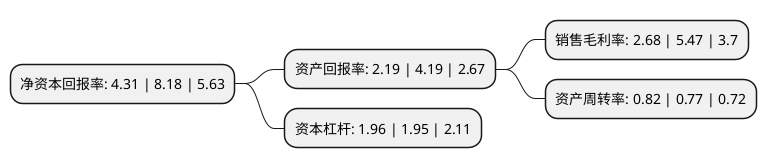

> 本页面由自动化程序生成于 2022年5月20日 01:34
> 内容可能存在错误，如有bug请提交issue至：https://github.com/Eroleice/doc-pi/issues
{.is-warning}

# 上市公司基本情况

## 基本资料

青岛汇金通电力设备股份有限公司（以下简称“汇金通”）成立于2004年04月06日，青岛市。于2016年12月22日在上交所主板上市。

汇金通注册资本33,913.91万元，主营业务:专注于输电线路铁塔的研发，设计，生产和销售。主营产品为输电线路铁塔。以下是详细信息：

- 公司名称: 青岛汇金通电力设备股份有限公司
- 股票代码: 603577.SH
- 所在地: 山东 - 青岛市
- 成立日期: 2004年04月06日
- 注册资本: 33,913.91万元
- 法定代表人: 刘锋
- 主营业务: 主营业务:专注于输电线路铁塔的研发，设计，生产和销售主营产品为输电线路铁塔
- 公司官网: www.hjttower.com
- 公司介绍: 公司是生产输电线路角钢塔、钢管塔、变电站构架等电力输送设备的高新技术企业。公司具有国内最高电压等级750KV输电线路铁塔生产许可证以及国家电网公司特高压铁塔产品供应资质。公司作为完全独立发展的民营铁塔企业代表，相对于国有背景的铁塔企业虽成立较晚，但凭借现代化的管理，先进的技术装备，灵活的市场开拓战略，在业内取得了良好的声誉，获得了较快发展。同时公司与国家电网、山东鲁能集团等大型客户建立了长期稳定的业务合作关系。

## 股东及高管情况

上市公司第一大股东为河北津西钢铁集团股份有限公司，持股94,111,100股，占比27.75%，**疑似为**上市公司实际控制人。

截至2022年03月31日，上市公司的前十大股东中，共有8名自然人股东，2名机构股东，其中5%以上大股东共有4名。上市公司前十大股东明细如下：

> 未能通过持股比例判定出上市公司实际控制人（持股30%以上）
> 可能存在通过间接持股、联合持股、协议控制等方式拥有实际控制权的主体，具体请参考上市公司定期公告！
{.is-warning}

> 截至2022年03月31日，上市公司前十大股东信息如下：

| 股东名称 | 持股数量（股） | 持股比例 |
| --- | --- | --- |
| 河北津西钢铁集团股份有限公司 | 94,111,100 | 27.75% |
| 刘锋 | 53,763,037 | 15.85% |
| 天津安塞资产管理有限公司 | 43,240,235 | 12.75% |
| 刘艳华 | 25,597,765 | 7.55% |
| 路遥 | 7,206,360 | 2.12% |
| 姚杨 | 2,420,370 | 0.71% |
| 林源晟 | 1,850,278 | 0.55% |
| 吴唯清 | 1,643,400 | 0.48% |
| 刘雪芳 | 1,430,430 | 0.42% |
| 姚力菁 | 1,325,600 | 0.39% |

## 利润表分析

上市公司2021年总收入为24.98亿元，净利润为0.66亿元，实现盈利。

## 杜邦分析

> 数据列示周期：2021年 | 2020年 | 2019年
{.is-info}

上市公司的净资产收益率在近一年有所下降，下降幅度为-47.31%，其变化情况分解如下：
- 上市公司的销售毛利率在近一年下降了-51.01%，可能是生产效率的下降、商品原材料价格上涨或商品价格的下跌所致。
- 上市公司的资产周转率在近一年上升了6.49%，可能是源自于更快的销售回款或库存管理效果提升。
- 上市公司的财务杠杆比率在近一年上升了0.51%，可能是增加负债扩大生产规模。

