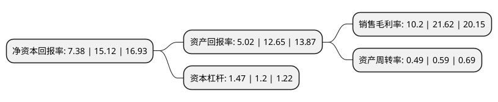

> 本页面由自动化程序生成于 2022年5月20日 01:34
> 内容可能存在错误，如有bug请提交issue至：https://github.com/Eroleice/doc-pi/issues
{.is-warning}

# 上市公司基本情况

## 基本资料

浙江捷昌线性驱动科技股份有限公司（以下简称“捷昌驱动”）成立于2010年04月30日，绍兴市。于2018年09月21日在上交所主板上市。

捷昌驱动注册资本38,191.585万元，自成立以来，公司主要从事线性驱动系统的研发，生产和销售业务。主要产品按应用领域可分为医疗康护驱动系统，智慧办公驱动系统及智能家居控制系统等。以下是详细信息：

- 公司名称: 浙江捷昌线性驱动科技股份有限公司
- 股票代码: 603583.SH
- 所在地: 浙江 - 绍兴市
- 成立日期: 2010年04月30日
- 注册资本: 38,191.585万元
- 法定代表人: 胡仁昌
- 主营业务: 自成立以来，公司主要从事线性驱动系统的研发，生产和销售业务主要产品按应用领域可分为医疗康护驱动系统，智慧办公驱动系统及智能家居控制系统等
- 公司官网: www.jiecang.com
- 公司介绍: 公司是一家专业从事智能线性驱动控制系统研发、生产、销售的国家级高新技术企业，总部位于浙江省绍兴市新昌县省级高新技术产业园区。目前公司已形成医疗康护，智慧办公，智能家居三大产品体系，作为国内行业龙头企业，是直流电动推杆国家行业标准起草单位，为全球医疗康复、养老护理、智能家居等相关行业提供专业的智能控制及传动解决方案。公司建有两个生产基地，分别位于新昌和慈溪，分别拥有自动化激光切割机，焊接机器人以及电子加工设备等，先进的智能化设备，和精益化生产管理使公司成为国内外顶尖医疗器械和家具企业的供应商。同时，公司建有省级企业研究院，并与上海交大等科研所建立联合实验室，研究行业前沿技术，开发具有核心竞争力的新产品。

## 股东及高管情况

上市公司第一大股东为胡仁昌，持股105,347,070股，占比27.58%，**疑似为**上市公司实际控制人。

截至2022年03月31日，上市公司的前十大股东中，共有4名自然人股东，1名机构股东，2个产品账户，1个海外主体，2名其他股东，其中5%以上大股东共有4名。上市公司前十大股东明细如下：

> 未能通过持股比例判定出上市公司实际控制人（持股30%以上）
> 可能存在通过间接持股、联合持股、协议控制等方式拥有实际控制权的主体，具体请参考上市公司定期公告！
{.is-warning}

> 截至2022年03月31日，上市公司前十大股东信息如下：

| 股东名称 | 持股数量（股） | 持股比例 |
| --- | --- | --- |
| 胡仁昌 | 105,347,070 | 27.58% |
| 陆小健 | 66,112,799 | 17.31% |
| 新昌县众盛投资有限公司 | 24,529,000 | 6.42% |
| 香港中央结算有限公司(陆股通) | 20,278,538 | 5.31% |
| 全国社保基金四零六组合 | 17,054,248 | 4.47% |
| 吴迪增 | 8,271,200 | 2.17% |
| 沈安彬 | 7,673,400 | 2.01% |
| 基本养老保险基金一二零一组合 | 6,584,696 | 1.72% |
| 澳门金融管理局-自有资金 | 5,637,386 | 1.48% |
| 科威特政府投资局-自有资金 | 4,803,387 | 1.26% |

## 利润表分析

上市公司2021年总收入为26.36亿元，净利润为2.68亿元，实现盈利。

## 杜邦分析

> 数据列示周期：2021年 | 2020年 | 2019年
{.is-info}

上市公司的净资产收益率在近一年有所下降，下降幅度为-51.19%，其变化情况分解如下：
- 上市公司的销售毛利率在近一年下降了-52.82%，可能是生产效率的下降、商品原材料价格上涨或商品价格的下跌所致。
- 上市公司的资产周转率在近一年下降了-16.95%，可能是源自于更慢的销售回款或库存管理效果下降。
- 上市公司的财务杠杆比率在近一年上升了22.5%，可能是增加负债扩大生产规模。

