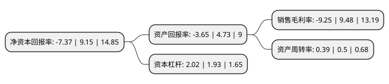

> 本页面由自动化程序生成于 2022年5月20日 01:35
> 内容可能存在错误，如有bug请提交issue至：https://github.com/Eroleice/doc-pi/issues
{.is-warning}

# 上市公司基本情况

## 基本资料

四川华体照明科技股份有限公司（以下简称“华体科技”）成立于2004年05月21日，成都市。于2017年06月21日在上交所主板上市。

华体科技注册资本14,201.274万元，公司是城市照明综合服务提供商，专注于城市照明领域的方案规划设计，产品研发制造，工程项目安装和运行管理维护服务，并致力于成为城市文化照明和绿色照明的领导者。公司现拥有一套包括前期咨询，照明方案规划设计，技术支持，产品研发制造，工程项目安装，合同能源管理和照明运行管理维护服务的高质量，个性化技术服务链，致力于为客户提供全过程的城市照明服务。以下是详细信息：

- 公司名称: 四川华体照明科技股份有限公司
- 股票代码: 603679.SH
- 所在地: 四川 - 成都市
- 成立日期: 2004年05月21日
- 注册资本: 14,201.274万元
- 法定代表人: 梁熹
- 主营业务: 公司是城市照明综合服务提供商，专注于城市照明领域的方案规划设计，产品研发制造，工程项目安装和运行管理维护服务，并致力于成为城市文化照明和绿色照明的领导者公司现拥有一套包括前期咨询，照明方案规划设计，技术支持，产品研发制造，工程项目安装，合同能源管理和照明运行管理维护服务的高质量，个性化技术服务链，致力于为客户提供全过程的城市照明服务
- 公司官网: www.huaticn.com
- 公司介绍: 公司是一家集照明方案设计、产品研发制造、工程项目实施、物联网智能管理维护四大业务板块为一体的户外照明企业，为中国名列前茅的户外道路照明企业。公司主要优势业务包括智慧路灯、文化照明产品、LED户外大功率照明产品、城市景观亮化工程及公共设施。经过多年的历练和沉淀，探索与发展，公司完成了从单一生产向全产业链覆盖的蜕变，并于2015年获得中国驰名商标。公司设计的玉兰灯、芙蓉中华灯、神晖灯等系列产品广泛应用于国内近百个城市，取得了显著的经济效益与社会效益，得到了照明行业、城市建设部门与市民的高度肯定和广泛认可，其中，玉兰灯专利荣获“中国外观设计优秀奖”。公司产品以“规模大、配套齐、技术性能优越、节能环保、性价比高”的竞争优势享誉海内外市场，现已遍布国内并远销欧美。

## 股东及高管情况

上市公司第一大股东为梁熹，持股23,404,943股，占比16.48%，**疑似为**上市公司实际控制人。

截至2022年03月31日，上市公司的前十大股东中，共有8名自然人股东，2名机构股东，其中5%以上大股东共有4名。上市公司前十大股东明细如下：

> 未能通过持股比例判定出上市公司实际控制人（持股30%以上）
> 可能存在通过间接持股、联合持股、协议控制等方式拥有实际控制权的主体，具体请参考上市公司定期公告！
{.is-warning}

> 截至2022年03月31日，上市公司前十大股东信息如下：

| 股东名称 | 持股数量（股） | 持股比例 |
| --- | --- | --- |
| 梁熹 | 23,404,943 | 16.48% |
| 梁钰祥 | 18,899,236 | 13.31% |
| 王绍蓉 | 18,656,863 | 13.14% |
| 北京天联行健科技有限责任公司 | 7,136,920 | 5.03% |
| 王绍兰 | 1,974,332 | 1.39% |
| 唐虹 | 1,761,632 | 1.24% |
| 王肇英 | 1,636,072 | 1.15% |
| 张辉 | 1,545,866 | 1.09% |
| 张映浩 | 1,368,000 | 0.96% |
| 上海华敏置业(集团)有限公司 | 1,308,400 | 0.92% |

## 利润表分析

上市公司2021年总收入为5.9亿元，净利润为-0.55亿元，**未实现盈利**。

## 杜邦分析

> 数据列示周期：2021年 | 2020年 | 2019年
{.is-info}

上市公司的净资产收益率在近一年有所下降，下降幅度为-180.55%，其变化情况分解如下：
- 上市公司的销售毛利率在近一年下降了-197.57%，可能是生产效率的下降、商品原材料价格上涨或商品价格的下跌所致。
- 上市公司的资产周转率在近一年下降了-22%，可能是源自于更慢的销售回款或库存管理效果下降。
- 上市公司的财务杠杆比率在近一年上升了4.66%，可能是增加负债扩大生产规模。

