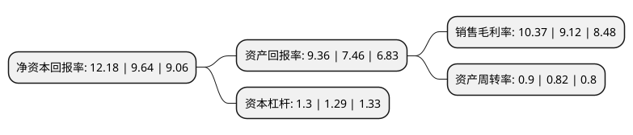

> 本页面由自动化程序生成于 2022年5月20日 01:35
> 内容可能存在错误，如有bug请提交issue至：https://github.com/Eroleice/doc-pi/issues
{.is-warning}

# 上市公司基本情况

## 基本资料

上海鸣志电器股份有限公司（以下简称“鸣志电器”）成立于1998年07月07日，上海市。于2017年05月09日在上交所主板上市。

鸣志电器注册资本42,016.5万元，主要产品:控制电机及其驱动系统，LED智能照明控制与驱动产品以及设备状态管理整体解决方案，电源电控与继电器代理贸易等。主营业务:信息化，自动化和智能化技术应用领域内控制执行元器件及其集成产品的研发和经营。以下是详细信息：

- 公司名称: 上海鸣志电器股份有限公司
- 股票代码: 603728.SH
- 所在地: 上海 - 上海市
- 成立日期: 1998年07月07日
- 注册资本: 42,016.5万元
- 法定代表人: 常建鸣
- 主营业务: 主要产品:控制电机及其驱动系统，LED智能照明控制与驱动产品以及设备状态管理整体解决方案，电源电控与继电器代理贸易等主营业务:信息化，自动化和智能化技术应用领域内控制执行元器件及其集成产品的研发和经营
- 公司官网: www.moons.com.cn
- 公司介绍: 公司始终秉持对专业应用技术和国际化科学管理手段的追求。从工厂自动化专业部件到智能LED照明驱动器，从大型工厂设备的智能管理系统到汽车通信设备的控制执行机构，广泛的应用领域中不断的提供更专业、更节能、更高效的产品，为顾客带来安心和便利，创造顾客价值。公司经营范围：生产传感器、步进电机、直流电机、仪动传感装置，销售自产产品，上述产品同类商品、进出口、佣金代理(拍卖除外)，并提供相关配套服务(不涉及国营贸易管理商品，涉及配额、许可证管理商品的，按国家有关规定办理申请)。

## 股东及高管情况

上市公司第一大股东为上海鸣志投资管理有限公司，持股235,560,000股，占比56.06%，为上市公司实际控制人。

截至2022年03月31日，上市公司的前十大股东中，共有1名自然人股东，4名机构股东，4个产品账户，1个海外主体，其中5%以上大股东共有2名。上市公司前十大股东明细如下：

> 截至2022年03月31日，上市公司前十大股东信息如下：

| 股东名称 | 持股数量（股） | 持股比例 |
| --- | --- | --- |
| 上海鸣志投资管理有限公司 | 235,560,000 | 56.06% |
| 新永恒公司 | 37,145,746 | 8.84% |
| 刘晋平 | 14,040,000 | 3.34% |
| 兴业银行股份有限公司-天弘永利债券型证券投资基金 | 6,844,790 | 1.63% |
| 安信证券资管-安信资管创赢21号单一资产管理计划 | 6,500,100 | 1.55% |
| 上海凯康投资管理有限公司 | 4,680,000 | 1.11% |
| 金寶德實業(香港)有限公司 | 3,900,000 | 0.93% |
| 香港中央结算有限公司(陆股通) | 3,853,010 | 0.92% |
| 中国工商银行股份有限公司-东方主题精选混合型证券投资基金 | 2,856,160 | 0.68% |
| 中国工商银行股份有限公司-诺安灵活配置混合型证券投资基金 | 2,700,000 | 0.64% |

## 利润表分析

上市公司2021年总收入为27.14亿元，净利润为2.81亿元，实现盈利。

## 杜邦分析

> 数据列示周期：2021年 | 2020年 | 2019年
{.is-info}

上市公司的净资产收益率在近一年有所上升，上升幅度为26.35%，其变化情况分解如下：
- 上市公司的销售毛利率在近一年上升了13.71%，可能是生产效率的提升、商品原材料价格下跌或商品价格的上涨所致。
- 上市公司的资产周转率在近一年上升了9.76%，可能是源自于更快的销售回款或库存管理效果提升。
- 上市公司的财务杠杆比率在近一年上升了0.78%，可能是增加负债扩大生产规模。

