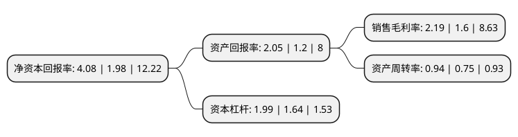

> 本页面由自动化程序生成于 2022年5月20日 01:35
> 内容可能存在错误，如有bug请提交issue至：https://github.com/Eroleice/doc-pi/issues
{.is-warning}

# 上市公司基本情况

## 基本资料

常州神力电机股份有限公司（以下简称“神力股份”）成立于1991年12月16日，常州市。于2016年11月25日在上交所主板上市。

神力股份注册资本21,773.019万元，主营业务:主要从事电机(包括电动机和发电机)定子，转子冲片和铁芯的研发，生产和销售。主要产品是电机定子，转子冲片和铁芯，是电机的重要核心部件。以下是详细信息：

- 公司名称: 常州神力电机股份有限公司
- 股票代码: 603819.SH
- 所在地: 江苏 - 常州市
- 成立日期: 1991年12月16日
- 注册资本: 21,773.019万元
- 法定代表人: 陈猛
- 主营业务: 主营业务:主要从事电机(包括电动机和发电机)定子，转子冲片和铁芯的研发，生产和销售主要产品是电机定子，转子冲片和铁芯，是电机的重要核心部件
- 公司官网: www.czshenli.com
- 公司介绍: 公司是大中型电机、发电机定转子冲片、铁芯的专业化生产企业，生产规模和产品质量在国内同行业中处领先地位，是行业中高端产品加工的集中点。主要生产柴油发电机、风力发电机、中高压发电机、轨道电机、电梯电机、交流电机等定转子冲片和铁芯，产品遍布国内外，主要客户均为全球知名企业。康明斯，维斯塔斯，上海三菱，ABB，科勒，西门子，庞巴迪，美奥迪，GE，歌美飒，利莱森玛，东芝三菱，马拉松等。公司的产品质量和专业服务，长期以来得到客户的一致认可和好评，获得了客户的多方面赞誉，数次被评定为“优秀供应商”、“及时交付优秀供应商”、“年度最佳供应商”、“杰出供应商”等奖项。公司通过了ISO/FDIS09001:2008质量管理体系认证；ISO14001:2004环境管理体系认证；GB/T28001-2011/OHSAS18001:2007职业健康安全管理体系认证；EN15085-2欧洲标准轨道车辆焊接认证；ISO/TS16949:2009标准的预审。

## 股东及高管情况

上市公司第一大股东为陈忠渭，持股78,818,103股，占比36.2%，为上市公司实际控制人。

截至2022年03月31日，上市公司的前十大股东中，共有5名自然人股东，4名机构股东，1个产品账户，其中5%以上大股东共有3名。上市公司前十大股东明细如下：

> 截至2022年03月31日，上市公司前十大股东信息如下：

| 股东名称 | 持股数量（股） | 持股比例 |
| --- | --- | --- |
| 陈忠渭 | 78,818,103 | 36.2% |
| 深圳市前海中物一方企业管理顾问有限公司 | 17,450,700 | 8.01% |
| 遂川睿忠企业管理服务中心(有限合伙) | 11,277,630 | 5.18% |
| 庞琴英 | 8,757,567 | 4.02% |
| 常州市中科江南股权投资中心(有限合伙) | 5,977,982 | 2.75% |
| 夏世勇 | 3,949,348 | 1.81% |
| 常州神力电机股份有限公司-第一期员工持股计划 | 3,524,302 | 1.62% |
| 宜兴中科金源创业投资企业(有限合伙) | 2,846,038 | 1.31% |
| 张跃辉 | 1,837,920 | 0.84% |
| 杨翠君 | 1,136,851 | 0.52% |

## 利润表分析

上市公司2021年总收入为14.41亿元，净利润为0.31亿元，实现盈利。

## 杜邦分析

> 数据列示周期：2021年 | 2020年 | 2019年
{.is-info}

上市公司的净资产收益率在近一年有所上升，上升幅度为106.06%，其变化情况分解如下：
- 上市公司的销售毛利率在近一年上升了36.87%，可能是生产效率的提升、商品原材料价格下跌或商品价格的上涨所致。
- 上市公司的资产周转率在近一年上升了25.33%，可能是源自于更快的销售回款或库存管理效果提升。
- 上市公司的财务杠杆比率在近一年上升了21.34%，可能是增加负债扩大生产规模。

