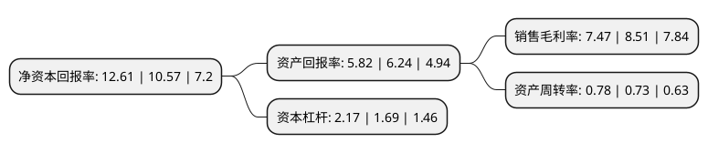

> 本页面由自动化程序生成于 2022年5月20日 01:35
> 内容可能存在错误，如有bug请提交issue至：https://github.com/Eroleice/doc-pi/issues
{.is-warning}

# 上市公司基本情况

## 基本资料

江苏洛凯机电股份有限公司（以下简称“洛凯股份”）成立于2010年09月30日，常州市。于2017年10月17日在上交所主板上市。

洛凯股份注册资本16,000万元，主营业务为断路器关键部件，附件，零部件及其他输配电开关设备配套产品的研发，生产和销售。主要产品:低压及中高压断路器配套用框(抽)架和操作机构。以下是详细信息：

- 公司名称: 江苏洛凯机电股份有限公司
- 股票代码: 603829.SH
- 所在地: 江苏 - 常州市
- 成立日期: 2010年09月30日
- 注册资本: 16,000万元
- 法定代表人: 谈行
- 主营业务: 主营业务为断路器关键部件，附件，零部件及其他输配电开关设备配套产品的研发，生产和销售主要产品:低压及中高压断路器配套用框(抽)架和操作机构
- 公司官网: www.lk-jd.com
- 公司介绍: 公司专注于高低压配电电器关键部附件的研发、生产、销售及服务，已成为我国配电电器部附件行业的领军企业之一。公司拥有包括上海电气股份有限公司人民电器厂、上海良信电器、浙江正泰电气、德力西电气集团、许继电气、平高电气、西电电气、美国通用电气(GE)、法国施耐德电气(Schneider)、德国西门子电器(Siemens)、瑞士ABB电器等在内的国内外知名顾客，产品还出口到美国、法国、荷兰、印度、意大利等国。公司拥有一支优秀的研发、工艺、检试技术团队，具有众多精良加工设备及齐全的精密测量、试验仪器设施，建立了完善的现代企业管理制度、质量管理体系和具有洛凯特色的“3E7S”管理模式，过程控制严格，产品质量优良，服务及时高效，“Rocoi”品牌具有较高美誉度及知名度。

## 股东及高管情况

上市公司第一大股东为常州市洛辉投资有限公司，持股35,900,000股，占比22.44%，**疑似为**上市公司实际控制人。

截至2022年03月31日，上市公司的前十大股东中，共有3名自然人股东，6名机构股东，1个海外主体，其中5%以上大股东共有6名。上市公司前十大股东明细如下：

> 未能通过持股比例判定出上市公司实际控制人（持股30%以上）
> 可能存在通过间接持股、联合持股、协议控制等方式拥有实际控制权的主体，具体请参考上市公司定期公告！
{.is-warning}

> 截至2022年03月31日，上市公司前十大股东信息如下：

| 股东名称 | 持股数量（股） | 持股比例 |
| --- | --- | --- |
| 常州市洛辉投资有限公司 | 35,900,000 | 22.44% |
| 常州市洛腾投资有限公司 | 32,300,000 | 20.19% |
| 常州市洛盛投资合伙企业(有限合伙) | 19,400,000 | 12.13% |
| 上海电科创业投资有限公司 | 15,000,000 | 9.38% |
| 常州润凯投资发展有限公司 | 8,800,000 | 5.5% |
| 上海添赛电气科技有限公司 | 8,386,000 | 5.24% |
| UBS   AG | 615,796 | 0.38% |
| 李光宇 | 572,100 | 0.36% |
| 麻旭亮 | 500,000 | 0.31% |
| 陈晓玲 | 427,700 | 0.27% |

## 利润表分析

上市公司2021年总收入为12.82亿元，净利润为0.95亿元，实现盈利。

## 杜邦分析

> 数据列示周期：2021年 | 2020年 | 2019年
{.is-info}

上市公司的净资产收益率在近一年有所上升，上升幅度为19.3%，其变化情况分解如下：
- 上市公司的销售毛利率在近一年下降了-12.22%，可能是生产效率的下降、商品原材料价格上涨或商品价格的下跌所致。
- 上市公司的资产周转率在近一年上升了6.85%，可能是源自于更快的销售回款或库存管理效果提升。
- 上市公司的财务杠杆比率在近一年上升了28.4%，可能是增加负债扩大生产规模。

