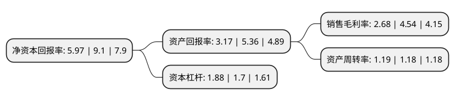

> 本页面由自动化程序生成于 2022年5月20日 01:36
> 内容可能存在错误，如有bug请提交issue至：https://github.com/Eroleice/doc-pi/issues
{.is-warning}

# 上市公司基本情况

## 基本资料

河北华通线缆集团股份有限公司（以下简称“华通线缆”）成立于2002年06月21日，唐山市。于2021年05月11日在上交所主板上市。

华通线缆注册资本50,682.21万元，主导产品包括以进户线等为代表的中低压电力电缆，及以潜油泵电缆，矿用及通用橡套软电缆等为代表的电气装备用电缆，主要从事电线电缆的研发，生产与销售业务。以下是详细信息：

- 公司名称: 河北华通线缆集团股份有限公司
- 股票代码: 605196.SH
- 所在地: 河北 - 唐山市
- 成立日期: 2002年06月21日
- 注册资本: 50,682.21万元
- 法定代表人: 张文东
- 主营业务: 主导产品包括以进户线等为代表的中低压电力电缆，及以潜油泵电缆，矿用及通用橡套软电缆等为代表的电气装备用电缆，主要从事电线电缆的研发，生产与销售业务
- 公司官网: www.huatongcables.com
- 公司介绍: 公司系国内电线电缆行业综合性型企业之一，主要从事电线电缆产品的设计、研发、生产与销售。公司的主要产品有：潜油泵电缆、矿用电缆、低中压电力电缆、船用电缆、通用橡套电缆、机车车辆线、布电线、方电缆等，广泛应用于石油化工、煤炭、电力、冶金、交通、建筑、国防、铁路、航天等行业及国家重点工程。产品畅销全国各地，并出口到美国、荷兰、意大利、俄罗斯、英国、澳大利亚、新西兰、埃塞俄比亚、加纳、刚果、中东、东南亚等国家和地区。公司在专用线缆领域、油气钻采领域持续发力，拥有境内外相关核心专利113项(其中发明专利28项)，参与起草了多项涉及潜油泵电缆、矿用电缆等领域的国家或行业标准，是《中国电线电缆行业“十三五”发展指导意见》之油矿电缆(含潜油泵电缆)、矿用电缆的两家执笔单位之一。公司于北美、新加坡等发达地区积累了稳定的品牌客户资源并设立销售公司进行本地化服务，且围绕共建“一带一路”及中非合作国家战略，于坦桑尼亚、喀麦隆建立生产基地辐射东非、西非市场。

## 股东及高管情况

上市公司第一大股东为张文勇，持股85,199,100股，占比16.81%，**疑似为**上市公司实际控制人。

截至2022年03月31日，上市公司的前十大股东中，共有5名自然人股东，4名机构股东，1个产品账户，其中5%以上大股东共有2名。上市公司前十大股东明细如下：

> 未能通过持股比例判定出上市公司实际控制人（持股30%以上）
> 可能存在通过间接持股、联合持股、协议控制等方式拥有实际控制权的主体，具体请参考上市公司定期公告！
{.is-warning}

> 截至2022年03月31日，上市公司前十大股东信息如下：

| 股东名称 | 持股数量（股） | 持股比例 |
| --- | --- | --- |
| 张文勇 | 85,199,100 | 16.81% |
| 张文东 | 74,019,400 | 14.6% |
| 唐山市汇润股权投资基金管理部(有限合伙) | 23,096,100 | 4.56% |
| 青岛金石灏汭投资有限公司 | 18,870,300 | 3.72% |
| 林超 | 18,000,000 | 3.55% |
| 刘宽清 | 15,333,334 | 3.03% |
| 共青城银泰嘉铭投资管理合伙企业(有限合伙) | 13,450,000 | 2.65% |
| 唐山市厚润企业管理咨询中心(有限合伙) | 13,053,000 | 2.58% |
| 张书军 | 11,532,500 | 2.28% |
| 宁波梅山保税港区泽链通股权投资合伙企业(有限合伙) | 9,500,000 | 1.87% |

## 利润表分析

上市公司2021年总收入为43.97亿元，净利润为1.17亿元，实现盈利。

## 杜邦分析

> 数据列示周期：2021年 | 2020年 | 2019年
{.is-info}

上市公司的净资产收益率在近一年有所下降，下降幅度为-34.4%，其变化情况分解如下：
- 上市公司的销售毛利率在近一年下降了-40.97%，可能是生产效率的下降、商品原材料价格上涨或商品价格的下跌所致。
- 上市公司的资产周转率在近一年上升了0.85%，可能是源自于更快的销售回款或库存管理效果提升。
- 上市公司的财务杠杆比率在近一年上升了10.59%，可能是增加负债扩大生产规模。

