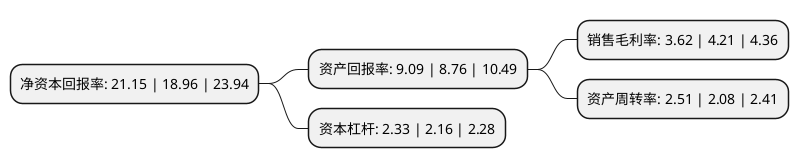

> 本页面由自动化程序生成于 2022年5月20日 01:36
> 内容可能存在错误，如有bug请提交issue至：https://github.com/Eroleice/doc-pi/issues
{.is-warning}

# 上市公司基本情况

## 基本资料

上海起帆电缆股份有限公司（以下简称“起帆电缆”）成立于1994年07月11日，上海市。于2020年07月31日在上交所主板上市。

起帆电缆注册资本41,821.321万元，主营业务:从事电线电缆研发，生产，销售和服务，主要产品包括电力电缆和电气装备用电线电缆。以下是详细信息：

- 公司名称: 上海起帆电缆股份有限公司
- 股票代码: 605222.SH
- 所在地: 上海 - 上海市
- 成立日期: 1994年07月11日
- 注册资本: 41,821.321万元
- 法定代表人: 周桂华
- 主营业务: 主营业务:从事电线电缆研发，生产，销售和服务，主要产品包括电力电缆和电气装备用电线电缆
- 公司官网: www.qifancable.com
- 公司介绍: 公司为一家从事电线电缆研发、生产、销售和服务的专业制造商。经过二十余年在电线电缆行业的深耕细作，公司已成为上海地区规模最大的电线电缆生产销售企业、全国最大的布电线产品生产和销售商之一。公司产品主要分为电力电缆和电气装备用电线电缆，两类线缆又细分为普通电缆和特种电缆，广泛应用于电力、家装、轨道交通、建筑工程、新能源、通信、舰/船、智能装备、冶金、石化、港口机械、海洋工程及工矿等多个领域。经过多年的经验积累及自主创新，公司已拥有万余种规格的产品，可满足耐磨、耐高温、耐寒、抗拉伸、耐弯折、防鼠蚁、阻燃、耐火、耐紫外光、耐辐射、电磁兼容等复杂使用环境要求。公司部分布电线产品被上海市电线电缆协会评为“五星级产品”；高柔性机器人电缆(耐弯折达2000万次)、军用水密封电缆(耐水压10兆帕)、耐寒电缆(零下80摄氏度)等高端特种电缆达到国内领先水平。公司自成立以来，始终如一地推行“以质量求生存、以信誉求发展、以服务为保障”的经营理念，凭借“质量高、规模大、品种全、交货快、服务好”取得一定的竞争优势和品牌影响力。

## 股东及高管情况

上市公司第一大股东为周供华，持股91,008,200股，占比21.76%，**疑似为**上市公司实际控制人。

截至2022年03月31日，上市公司的前十大股东中，共有10名自然人股东，其中5%以上大股东共有4名。上市公司前十大股东明细如下：

> 未能通过持股比例判定出上市公司实际控制人（持股30%以上）
> 可能存在通过间接持股、联合持股、协议控制等方式拥有实际控制权的主体，具体请参考上市公司定期公告！
{.is-warning}

> 截至2022年03月31日，上市公司前十大股东信息如下：

| 股东名称 | 持股数量（股） | 持股比例 |
| --- | --- | --- |
| 周供华 | 91,008,200 | 21.76% |
| 周桂华 | 84,996,400 | 20.32% |
| 周桂幸 | 84,991,400 | 20.32% |
| 何德康 | 24,078,000 | 5.76% |
| 赵杨勇 | 11,660,500 | 2.79% |
| 周悦 | 6,016,800 | 1.44% |
| 周智巧 | 6,016,800 | 1.44% |
| 周宜静 | 6,016,800 | 1.44% |
| 周志浩 | 6,016,800 | 1.44% |
| 周婷 | 6,016,800 | 1.44% |

## 利润表分析

上市公司2021年总收入为188.77亿元，净利润为6.83亿元，实现盈利。

## 杜邦分析

> 数据列示周期：2021年 | 2020年 | 2019年
{.is-info}

上市公司的净资产收益率在近一年有所上升，上升幅度为11.55%，其变化情况分解如下：
- 上市公司的销售毛利率在近一年下降了-14.01%，可能是生产效率的下降、商品原材料价格上涨或商品价格的下跌所致。
- 上市公司的资产周转率在近一年上升了20.67%，可能是源自于更快的销售回款或库存管理效果提升。
- 上市公司的财务杠杆比率在近一年上升了7.87%，可能是增加负债扩大生产规模。

