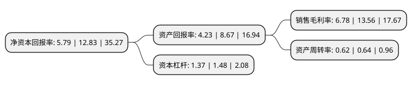

> 本页面由自动化程序生成于 2022年5月20日 01:37
> 内容可能存在错误，如有bug请提交issue至：https://github.com/Eroleice/doc-pi/issues
{.is-warning}

# 上市公司基本情况

## 基本资料

常州市凯迪电器股份有限公司（以下简称“凯迪股份”）成立于1992年08月27日，常州市。于2020年06月01日在上交所主板上市。

凯迪股份注册资本7,066.304万元，公司主要业务为线性驱动系统产品的研发，生产与销售，公司的主要产品是线性驱动系统产品，由电动推杆，手控器，电器盒及其他配套零部件组成。以下是详细信息：

- 公司名称: 常州市凯迪电器股份有限公司
- 股票代码: 605288.SH
- 所在地: 江苏 - 常州市
- 成立日期: 1992年08月27日
- 注册资本: 7,066.304万元
- 法定代表人: 周荣清
- 主营业务: 公司主要业务为线性驱动系统产品的研发，生产与销售，公司的主要产品是线性驱动系统产品，由电动推杆，手控器，电器盒及其他配套零部件组成
- 公司官网: www.czkaidi.cn
- 公司介绍: 公司长期从事线性驱动系统的研发、生产与销售。历经多年发展，公司已形成集技术研发、产品开发、生产制造、国内外营销于一体的全流程服务体系，主要为智能家居、智慧办公、医疗康护、汽车零部件等领域提供配套线性驱动系统产品。公司是线性驱动行业的领先企业。公司生产的直线驱动器被广泛应用于沙发、按摩椅、医疗床、升降办公桌、汽车配件等领域，深受新老顾客的好评。公司在北美和欧洲设立了多个销售网点和仓库，凭借垂直一体化生产竞争优势，立志于为客户提供及时专业的服务和一站式的成套解决方案，免除客户的后顾之忧。

## 股东及高管情况

上市公司第一大股东为常州市凯中投资有限公司，持股31,500,000股，占比44.58%，为上市公司实际控制人。

截至2022年03月31日，上市公司的前十大股东中，共有5名自然人股东，2名机构股东，3个产品账户，其中5%以上大股东共有3名。上市公司前十大股东明细如下：

> 截至2022年03月31日，上市公司前十大股东信息如下：

| 股东名称 | 持股数量（股） | 持股比例 |
| --- | --- | --- |
| 常州市凯中投资有限公司 | 31,500,000 | 44.58% |
| 周殊程 | 15,400,000 | 21.79% |
| 常州市凯恒投资中心(有限合伙) | 5,110,000 | 7.23% |
| 中国银行股份有限公司-招商瑞文混合型证券投资基金 | 922,240 | 1.31% |
| 张东东 | 288,680 | 0.41% |
| 周林玉 | 280,000 | 0.4% |
| 周荣清 | 210,000 | 0.3% |
| 东方证券股份有限公司-中庚价值先锋股票型证券投资基金 | 189,700 | 0.27% |
| 广发证券股份有限公司-中庚小盘价值股票型证券投资基金 | 184,700 | 0.26% |
| 方皓 | 117,400 | 0.17% |

## 利润表分析

上市公司2021年总收入为17.18亿元，净利润为1.16亿元，实现盈利。

## 杜邦分析

> 数据列示周期：2021年 | 2020年 | 2019年
{.is-info}

上市公司的净资产收益率在近一年有所下降，下降幅度为-54.87%，其变化情况分解如下：
- 上市公司的销售毛利率在近一年下降了-50%，可能是生产效率的下降、商品原材料价格上涨或商品价格的下跌所致。
- 上市公司的资产周转率在近一年下降了-3.12%，可能是源自于更慢的销售回款或库存管理效果下降。
- 上市公司的财务杠杆比率在近一年下降了-7.43%，可能是减少负债降低财务费用。

