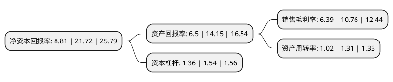

> 本页面由自动化程序生成于 2022年5月20日 01:37
> 内容可能存在错误，如有bug请提交issue至：https://github.com/Eroleice/doc-pi/issues
{.is-warning}

# 上市公司基本情况

## 基本资料

浙江野马电池股份有限公司（以下简称“野马电池”）成立于1996年11月06日，宁波市。于2021年04月12日在上交所主板上市。

野马电池注册资本10,000万元，专注于高性能，环保锌锰电池的研发，生产和销售，致力于为客户提供高品质，长寿命，无污染的绿色环保碱性电池和碳性电池产品。以下是详细信息：

- 公司名称: 浙江野马电池股份有限公司
- 股票代码: 605378.SH
- 所在地: 浙江 - 宁波市
- 成立日期: 1996年11月06日
- 注册资本: 10,000万元
- 法定代表人: 陈一军
- 主营业务: 专注于高性能，环保锌锰电池的研发，生产和销售，致力于为客户提供高品质，长寿命，无污染的绿色环保碱性电池和碳性电池产品
- 公司官网: www.mustangbattery.com
- 公司介绍: 公司产品以出口为主，是综合实力位居国内前列的锌锰电池制造商和出口商,专注于高性能、环保锌锰电池的研发、生产和销售，致力于为客户提供高品质、长寿命、无污染的绿色环保碱性电池和碳性电池产品。公司产品广泛应用于家用电器、电动玩具、智能家居用品、家用医疗健康电子仪器、新型消费电子、无线安防设备、户外电子设备、无线通讯设备、应急照明等多个领域。公司一直注重锌锰电池产业链的有效整合，通过多年的探索和研究开发，已掌握了锌锰电池的核心生产技术工艺，并逐渐拥有了较强的生产设备改进及再研发能力，实现锌锰电池生产的自动化和信息化。2018年公司“年产2亿只碱性锌锰电池自动化生产线技改项目”入选宁波市首批数字化车间/智能工厂示范项目。公司产品“高容量、环保型LR6/LR03碱性锌-二氧化锰电池”获得首张干电池领域的“浙江制造”品牌认证证书。

## 股东及高管情况

上市公司第一大股东为陈恩乐，持股20,000,000股，占比15%，**疑似为**上市公司实际控制人。

截至2022年03月31日，上市公司的前十大股东中，共有6名自然人股东，1名机构股东，1个产品账户，2个海外主体，其中5%以上大股东共有6名。上市公司前十大股东明细如下：

> 未能通过持股比例判定出上市公司实际控制人（持股30%以上）
> 可能存在通过间接持股、联合持股、协议控制等方式拥有实际控制权的主体，具体请参考上市公司定期公告！
{.is-warning}

> 截至2022年03月31日，上市公司前十大股东信息如下：

| 股东名称 | 持股数量（股） | 持股比例 |
| --- | --- | --- |
| 陈恩乐 | 20,000,000 | 15% |
| 余元康 | 20,000,000 | 15% |
| 余谷涌 | 15,000,000 | 11.25% |
| 陈科军 | 15,000,000 | 11.25% |
| 余谷峰 | 15,000,000 | 11.25% |
| 陈一军 | 15,000,000 | 11.25% |
| JPMORGAN CHASE BANK,NATIONAL ASSOCIATION | 434,511 | 0.33% |
| 上海玖石股权投资管理有限公司-玖石阿拉丁1号证券投资基金 | 400,000 | 0.3% |
| UBS   AG | 239,645 | 0.18% |
| 华泰证券股份有限公司 | 205,566 | 0.15% |

## 利润表分析

上市公司2021年总收入为11.86亿元，净利润为0.75亿元，实现盈利。

## 杜邦分析

> 数据列示周期：2021年 | 2020年 | 2019年
{.is-info}

上市公司的净资产收益率在近一年有所下降，下降幅度为-59.44%，其变化情况分解如下：
- 上市公司的销售毛利率在近一年下降了-40.61%，可能是生产效率的下降、商品原材料价格上涨或商品价格的下跌所致。
- 上市公司的资产周转率在近一年下降了-22.14%，可能是源自于更慢的销售回款或库存管理效果下降。
- 上市公司的财务杠杆比率在近一年下降了-11.69%，可能是减少负债降低财务费用。

