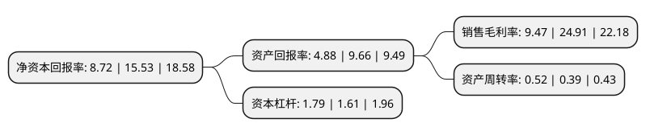

> 本页面由自动化程序生成于 2022年5月20日 01:37
> 内容可能存在错误，如有bug请提交issue至：https://github.com/Eroleice/doc-pi/issues
{.is-warning}

# 上市公司基本情况

## 基本资料

浙江杭可科技股份有限公司（以下简称“杭可科技”）成立于2011年11月21日，杭州市。于2019年07月22日在上交所科创板上市。

杭可科技注册资本40,309万元，致力于各类可充电电池，特别是锂离子电池的后处理系统的设计，研发，生产与销售。以下是详细信息：

- 公司名称: 浙江杭可科技股份有限公司
- 股票代码: 688006.SH
- 所在地: 浙江 - 杭州市
- 成立日期: 2011年11月21日
- 注册资本: 40,309万元
- 法定代表人: 曹骥
- 主营业务: 致力于各类可充电电池，特别是锂离子电池的后处理系统的设计，研发，生产与销售
- 公司官网: www.chr-group.net
- 公司介绍: 公司是一家从事可充电电池设计、研发生产的高新技术企业,在充放电机、内阻测试仪等后处理系统核心设备的研发、生产方面拥有核心技术和能力，并能提供锂离子电池生产线后处理系统整体解决方案。公司依托专业技术、精细化管理和贴身服务，公司凭借自身的研发实力及自主创新能力，在产品的功能、性能、质量和安全等方面实现自主研发，公司拥有发明专利12项，实用新型专利49项,为韩国三星、韩国LG、日本索尼(现为日本村田)、宁德新能源、比亚迪、国轩高科、比克动力、天津力神等国内外知名锂离子电池制造商配套供应各类锂离子电池生产线后处理系统设备。

## 股东及高管情况

上市公司第一大股东为曹骥，持股187,616,596股，占比46.54%，为上市公司实际控制人。

截至2022年03月31日，上市公司的前十大股东中，共有4名自然人股东，1名机构股东，4个产品账户，1个海外主体，其中5%以上大股东共有2名。上市公司前十大股东明细如下：

> 截至2022年03月31日，上市公司前十大股东信息如下：

| 股东名称 | 持股数量（股） | 持股比例 |
| --- | --- | --- |
| 曹骥 | 187,616,596 | 46.54% |
| 杭州杭可智能设备集团有限公司 | 96,411,406 | 23.92% |
| 香港中央结算有限公司(陆股通) | 17,021,256 | 4.22% |
| 交通银行股份有限公司-汇丰晋信低碳先锋股票型证券投资基金 | 6,310,635 | 1.57% |
| 中国工商银行股份有限公司-农银汇理新能源主题灵活配置混合型证券投资基金 | 5,601,085 | 1.39% |
| 交通银行-汇丰晋信动态策略混合型证券投资基金 | 4,996,546 | 1.24% |
| 曹政 | 4,242,102 | 1.05% |
| 招商银行股份有限公司-华夏上证科创板50成份交易型开放式指数证券投资基金 | 3,596,811 | 0.89% |
| 曹冠群 | 2,506,697 | 0.62% |
| 桑宏宇 | 2,386,183 | 0.59% |

## 杜邦分析

> 数据列示周期：2021年 | 2020年 | 2019年
{.is-info}

上市公司的净资产收益率在近一年有所下降，下降幅度为-43.85%，其变化情况分解如下：
- 上市公司的销售毛利率在近一年下降了-61.98%，可能是生产效率的下降、商品原材料价格上涨或商品价格的下跌所致。
- 上市公司的资产周转率在近一年上升了33.33%，可能是源自于更快的销售回款或库存管理效果提升。
- 上市公司的财务杠杆比率在近一年上升了11.18%，可能是增加负债扩大生产规模。

