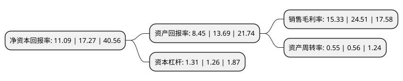

> 本页面由自动化程序生成于 2022年5月20日 01:37
> 内容可能存在错误，如有bug请提交issue至：https://github.com/Eroleice/doc-pi/issues
{.is-warning}

# 上市公司基本情况

## 基本资料

上海派能能源科技股份有限公司（以下简称“派能科技”）成立于2009年10月28日，上海市。于2020年12月30日在上交所科创板上市。

派能科技注册资本15,484.453万元，专注于磷酸铁锂电芯，模组及储能电池系统的研发，生产和销售。以下是详细信息：

- 公司名称: 上海派能能源科技股份有限公司
- 股票代码: 688063.SH
- 所在地: 上海 - 上海市
- 成立日期: 2009年10月28日
- 注册资本: 15,484.453万元
- 法定代表人: 韦在胜
- 主营业务: 专注于磷酸铁锂电芯，模组及储能电池系统的研发，生产和销售
- 公司官网: www.pylontech.com.cn
- 公司介绍: 公司是行业领先的储能电池系统提供商，专注于磷酸铁锂电芯、模组及储能电池系统的研发、生产和销售。公司产品可广泛应用于电力系统的发、输、配、用等环节以及通信基站和数据中心等场景,公司在全球电化学储能市场中具有较高品牌知名度和较强市场竞争力,2019年公司自主品牌家用储能产品出货量约占全球出货总量的8.5%，位居全球第三名。2019年公司以自主品牌和贴牌方式销售家用储能产品共计366MWh，约占全球出货总量的12.2%。报告期内公司连续荣获中国国际储能大会、中国储能网颁发的“中国储能产业最佳储能电池供应商”、“中国储能产业最具影响力企业”和“中国储能产业最佳系统集成解决方案供应商”等奖项。

## 股东及高管情况

上市公司第一大股东为中兴新通讯有限公司，持股43,218,677股，占比27.91%，**疑似为**上市公司实际控制人。

截至2022年04月29日，上市公司的前十大股东中，共有2名自然人股东，6名机构股东，2个产品账户，其中5%以上大股东共有6名。上市公司前十大股东明细如下：

> 未能通过持股比例判定出上市公司实际控制人（持股30%以上）
> 可能存在通过间接持股、联合持股、协议控制等方式拥有实际控制权的主体，具体请参考上市公司定期公告！
{.is-warning}

> 截至2022年04月29日，上市公司前十大股东信息如下：

| 股东名称 | 持股数量（股） | 持股比例 |
| --- | --- | --- |
| 中兴新通讯有限公司 | 43,218,677 | 27.91% |
| 中兴新通讯有限公司 | 43,218,677 | 27.91% |
| 中兴新通讯有限公司 | 43,218,677 | 27.91% |
| 黄石融科创新投资基金中心(有限合伙) | 21,873,364 | 14.13% |
| 黄石融科创新投资基金中心(有限合伙) | 21,873,364 | 14.13% |
| 北京融通高科资本管理中心(有限合伙) | 7,795,050 | 5.0341% |
| 恽菁 | 3,636,364 | 2.35% |
| 上海晢牂企业管理合伙企业(有限合伙) | 3,449,000 | 2.23% |
| 上海中派云图投资管理合伙企业(有限合伙) | 3,325,360 | 2.15% |
| 何杨勇 | 2,079,222 | 1.34% |

## 利润表分析

上市公司2021年总收入为20.62亿元，净利润为3.16亿元，实现盈利。

## 杜邦分析

> 数据列示周期：2021年 | 2020年 | 2019年
{.is-info}

上市公司的净资产收益率在近一年有所下降，下降幅度为-35.78%，其变化情况分解如下：
- 上市公司的销售毛利率在近一年下降了-37.45%，可能是生产效率的下降、商品原材料价格上涨或商品价格的下跌所致。
- 上市公司的资产周转率在近一年下降了-1.79%，可能是源自于更慢的销售回款或库存管理效果下降。
- 上市公司的财务杠杆比率在近一年上升了3.97%，可能是增加负债扩大生产规模。

