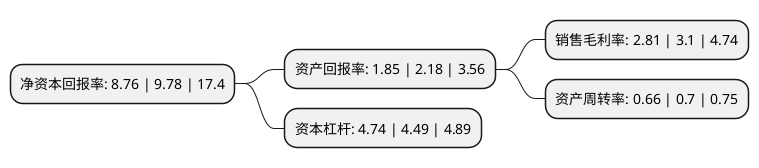

> 本页面由自动化程序生成于 2022年5月20日 01:38
> 内容可能存在错误，如有bug请提交issue至：https://github.com/Eroleice/doc-pi/issues
{.is-warning}

# 上市公司基本情况

## 基本资料

晶科能源股份有限公司（以下简称“晶科能源”）成立于2006年12月13日，上饶市。于2022年01月26日在上交所科创板上市。

晶科能源注册资本1,000,000万元，主营业务是太阳能光伏组件，电池片，硅片的研发，生产和销售以及光伏技术的应用和产业化。以下是详细信息：

- 公司名称: 晶科能源股份有限公司
- 股票代码: 688223.SH
- 所在地: 江西 - 上饶市
- 成立日期: 2006年12月13日
- 注册资本: 1,000,000万元
- 法定代表人: 李仙德
- 主营业务: 主营业务是太阳能光伏组件，电池片，硅片的研发，生产和销售以及光伏技术的应用和产业化
- 公司官网: www.jinkosolar.com
- 公司介绍: 公司以“改变能源结构，承担未来责任”为发展愿景，是一家以光伏产业技术为核心、全球知名的光伏产品制造商。公司现阶段主要从事太阳能光伏组件、电池片、硅片的研发、生产和销售以及光伏技术的应用和产业化，并以此为基础向全球客户提供高效、高质量的太阳能光伏产品，持续输送清洁能源，践行“碳中和、碳达峰”战略规划，助力并推动全球能源绿色转型。公司伴随着国家《可再生能源法》的颁布而于2006年成立，是国内较早规模化从事光伏技术研发和光伏产品开发、制造的企业。自成立以来，公司紧密围绕国家新能源战略规划，凭借前瞻性的战略布局、持续的研发投入和自主创新、优质的产品质量和广泛的市场销售网络布局，在全球范围内建立了良好的市场地位，光伏组件产销规模稳居世界前列，组件出货量于2020年末累计超过70GW。

## 股东及高管情况

上市公司第一大股东为晶科能源投资有限公司，持股5,862,072,000股，占比58.62%，为上市公司实际控制人。

截至2022年03月31日，上市公司的前十大股东中，共有8名机构股东，2个产品账户，其中5%以上大股东共有1名。上市公司前十大股东明细如下：

> 截至2022年03月31日，上市公司前十大股东信息如下：

| 股东名称 | 持股数量（股） | 持股比例 |
| --- | --- | --- |
| 晶科能源投资有限公司 | 5,862,072,000 | 58.62% |
| 上饶市佳瑞企业发展中心(有限合伙) | 344,832,000 | 3.45% |
| 上饶市润嘉企业管理发展中心(有限合伙) | 316,480,000 | 3.16% |
| 上饶市卓领贰号企业发展中心(有限合伙) | 217,080,000 | 2.17% |
| 上饶市卓群企业发展中心(有限合伙) | 210,984,000 | 2.11% |
| 西藏云尚股权投资基金管理有限公司-宁波榕欣投资合伙企业(有限合伙) | 209,656,000 | 2.1% |
| 兴资睿盈(平潭)资产管理有限公司-福州经济技术开发区兴睿和盛股权投资合伙企业(有限合伙) | 206,896,000 | 2.07% |
| 上饶市卓领企业发展中心(有限合伙) | 144,720,000 | 1.45% |
| 兴业国信资产管理有限公司-嘉兴晶能投资合伙企业(有限合伙) | 137,928,000 | 1.38% |
| 西藏云尚股权投资基金管理有限公司-共青城云晶投资合伙企业(有限合伙) | 135,176,000 | 1.35% |

## 利润表分析

上市公司2021年总收入为405.69亿元，净利润为11.41亿元，实现盈利。

## 杜邦分析

> 数据列示周期：2021年 | 2020年 | 2019年
{.is-info}

上市公司的净资产收益率在近一年有所下降，下降幅度为-10.43%，其变化情况分解如下：
- 上市公司的销售毛利率在近一年下降了-9.35%，可能是生产效率的下降、商品原材料价格上涨或商品价格的下跌所致。
- 上市公司的资产周转率在近一年下降了-5.71%，可能是源自于更慢的销售回款或库存管理效果下降。
- 上市公司的财务杠杆比率在近一年上升了5.57%，可能是增加负债扩大生产规模。

