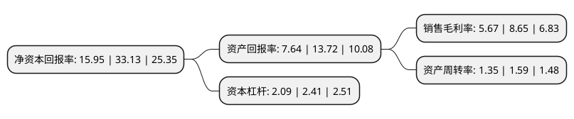

> 本页面由自动化程序生成于 2022年5月20日 01:39
> 内容可能存在错误，如有bug请提交issue至：https://github.com/Eroleice/doc-pi/issues
{.is-warning}

# 上市公司基本情况

## 基本资料

广东博力威科技股份有限公司（以下简称“博力威”）成立于2010年04月08日，东莞市。于2021年06月11日在上交所科创板上市。

博力威注册资本10,000万元，产品主要为锂离子电池组和锂离子电芯，主营业务为锂离子电池研发，制造和销售。以下是详细信息：

- 公司名称: 广东博力威科技股份有限公司
- 股票代码: 688345.SH
- 所在地: 广东 - 东莞市
- 成立日期: 2010年04月08日
- 注册资本: 10,000万元
- 法定代表人: 张志平
- 主营业务: 产品主要为锂离子电池组和锂离子电芯，主营业务为锂离子电池研发，制造和销售
- 公司官网: www.greenway-battery.com
- 公司介绍: 公司是一家以锂离子电池研发、制造和销售为基础的高科技企业，是“中国锂电池出口前20强企业”和“中国电池百强企业”，致力于为客户提供全方位的锂电池解决方案，力争成为全球最具竞争力的锂电解决方案引领者。公司研发的“摩托车锂电池总成YQ2A”、“电动自行车智能锂电池组”、“便携式汽车应急启动电源”、“高效率快充智能移动电源”、“高能量密度型锂离子电池”、“长循环型锂离子电池”等21项产品被认定为广东省高新技术产品。公司重视产品品质管控，通过ISO9001以及IATF16949质量管理体系认证，产品符合CE、CB、UL、FCC、RoHS、UN38.3、CQC等各主要国家和地区的认证标准。公司建立了专业的电池检验实验室，并获得世界著名检测机构TUV、SGS的认可与授权，出具的电池产品检测结果可作为TUV、SGS出具认证报告的基础。2019年公司取得TUV SUD签发的满足EN ISO13849-1:2015以及EN15194:2017相关要求的锂离子电池认可报告，成为国内率先符合欧洲市场EPAC标准的轻型车锂电池企业之一。

## 股东及高管情况

上市公司第一大股东为深圳昆仑鼎天投资有限公司，持股42,250,000股，占比42.25%，为上市公司实际控制人。

截至2022年03月31日，上市公司的前十大股东中，共有3名自然人股东，4名机构股东，3个产品账户，其中5%以上大股东共有2名。上市公司前十大股东明细如下：

> 截至2022年03月31日，上市公司前十大股东信息如下：

| 股东名称 | 持股数量（股） | 持股比例 |
| --- | --- | --- |
| 深圳昆仑鼎天投资有限公司 | 42,250,000 | 42.25% |
| 张志平 | 19,875,000 | 19.88% |
| 刘聪 | 5,000,000 | 5% |
| 珠海乔戈里企业管理合伙企业(有限合伙) | 3,750,000 | 3.75% |
| 珠海博广聚力企业管理合伙企业(有限合伙) | 3,750,000 | 3.75% |
| 广发证券资管-工商银行-广发原驰·博力威战略配售1号集合资产管理计划 | 2,419,900 | 2.42% |
| 东莞市东证宏德投资有限公司 | 1,066,100 | 1.07% |
| 中国银行股份有限公司-景顺长城策略精选灵活配置混合型证券投资基金 | 675,258 | 0.68% |
| 周国怀 | 593,057 | 0.59% |
| 广发银行股份有限公司-中欧盛世成长分级股票型证券投资基金 | 428,297 | 0.43% |

## 利润表分析

上市公司2021年总收入为22.16亿元，净利润为1.25亿元，实现盈利。

## 杜邦分析

> 数据列示周期：2021年 | 2020年 | 2019年
{.is-info}

上市公司的净资产收益率在近一年有所下降，下降幅度为-51.86%，其变化情况分解如下：
- 上市公司的销售毛利率在近一年下降了-34.45%，可能是生产效率的下降、商品原材料价格上涨或商品价格的下跌所致。
- 上市公司的资产周转率在近一年下降了-15.09%，可能是源自于更慢的销售回款或库存管理效果下降。
- 上市公司的财务杠杆比率在近一年下降了-13.28%，可能是减少负债降低财务费用。

