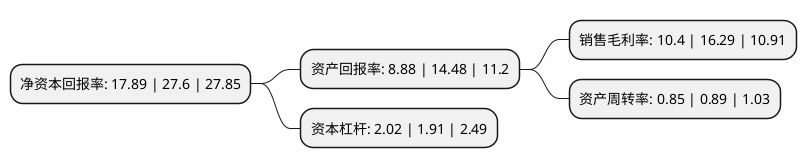

> 本页面由自动化程序生成于 2022年5月20日 01:39
> 内容可能存在错误，如有bug请提交issue至：https://github.com/Eroleice/doc-pi/issues
{.is-warning}

# 上市公司基本情况

## 基本资料

固德威技术股份有限公司（以下简称“固德威”）成立于2010年11月05日，苏州市。于2020年09月04日在上交所科创板上市。

固德威注册资本8,800万元，主要产品包括光伏并网逆变器，光伏储能逆变器，智能数据采集器以及SEMS智慧能源管理系统。专注于太阳能，储能等新能源电力电源设备的研发，生产和销售，并致力于为家庭，工商业用户及地面电站提供智慧能源管理等整体解决方案。以下是详细信息：

- 公司名称: 固德威技术股份有限公司
- 股票代码: 688390.SH
- 所在地: 江苏 - 苏州市
- 成立日期: 2010年11月05日
- 注册资本: 8,800万元
- 法定代表人: 黄敏
- 主营业务: 主要产品包括光伏并网逆变器，光伏储能逆变器，智能数据采集器以及SEMS智慧能源管理系统专注于太阳能，储能等新能源电力电源设备的研发，生产和销售，并致力于为家庭，工商业用户及地面电站提供智慧能源管理等整体解决方案
- 公司官网: www.goodwe.com
- 公司介绍: 公司系以新能源电力电源设备的转换、储能变换、能源管理为基础，以降低用电成本、提高用电效率为核心，以能源多能互补、能源价值创造为目的，集自主研发、生产、销售及服务为一体的高新技术企业。公司是高新技术企业、国家级博士后科研工作站设站企业、国家火炬计划产业化示范项目承担单位。公司研发中心被认定为江苏省可再生能源并网逆变器工程技术研究中心、江苏省认定企业技术中心、苏州市光伏并网逆变器工程技术研究中心、苏州市工业设计中心、江苏省工业设计中心。公司已在新能源电力电源设备领域深耕近十载，建立了一套有效的研发体系，长期从事新能源电力能源领域系统产品、技术、解决方案的研究，具备持续的研发投入能力。公司先后获得“苏州市名牌产品”、“江苏省名牌产品”、“德国红点设计奖”，连续四年蝉联TüV莱茵“质胜中国优胜奖”等荣誉和资质。

## 股东及高管情况

上市公司第一大股东为黄敏，持股27,250,000股，占比30.97%，为上市公司实际控制人。

截至2022年03月31日，上市公司的前十大股东中，共有7名自然人股东，2名机构股东，1个产品账户，其中5%以上大股东共有2名。上市公司前十大股东明细如下：

> 截至2022年03月31日，上市公司前十大股东信息如下：

| 股东名称 | 持股数量（股） | 持股比例 |
| --- | --- | --- |
| 黄敏 | 27,250,000 | 30.97% |
| 卢红萍 | 5,801,563 | 6.59% |
| 郑加炫 | 3,202,613 | 3.64% |
| 苏州合众聚德投资企业(有限合伙) | 3,080,000 | 3.5% |
| 倪祖根 | 3,059,155 | 3.48% |
| 苏州高新富德投资企业(有限合伙) | 2,648,000 | 3.01% |
| 方刚 | 2,320,000 | 2.64% |
| 卢进军 | 1,485,000 | 1.69% |
| 招商银行股份有限公司-华夏上证科创板50成份交易型开放式指数证券投资基金 | 1,221,246 | 1.39% |
| 陈斌 | 992,920 | 1.13% |

## 利润表分析

上市公司2021年总收入为26.78亿元，净利润为2.78亿元，实现盈利。

## 杜邦分析

> 数据列示周期：2021年 | 2020年 | 2019年
{.is-info}

上市公司的净资产收益率在近一年有所下降，下降幅度为-35.18%，其变化情况分解如下：
- 上市公司的销售毛利率在近一年下降了-36.16%，可能是生产效率的下降、商品原材料价格上涨或商品价格的下跌所致。
- 上市公司的资产周转率在近一年下降了-4.49%，可能是源自于更慢的销售回款或库存管理效果下降。
- 上市公司的财务杠杆比率在近一年上升了5.76%，可能是增加负债扩大生产规模。

