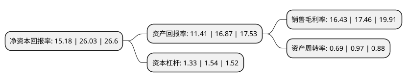

> 本页面由自动化程序生成于 2022年5月20日 01:39
> 内容可能存在错误，如有bug请提交issue至：https://github.com/Eroleice/doc-pi/issues
{.is-warning}

# 上市公司基本情况

## 基本资料

深圳市正弦电气股份有限公司（以下简称“正弦电气”）成立于2003年04月03日，深圳市。于2021年04月29日在上交所科创板上市。

正弦电气注册资本8,600万元，通用变频器，一体化专机，伺服系统等，电机驱动和控制系统解决方案提供商。以下是详细信息：

- 公司名称: 深圳市正弦电气股份有限公司
- 股票代码: 688395.SH
- 所在地: 广东 - 深圳市
- 成立日期: 2003年04月03日
- 注册资本: 8,600万元
- 法定代表人: 涂从欢
- 主营业务: 通用变频器，一体化专机，伺服系统等，电机驱动和控制系统解决方案提供商
- 公司官网: www.sinee.cn
- 公司介绍: 公司主要从事工业自动化控制产品的研发、生产和销售，定位于服务中高端设备制造商，致力于为客户提供优质的工业自动化产品及系统解决方案，自2003年成立以来公司主营业务没有发生变化。公司主要产品包括：通用变频器、专用变频器、一体化专机、伺服系统、电梯驱动控制器、专用电源等交流传动自动化产品，共六大类，数百种规格。

## 股东及高管情况

上市公司第一大股东为涂从欢，持股27,551,280股，占比32.04%，为上市公司实际控制人。

截至2022年03月31日，上市公司的前十大股东中，共有7名自然人股东，2名机构股东，1个产品账户，其中5%以上大股东共有3名。上市公司前十大股东明细如下：

> 截至2022年03月31日，上市公司前十大股东信息如下：

| 股东名称 | 持股数量（股） | 持股比例 |
| --- | --- | --- |
| 涂从欢 | 27,551,280 | 32.04% |
| 张晓光 | 16,795,200 | 19.53% |
| 何畏 | 6,091,120 | 7.08% |
| 深圳市信通力达投资合伙企业(有限合伙) | 2,570,000 | 2.99% |
| 国泰君安证券资管-招商银行-国泰君安君享科创板正弦电气1号战略配售集合资产管理计划 | 2,119,700 | 2.46% |
| 贺有良 | 1,409,220 | 1.64% |
| 黄诗胜 | 1,180,800 | 1.37% |
| 彭守峰 | 1,100,220 | 1.28% |
| 国泰君安证裕投资有限公司 | 975,100 | 1.13% |
| 张耘 | 906,000 | 1.05% |

## 利润表分析

上市公司2021年总收入为4.45亿元，净利润为0.73亿元，实现盈利。

## 杜邦分析

> 数据列示周期：2021年 | 2020年 | 2019年
{.is-info}

上市公司的净资产收益率在近一年有所下降，下降幅度为-41.68%，其变化情况分解如下：
- 上市公司的销售毛利率在近一年下降了-5.9%，可能是生产效率的下降、商品原材料价格上涨或商品价格的下跌所致。
- 上市公司的资产周转率在近一年下降了-28.87%，可能是源自于更慢的销售回款或库存管理效果下降。
- 上市公司的财务杠杆比率在近一年下降了-13.64%，可能是减少负债降低财务费用。

