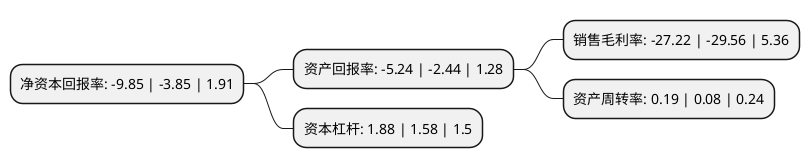

> 本页面由自动化程序生成于 2022年5月20日 01:40
> 内容可能存在错误，如有bug请提交issue至：https://github.com/Eroleice/doc-pi/issues
{.is-warning}

# 上市公司基本情况

## 基本资料

孚能科技(赣州)股份有限公司（以下简称“孚能科技”）成立于2009年12月18日，赣州市。于2020年07月17日在上交所科创板上市。

孚能科技注册资本107,066.969万元，专注于新能源车用锂离子动力电池及整车电池系统的研发，生产和销售，并为新能源汽车整车企业提供动力电池整体解决方案。以下是详细信息：

- 公司名称: 孚能科技(赣州)股份有限公司
- 股票代码: 688567.SH
- 所在地: 江西 - 赣州市
- 成立日期: 2009年12月18日
- 注册资本: 107,066.969万元
- 法定代表人: 王瑀
- 主营业务: 专注于新能源车用锂离子动力电池及整车电池系统的研发，生产和销售，并为新能源汽车整车企业提供动力电池整体解决方案
- 公司官网: www.farasisenergy.com.cn
- 公司介绍: 公司是全球动力电池技术发展的引领者，是新能源汽车动力电池系统整体技术方案的提供商，也是高性能动力电池系统的生产商，一直专注于新能源车用锂离子动力电池及整车电池系统的研发、生产和销售，并为新能源汽车整车企业提供动力电池整体解决方案，目前已成为全球三元软包动力电池的领军企业之一,公司研发团队长期与全球锂离子动力电池行业科研院所、知名企业、顶尖专家展开战略合作，合作单位包括美国阿贡国家实验室、美国伯克利劳伦斯国家实验室、巴斯夫、杜邦、3M公司等，合作专家包括全球最具影响力的锂离子动力电池行业顶尖专家Michael M.Thackeray、Jeff Dahn等。通过整合全球锂离子动力电池领域的创新资源，公司的技术能力始终保持国际领先水平。公司其他客户包括广汽、长城、吉利、一汽、江铃、长安等国内知名整车企业，同时正在拓展大众、奥迪、保时捷、通用、雷诺、日产、本田、奇瑞、东风等国内外一线整车企业客户。

## 股东及高管情况

上市公司第一大股东为Farasis Energy(Asia Pacific)Limited，持股242,874,025股，占比22.68%，**疑似为**上市公司实际控制人。

截至2022年03月31日，上市公司的前十大股东中，共有8名机构股东，1个产品账户，1个海外主体，其中5%以上大股东共有2名。上市公司前十大股东明细如下：

> 未能通过持股比例判定出上市公司实际控制人（持股30%以上）
> 可能存在通过间接持股、联合持股、协议控制等方式拥有实际控制权的主体，具体请参考上市公司定期公告！
{.is-warning}

> 截至2022年03月31日，上市公司前十大股东信息如下：

| 股东名称 | 持股数量（股） | 持股比例 |
| --- | --- | --- |
| Farasis Energy(Asia Pacific)Limited | 242,874,025 | 22.68% |
| 国新风险投资管理(深圳)有限公司-深圳安晏投资合伙企业(有限合伙) | 161,769,650 | 15.11% |
| 东兴资本投资管理有限公司-上杭兴源股权投资合伙企业(有限合伙) | 52,280,487 | 4.88% |
| 重庆江河汇企业管理有限责任公司 | 42,800,000 | 4% |
| 上海宏鹰股权投资基金管理有限公司-兰溪宏鹰新润新能源股权投资合伙企业(有限合伙) | 34,671,888 | 3.24% |
| 戴姆勒大中华区投资有限公司 | 32,120,091 | 3% |
| 江西裕润立达股权投资管理有限公司-江西立达新材料产业创业投资中心(有限合伙) | 20,674,487 | 1.93% |
| 赣州孚创企业管理合伙企业(有限合伙) | 17,130,715 | 1.6% |
| 北京云晖投资管理有限公司-无锡云晖新汽车产业投资管理合伙企业(有限合伙) | 15,826,433 | 1.48% |
| 江西裕润立达股权投资管理有限公司-北京立达高新创业投资中心(有限合伙) | 14,782,444 | 1.38% |

## 利润表分析

上市公司2021年总收入为35亿元，净利润为-9.53亿元，**未实现盈利**。

## 杜邦分析

> 数据列示周期：2021年 | 2020年 | 2019年
{.is-info}

上市公司的净资产收益率在近一年有所上升，上升幅度为155.84%，其变化情况分解如下：
- 上市公司的销售毛利率在近一年下降了-7.92%，可能是生产效率的下降、商品原材料价格上涨或商品价格的下跌所致。
- 上市公司的资产周转率在近一年上升了137.5%，可能是源自于更快的销售回款或库存管理效果提升。
- 上市公司的财务杠杆比率在近一年上升了18.99%，可能是增加负债扩大生产规模。

