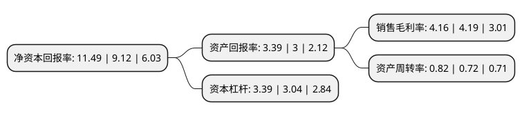

> 本页面由自动化程序生成于 2022年5月20日 01:40
> 内容可能存在错误，如有bug请提交issue至：https://github.com/Eroleice/doc-pi/issues
{.is-warning}

# 上市公司基本情况

## 基本资料

天合光能股份有限公司（以下简称“天合光能”）成立于1997年12月26日，常州市。于2020年06月10日在上交所科创板上市。

天合光能注册资本211,583.982万元，主要业务包括光伏产品，光伏系统，智慧能源三大板块。光伏产品包括单，多晶的硅基光伏组件的研发，生产和销售;光伏系统包括电站业务及系统产品业务;智慧能源包括光伏发电及运维服务，智能微网及多能系统的开发和销售以及能源云平台运营等业务。以下是详细信息：

- 公司名称: 天合光能股份有限公司
- 股票代码: 688599.SH
- 所在地: 江苏 - 常州市
- 成立日期: 1997年12月26日
- 注册资本: 211,583.982万元
- 法定代表人: 高纪凡
- 主营业务: 主要业务包括光伏产品，光伏系统，智慧能源三大板块光伏产品包括单，多晶的硅基光伏组件的研发，生产和销售;光伏系统包括电站业务及系统产品业务;智慧能源包括光伏发电及运维服务，智能微网及多能系统的开发和销售以及能源云平台运营等业务
- 公司官网: www.trinasolar.com
- 公司介绍: 天合光能是行业领先的光伏智慧能源整体解决方案提供商，业务布局包括光伏产品、光伏系统及智慧能源三大板块。公司以光伏科学与技术国家重点实验室和新能源物联网产业创新中心等平台为依托，在核心技术及研发上具有领先优势。光伏组件是公司的主要产品，组件产品的客户主要为国内外光伏电站开发商和承包商以及分布式光伏系统的经销商。公司较早从事光伏产品的研发和生产业务，建立了强大的研发团队，积累了一批具有自主知识产权的核心技术，拥有光伏科学与技术国家重点实验室及国家企业技术中心等创新平台，长期保持行业领先的技术优势。在组件功率及电池片转换效率上18次突破世界记录。公司先后在瑞士苏黎世、美国加州圣何塞、新加坡、日本东京、墨西哥设立了区域总部，并在马德里、米兰、悉尼、北京、上海等地设立了办事处，产品覆盖全球100多个国家和地区。

## 股东及高管情况

上市公司第一大股东为高纪凡，持股351,928,947股，占比16.41%，**疑似为**上市公司实际控制人。

截至2022年03月31日，上市公司的前十大股东中，共有1名自然人股东，8名机构股东，1个产品账户，其中5%以上大股东共有4名。上市公司前十大股东明细如下：

> 未能通过持股比例判定出上市公司实际控制人（持股30%以上）
> 可能存在通过间接持股、联合持股、协议控制等方式拥有实际控制权的主体，具体请参考上市公司定期公告！
{.is-warning}

> 截至2022年03月31日，上市公司前十大股东信息如下：

| 股东名称 | 持股数量（股） | 持股比例 |
| --- | --- | --- |
| 高纪凡 | 351,928,947 | 16.41% |
| 江苏盘基投资有限公司 | 316,408,747 | 14.75% |
| 兴银成长资本管理有限公司 | 280,959,486 | 13.1% |
| 杭州宏禹投资管理有限公司 | 110,782,815 | 5.17% |
| 宁波梅山保税港区晶旻投资有限公司 | 81,013,938 | 3.78% |
| 常州融祺创业投资有限公司 | 45,417,138 | 2.12% |
| 天合星元投资发展有限公司 | 45,340,012 | 2.11% |
| 六安信实资产管理有限公司-当涂信实新兴产业基金(有限合伙) | 43,951,056 | 2.05% |
| 上海兴璟投资管理有限公司 | 36,793,407 | 1.72% |
| 江苏清海投资有限公司 | 35,156,527 | 1.64% |

## 利润表分析

上市公司2021年总收入为444.8亿元，净利润为18.49亿元，实现盈利。

## 杜邦分析

> 数据列示周期：2021年 | 2020年 | 2019年
{.is-info}

上市公司的净资产收益率在近一年有所上升，上升幅度为25.99%，其变化情况分解如下：
- 上市公司的销售毛利率在近一年下降了-0.72%，可能是生产效率的下降、商品原材料价格上涨或商品价格的下跌所致。
- 上市公司的资产周转率在近一年上升了13.89%，可能是源自于更快的销售回款或库存管理效果提升。
- 上市公司的财务杠杆比率在近一年上升了11.51%，可能是增加负债扩大生产规模。

