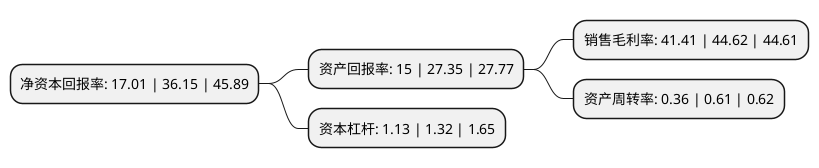

> 本页面由自动化程序生成于 2022年5月20日 01:40
> 内容可能存在错误，如有bug请提交issue至：https://github.com/Eroleice/doc-pi/issues
{.is-warning}

# 上市公司基本情况

## 基本资料

杭州柯林电气股份有限公司（以下简称“杭州柯林”）成立于2002年12月12日，杭州市。于2021年04月12日在上交所科创板上市。

杭州柯林注册资本5,590万元，专业从事电气设备健康状态智能感知与诊断预警装置的研发，生产和销售以下是详细信息：

- 公司名称: 杭州柯林电气股份有限公司
- 股票代码: 688611.SH
- 所在地: 浙江 - 杭州市
- 成立日期: 2002年12月12日
- 注册资本: 5,590万元
- 法定代表人: 谢东
- 主营业务: 专业从事电气设备健康状态智能感知与诊断预警装置的研发，生产和销售
- 公司官网: www.kelinpower.com
- 公司介绍: 公司是一家立足智能电网领域，聚焦电力物联网建设，专业从事电气设备健康状态智能感知与诊断预警装置的研发、生产和销售，并提供电力相关技术服务的高新技术企业,公司自主研发的电气设备智能感知与诊断预警装置，主要由智能传感器及数字化平台两部分构成。其中智能传感器可通过实时、动态、多维度的方式监测电气设备的机械性能、电气性能和热性能等状态量，跟踪各种劣化过程的发展状况，从而获取其运行质量的相关信息，实现电气设备的状态监测；数字化平台则运用算法、模型及评价体系对监测到的状态量进行分析，并做出科学的评估和预测，最终为电气设备的运行维护提供高效、精准的决策方案，实现电气设备的状态智能诊断及科学预警,公司已形成了软、硬件方面优秀的研发设计能力和针对全链路、全电压等级电气设备健康状态感知与诊断预警的应用创新能力，公司产品应用功能丰富、运行质量稳定、诊断结果精准，从而形成良好的品牌与核心竞争力。

## 股东及高管情况

上市公司第一大股东为谢东，持股25,039,438股，占比44.79%，为上市公司实际控制人。

截至2022年03月31日，上市公司的前十大股东中，共有9名自然人股东，1名机构股东，其中5%以上大股东共有2名。上市公司前十大股东明细如下：

> 截至2022年03月31日，上市公司前十大股东信息如下：

| 股东名称 | 持股数量（股） | 持股比例 |
| --- | --- | --- |
| 谢东 | 25,039,438 | 44.79% |
| 杭州广意投资管理合伙企业(有限合伙) | 5,136,294 | 9.19% |
| 毛雪明 | 1,540,888 | 2.76% |
| 谢方 | 1,348,277 | 2.41% |
| 李福星 | 770,444 | 1.38% |
| 刘朝河 | 577,833 | 1.03% |
| 聂明军 | 462,266 | 0.83% |
| 郑宏 | 462,266 | 0.83% |
| 谢炜 | 462,266 | 0.83% |
| 许炳灿 | 462,266 | 0.83% |

## 利润表分析

上市公司2021年总收入为2.43亿元，净利润为1亿元，实现盈利。

## 杜邦分析

> 数据列示周期：2021年 | 2020年 | 2019年
{.is-info}

上市公司的净资产收益率在近一年有所下降，下降幅度为-52.95%，其变化情况分解如下：
- 上市公司的销售毛利率在近一年下降了-7.19%，可能是生产效率的下降、商品原材料价格上涨或商品价格的下跌所致。
- 上市公司的资产周转率在近一年下降了-40.98%，可能是源自于更慢的销售回款或库存管理效果下降。
- 上市公司的财务杠杆比率在近一年下降了-14.39%，可能是减少负债降低财务费用。

