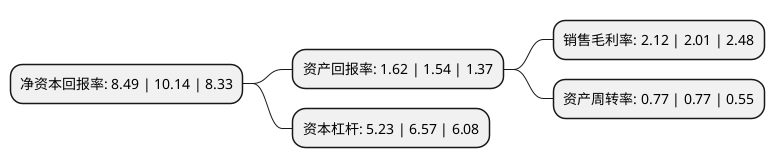

> 本页面由自动化程序生成于 2022年5月20日 01:40
> 内容可能存在错误，如有bug请提交issue至：https://github.com/Eroleice/doc-pi/issues
{.is-warning}

# 上市公司基本情况

## 基本资料

上海电气风电集团股份有限公司（以下简称“电气风电”）成立于2006年09月07日，上海市。于2021年05月19日在上交所科创板上市。

电气风电注册资本133,333.34万元，主营业务为风力发电设备设计，研发，制造和销售以及后市场配套服务。以下是详细信息：

- 公司名称: 上海电气风电集团股份有限公司
- 股票代码: 688660.SH
- 所在地: 上海 - 上海市
- 成立日期: 2006年09月07日
- 注册资本: 133,333.34万元
- 法定代表人: 金孝龙
- 主营业务: 主营业务为风力发电设备设计，研发，制造和销售以及后市场配套服务
- 公司官网: www.sewpg.com
- 公司介绍: 公司是国家清洁能源骨干企业，是中国领先的风电整机制造商与服务商，也是中国最大的海上风电整机制造商与服务商,主营业务为风力发电设备设计、研发、制造和销售以及后市场配套服务,公司以“致力于创造有未来的能源”为使命，推动风电成为重要的未来能源，以“成为全球领先的风电全生命周期服务商”为目标，为用户创造更大的价值。公司已经具备国内领先的风电整机设计与制造能力，产品基本实现了全功率覆盖和全场景覆盖。在陆上产品方面，公司已经成为国内领先的陆上风电整机制造商与服务商；在海上产品方面，公司掌握了先进的海上风电研发、供应链管理、制造和运维能力，推出了针对国内风资源特点的风力发电机组，提高了风电机组的环境适应性和发电收益，树立了国内海上风电整机领域的龙头地位。

## 股东及高管情况

上市公司第一大股东为上海电气集团股份有限公司，持股792,000,000股，占比59.4%，为上市公司实际控制人。

截至2022年03月31日，上市公司的前十大股东中，共有2名自然人股东，3名机构股东，5个产品账户，其中5%以上大股东共有1名。上市公司前十大股东明细如下：

> 截至2022年03月31日，上市公司前十大股东信息如下：

| 股东名称 | 持股数量（股） | 持股比例 |
| --- | --- | --- |
| 上海电气集团股份有限公司 | 792,000,000 | 59.4% |
| 国电投清洁能源基金管理有限公司-国电投创科清洁能源投资(天津)合伙企业(有限合伙) | 64,000,000 | 4.8% |
| 三峡建信(北京)投资基金管理有限公司-深圳市睿远创业投资合伙企业(有限合伙) | 35,200,000 | 2.64% |
| 中保投资有限责任公司-中国保险投资基金(有限合伙) | 34,133,350 | 2.56% |
| 中国银行-易方达稳健收益债券型证券投资基金 | 14,235,156 | 1.07% |
| 上海电气投资有限公司 | 8,000,000 | 0.6% |
| 中信证券投资有限公司 | 6,496,402 | 0.49% |
| 江敏 | 5,686,845 | 0.43% |
| 招商银行股份有限公司-南方科创板3年定期开放混合型证券投资基金 | 4,754,960 | 0.36% |
| 胡雪龙 | 2,287,290 | 0.17% |

## 利润表分析

上市公司2021年总收入为239.72亿元，净利润为5.07亿元，实现盈利。

## 杜邦分析

> 数据列示周期：2021年 | 2020年 | 2019年
{.is-info}

上市公司的净资产收益率在近一年有所下降，下降幅度为-16.27%，其变化情况分解如下：
- 上市公司的销售毛利率在近一年上升了5.47%，可能是生产效率的提升、商品原材料价格下跌或商品价格的上涨所致。
- 上市公司的资产周转率在近一年下降了0%，可能是源自于更慢的销售回款或库存管理效果下降。
- 上市公司的财务杠杆比率在近一年下降了-20.4%，可能是减少负债降低财务费用。

