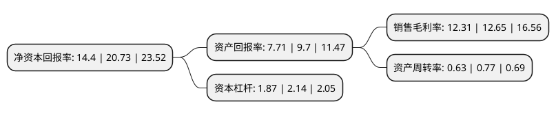

> 本页面由自动化程序生成于 2022年5月20日 01:40
> 内容可能存在错误，如有bug请提交issue至：https://github.com/Eroleice/doc-pi/issues
{.is-warning}

# 上市公司基本情况

## 基本资料

新风光电子科技股份有限公司（以下简称“新风光”）成立于2004年08月10日，济宁市。于2021年04月13日在上交所科创板上市。

新风光注册资本13,995万元，专业从事大功率电力电子节能控制技术及相关产品研发，生产，销售和服务，为客户量身打造调速节能，智能控制，改善电能质量等方面的产品及解决方案。产品包括高压动态无功补偿装置，各类高中低压变频器，轨道交通能量回馈装置，特种电源等。以下是详细信息：

- 公司名称: 新风光电子科技股份有限公司
- 股票代码: 688663.SH
- 所在地: 山东 - 济宁市
- 成立日期: 2004年08月10日
- 注册资本: 13,995万元
- 法定代表人: 何洪臣
- 主营业务: 专业从事大功率电力电子节能控制技术及相关产品研发，生产，销售和服务，为客户量身打造调速节能，智能控制，改善电能质量等方面的产品及解决方案产品包括高压动态无功补偿装置，各类高中低压变频器，轨道交通能量回馈装置，特种电源等
- 公司官网: www.fengguang.com
- 公司介绍: 公司自2004年成立以来，始终坚持以大功率电力电子节能控制技术为核心技术平台构筑电气控制装备产品体系，凭借雄厚的技术实力、先进的生产工艺、显著的成本优势及高素质的管理团队取得了快速发展。目前，公司高压动态无功补偿装置与高压变频器产品市场份额均在国内排名前列，在国内电能质量治理与高压节能领域树立了知名品牌形象。公司是变频调速器国家标准起草审定单位，参与了《调速电气传动系统》、《火电厂风机水泵用高压变频器》和《1kV及以上不超过35kV的通用变频调速设备》等标准的起草，作为第二执笔单位参与了SVG的团体标准《中压链式静止无功发生器》，牵头制定了轨道交通的国家标准《城市轨道交通再生制动能量吸收逆变装置》。

## 股东及高管情况

上市公司第一大股东为兖矿东华集团有限公司，持股53,529,600股，占比38.2491%，为上市公司实际控制人。

截至2022年05月19日，上市公司的前十大股东中，共有1名自然人股东，9名机构股东，其中5%以上大股东共有6名。上市公司前十大股东明细如下：

> 截至2022年05月19日，上市公司前十大股东信息如下：

| 股东名称 | 持股数量（股） | 持股比例 |
| --- | --- | --- |
| 兖矿东华集团有限公司 | 53,529,600 | 38.2491% |
| 兖矿东华集团有限公司 | 53,529,600 | 38.25% |
| 山东省高新技术创业投资有限公司 | 8,886,580 | 6.3498% |
| 何洪臣 | 8,884,416 | 6.3483% |
| 汶上开元控股集团有限公司 | 7,740,275 | 5.5307% |
| 汶上开元控股集团有限公司 | 7,740,275 | 5.53% |
| 福建平潭利恒投资有限公司 | 5,186,176 | 3.71% |
| 济宁英飞尼迪创业投资中心(有限合伙) | 1,928,640 | 1.38% |
| 济宁博创财务管理咨询合伙企业(有限合伙) | 1,804,800 | 1.29% |
| 中泰创业投资(深圳)有限公司 | 1,749,500 | 1.25% |

## 利润表分析

上市公司2021年总收入为9.42亿元，净利润为1.16亿元，实现盈利。

## 杜邦分析

> 数据列示周期：2021年 | 2020年 | 2019年
{.is-info}

上市公司的净资产收益率在近一年有所下降，下降幅度为-30.54%，其变化情况分解如下：
- 上市公司的销售毛利率在近一年下降了-2.69%，可能是生产效率的下降、商品原材料价格上涨或商品价格的下跌所致。
- 上市公司的资产周转率在近一年下降了-18.18%，可能是源自于更慢的销售回款或库存管理效果下降。
- 上市公司的财务杠杆比率在近一年下降了-12.62%，可能是减少负债降低财务费用。

