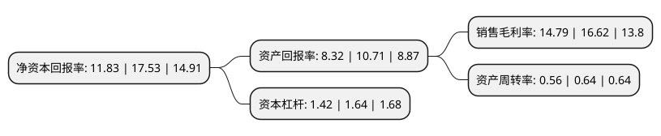

> 本页面由自动化程序生成于 2022年5月20日 01:40
> 内容可能存在错误，如有bug请提交issue至：https://github.com/Eroleice/doc-pi/issues
{.is-warning}

# 上市公司基本情况

## 基本资料

山东科汇电力自动化股份有限公司（以下简称“科汇股份”）成立于1993年10月15日，淄博市。于2021年06月16日在上交所科创板上市。

科汇股份注册资本10,467万元，致力于电气自动化新技术，工业物联网技术的研发与产业化。以下是详细信息：

- 公司名称: 山东科汇电力自动化股份有限公司
- 股票代码: 688681.SH
- 所在地: 山东 - 淄博市
- 成立日期: 1993年10月15日
- 注册资本: 10,467万元
- 法定代表人: 徐丙垠
- 主营业务: 致力于电气自动化新技术，工业物联网技术的研发与产业化
- 公司官网: www.kehui.cn
- 公司介绍: 公司是国内外为数不多的能够提供输电线路、配电线路、电力电缆故障监测、检测与定位完整解决方案的厂家，具有较高的行业知名度。公司致力于电气自动化新技术、工业物联网技术的研发与产业化，在电力故障监测与保护控制领域形成了鲜明特征和技术优势，公司主营产品分为智能电网故障监测与自动化、开关磁阻电机驱动系统等两大板块。其中，智能电网故障监测与自动化产品主要包括输电线路故障行波测距产品、电力系统同步时钟、配电网自动化产品、电力电缆故障探测与定位装置等四类产品，具有感知与控制、通信网络、平台服务等物联网层次与特征，主要服务于电力行业、铁路系统；开关磁阻电机驱动系统为开关磁阻电机与驱动系统的结合，服务于纺织、锻压、煤矿、石油石化等多个行业，公司通过开发、应用监测、通信等系统模块，进一步形成工业互联网解决方案。公司先后承担了国家863计划重大专项子课题、国家重点新产品计划、国家级火炬计划、科技部国际合作项目、国家科技型中小企业技术创新基金、省自主创新成果转化重大专项与自主创新工程等科技计划项目。

## 股东及高管情况

上市公司第一大股东为山东科汇投资股份有限公司，持股28,323,315股，占比27.06%，**疑似为**上市公司实际控制人。

截至2022年03月31日，上市公司的前十大股东中，共有3名自然人股东，5名机构股东，2个产品账户，其中5%以上大股东共有3名。上市公司前十大股东明细如下：

> 未能通过持股比例判定出上市公司实际控制人（持股30%以上）
> 可能存在通过间接持股、联合持股、协议控制等方式拥有实际控制权的主体，具体请参考上市公司定期公告！
{.is-warning}

> 截至2022年03月31日，上市公司前十大股东信息如下：

| 股东名称 | 持股数量（股） | 持股比例 |
| --- | --- | --- |
| 山东科汇投资股份有限公司 | 28,323,315 | 27.06% |
| 徐丙垠 | 9,355,000 | 8.94% |
| 山东省高新技术创业投资有限公司 | 5,780,459 | 5.52% |
| 深圳市华信睿诚创业投资中心(有限合伙) | 4,130,000 | 3.95% |
| 淄博市高新技术创业投资有限公司 | 2,780,300 | 2.66% |
| 云南华信润城生物医药产业创业投资基金合伙企业(有限合伙) | 2,650,000 | 2.53% |
| 国海证券-南京银行-国海证券科汇股份员工参与科创板战略配售集合资产管理计划 | 2,408,278 | 2.3% |
| 樊五洲 | 2,220,180 | 2.12% |
| 于晓红 | 2,011,000 | 1.92% |
| 烟台源创现代服务业创业投资合伙企业(有限合伙) | 1,590,000 | 1.52% |

## 利润表分析

上市公司2021年总收入为3.69亿元，净利润为0.54亿元，实现盈利。

## 杜邦分析

> 数据列示周期：2021年 | 2020年 | 2019年
{.is-info}

上市公司的净资产收益率在近一年有所下降，下降幅度为-32.52%，其变化情况分解如下：
- 上市公司的销售毛利率在近一年下降了-11.01%，可能是生产效率的下降、商品原材料价格上涨或商品价格的下跌所致。
- 上市公司的资产周转率在近一年下降了-12.5%，可能是源自于更慢的销售回款或库存管理效果下降。
- 上市公司的财务杠杆比率在近一年下降了-13.41%，可能是减少负债降低财务费用。

