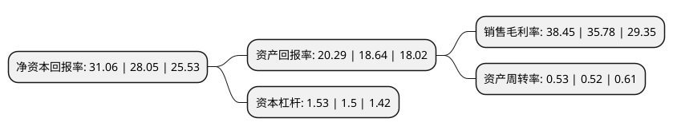

> 本页面由自动化程序生成于 2022年5月20日 01:02
> 内容可能存在错误，如有bug请提交issue至：https://github.com/Eroleice/doc-pi/issues
{.is-warning}

# 上市公司基本情况

## 基本资料

泸州老窖股份有限公司（以下简称“泸州老窖”）成立于1995年05月03日，泸州市。于1994年05月09日在深交所主板上市。

泸州老窖注册资本147,161.508万元，主要产品:“泸州老窖”系列酒。以下是详细信息：

- 公司名称: 泸州老窖股份有限公司
- 股票代码: 000568.SZ
- 所在地: 四川 - 泸州市
- 成立日期: 1995年05月03日
- 注册资本: 147,161.508万元
- 法定代表人: 刘淼
- 主营业务: 主要产品:“泸州老窖”系列酒
- 公司官网: www.lzlj.com
- 公司介绍: 公司是具有400多年酿酒历史的国有控股上市公司。公司以专业化白酒产品设计、生产、销售为主要经营模式，主营“国窖1573”、“泸州老窖”等系列白酒的研发、生产和销售，主要综合指标位于白酒行业前列。公司实施“双品牌塑造，多品牌运作”的品牌战略，构建起五大战略单品的金字塔品牌结构：国窖1573定位为中国白酒超高端品牌是塔尖，百年泸州老窖窖龄酒、泸州老窖特曲定位为商务与宴会用酒第一品牌组成塔柱，泸州老窖头曲和二曲为大众市场覆盖的第一品牌构筑塔基，并积极拓展养生酒产品和预调酒产品，开展以消费者需求为主导的定制酒业务。公司坚持以“全心全意酿酒、一心一意奉献”为宗旨，敬人敬业，创新卓越，努力实现市场占有领先、公司治理领先、品牌文化领先、质量技术领先、人才资源领先，酿造世界最好的白酒，为客户提供最优质的服务，把泸州老窖建成全球酒类市场中的航空母舰，形成融入经济全球化的大型现代企业，追求“在中国灿烂名酒文化熏陶中，全人类共享幸福美满的生活”。

## 股东及高管情况

上市公司第一大股东为泸州老窖集团有限责任公司，持股381,088,389股，占比25.9%，**疑似为**上市公司实际控制人。

截至2022年03月31日，上市公司的前十大股东中，共有4名机构股东，5个产品账户，1个海外主体，其中5%以上大股东共有2名。上市公司前十大股东明细如下：

> 未能通过持股比例判定出上市公司实际控制人（持股30%以上）
> 可能存在通过间接持股、联合持股、协议控制等方式拥有实际控制权的主体，具体请参考上市公司定期公告！
{.is-warning}

> 截至2022年03月31日，上市公司前十大股东信息如下：

| 股东名称 | 持股数量（股） | 持股比例 |
| --- | --- | --- |
| 泸州老窖集团有限责任公司 | 381,088,389 | 25.9% |
| 泸州市兴泸投资集团有限公司 | 365,971,142 | 24.87% |
| 中国银行股份有限公司-招商中证白酒指数分级证券投资基金 | 53,818,210 | 3.66% |
| 香港中央结算有限公司(陆股通) | 36,135,009 | 2.46% |
| 中国证券金融股份有限公司 | 33,842,059 | 2.3% |
| 中国银行股份有限公司-易方达蓝筹精选混合型证券投资基金 | 27,000,000 | 1.83% |
| 中国工商银行股份有限公司-景顺长城新兴成长混合型证券投资基金 | 19,200,000 | 1.3% |
| 中央汇金资产管理有限责任公司 | 13,539,862 | 0.92% |
| 中国农业银行股份有限公司-易方达消费行业股票型证券投资基金 | 10,573,293 | 0.72% |
| 中国银行股份有限公司-景顺长城鼎益混合型证券投资基金(LOF) | 8,000,000 | 0.54% |

## 利润表分析

上市公司2021年总收入为206.42亿元，净利润为79.37亿元，实现盈利。

## 杜邦分析

> 数据列示周期：2021年 | 2020年 | 2019年
{.is-info}

上市公司的净资产收益率在近一年有所上升，上升幅度为10.73%，其变化情况分解如下：
- 上市公司的销售毛利率在近一年上升了7.46%，可能是生产效率的提升、商品原材料价格下跌或商品价格的上涨所致。
- 上市公司的资产周转率在近一年上升了1.92%，可能是源自于更快的销售回款或库存管理效果提升。
- 上市公司的财务杠杆比率在近一年上升了2%，可能是增加负债扩大生产规模。

