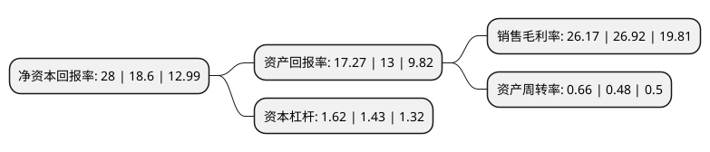

> 本页面由自动化程序生成于 2022年5月20日 01:03
> 内容可能存在错误，如有bug请提交issue至：https://github.com/Eroleice/doc-pi/issues
{.is-warning}

# 上市公司基本情况

## 基本资料

酒鬼酒股份有限公司（以下简称“酒鬼酒”）成立于1997年07月14日，湘西土家族苗族自治州。于1997年07月18日在深交所主板上市。

酒鬼酒注册资本32,492.898万元，主要产品:酒鬼酒。以下是详细信息：

- 公司名称: 酒鬼酒股份有限公司
- 股票代码: 000799.SZ
- 所在地: 湖南 - 湘西土家族苗族自治州
- 成立日期: 1997年07月14日
- 注册资本: 32,492.898万元
- 法定代表人: 王浩
- 主营业务: 主要产品:酒鬼酒
- 公司官网: www.jiuguijiu000799.com
- 公司介绍: 公司是中国白酒行业中文化营销的开创者、文化酒的引领者、洞藏文化酒的首创者、馥郁香型工艺白酒的独创者，公司主营业务为生产、销售洞藏酒、内参酒、酒鬼酒、湘泉酒等系列白酒产品。产品畅销全国30多个省、市、自治区，并远销美国、日本、俄罗斯、韩国、东南亚及港澳台等20多个国家和地区。公司系列产品依托“地理环境的独有性、民族文化的独特性、包装设计的独创性、酿酒工艺的唯一性、馥郁香型的和谐性、洞藏资源的稀缺性”六大优势资源，成就了“洞藏”、“内参”、“酒鬼”、“湘泉”四大品系，是中国馥郁香型白酒第一品牌，其“浓、清、酱”三香和谐共生，具备“颜色的透明感、香气的优雅感、口味的净爽感、风格的自然感”四大高端白酒品质，色、香、味、格具佳。其中“酒鬼”、“湘泉”是中国“驰名商标”，酒鬼酒是“中国地理标志产品”。

## 股东及高管情况

上市公司第一大股东为中皇有限公司，持股100,727,291股，占比31%，为上市公司实际控制人。

截至2022年03月31日，上市公司的前十大股东中，共有1名自然人股东，1名机构股东，7个产品账户，1个海外主体，其中5%以上大股东共有1名。上市公司前十大股东明细如下：

> 截至2022年03月31日，上市公司前十大股东信息如下：

| 股东名称 | 持股数量（股） | 持股比例 |
| --- | --- | --- |
| 中皇有限公司 | 100,727,291 | 31% |
| 中国银行股份有限公司-招商中证白酒指数分级证券投资基金 | 15,439,189 | 4.75% |
| 中国建设银行股份有限公司-银华富裕主题混合型证券投资基金 | 8,400,251 | 2.59% |
| 香港中央结算有限公司(陆股通) | 7,552,831 | 2.32% |
| 交通银行股份有限公司-汇添富中盘价值精选混合型证券投资基金 | 5,000,072 | 1.54% |
| 中国建设银行股份有限公司-汇添富消费行业混合型证券投资基金 | 3,600,000 | 1.11% |
| 张寿清 | 2,050,000 | 0.63% |
| 招商银行股份有限公司-东方红睿泽三年定期开放灵活配置混合型证券投资基金 | 1,751,512 | 0.54% |
| 中信银行股份有限公司-交银施罗德品质增长一年持有期混合型证券投资基金 | 1,729,311 | 0.53% |
| 中国建设银行股份有限公司-鹏华中证酒交易型开放式指数证券投资基金 | 1,703,155 | 0.52% |

## 利润表分析

上市公司2021年总收入为34.14亿元，净利润为8.93亿元，实现盈利。

## 杜邦分析

> 数据列示周期：2021年 | 2020年 | 2019年
{.is-info}

上市公司的净资产收益率在近一年有所上升，上升幅度为50.54%，其变化情况分解如下：
- 上市公司的销售毛利率在近一年下降了-2.79%，可能是生产效率的下降、商品原材料价格上涨或商品价格的下跌所致。
- 上市公司的资产周转率在近一年上升了37.5%，可能是源自于更快的销售回款或库存管理效果提升。
- 上市公司的财务杠杆比率在近一年上升了13.29%，可能是增加负债扩大生产规模。

