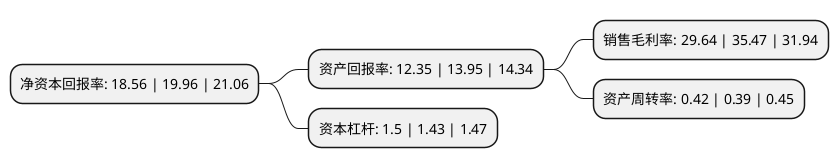

> 本页面由自动化程序生成于 2022年5月20日 01:07
> 内容可能存在错误，如有bug请提交issue至：https://github.com/Eroleice/doc-pi/issues
{.is-warning}

# 上市公司基本情况

## 基本资料

江苏洋河酒厂股份有限公司（以下简称“洋河股份”）成立于2002年12月27日，宿迁市。于2009年11月06日在深交所中小板上市。

洋河股份注册资本150,698.8万元，主营业务:洋河蓝色经典，洋河大曲，敦煌古酿等系列品牌浓香型白酒的生产，加工和销售以下是详细信息：

- 公司名称: 江苏洋河酒厂股份有限公司
- 股票代码: 002304.SZ
- 所在地: 江苏 - 宿迁市
- 成立日期: 2002年12月27日
- 注册资本: 150,698.8万元
- 法定代表人: 张联东
- 主营业务: 主营业务:洋河蓝色经典，洋河大曲，敦煌古酿等系列品牌浓香型白酒的生产，加工和销售
- 公司官网: www.chinayanghe.com
- 公司介绍: 公司是国有大型酿酒企业，公司主导产品洋河大曲已有500多年的历史，早在明清时代就享有盛名。洋河大曲属浓香型大曲酒，以优质高粱为原料，以小麦、大麦、豌豆制成的高温火曲为发酵剂，辅以闻名遐迩的美人泉水精工酿制而成，形成了“甜、绵、软、净、香”的独特风格，被专家和广大消费者誉为浓香型大曲酒的正宗代表。“洋河”商标被国家工商总局评定为“中国驰名商标”，产品获“江苏省重点名牌产品”。全力打造的“绵柔型”白酒经典之作洋河蓝色经典，面市以来销售增长迅猛，“蓝色风暴”愈刮愈猛，“蓝色魅力”已征服了越来越多的白酒消费者，并已成为竞争激烈的白酒市场中颇受关注的成功营销范例。

## 股东及高管情况

上市公司第一大股东为江苏洋河集团有限公司，持股514,858,939股，占比34.16%，为上市公司实际控制人。

截至2022年03月31日，上市公司的前十大股东中，共有5名机构股东，4个产品账户，1个海外主体，其中5%以上大股东共有3名。上市公司前十大股东明细如下：

> 截至2022年03月31日，上市公司前十大股东信息如下：

| 股东名称 | 持股数量（股） | 持股比例 |
| --- | --- | --- |
| 江苏洋河集团有限公司 | 514,858,939 | 34.16% |
| 江苏蓝色同盟股份有限公司 | 264,991,926 | 17.58% |
| 上海海烟物流发展有限公司 | 145,708,137 | 9.67% |
| 上海捷强烟草糖酒(集团)有限公司 | 59,744,099 | 3.96% |
| 中国银行股份有限公司-招商中证白酒指数分级证券投资基金 | 58,808,247 | 3.9% |
| 中国银行股份有限公司-易方达蓝筹精选混合型证券投资基金 | 36,300,000 | 2.41% |
| 香港中央结算有限公司(陆股通) | 33,980,577 | 2.25% |
| 中国证券金融股份有限公司 | 13,790,044 | 0.92% |
| 中国农业银行股份有限公司-易方达消费行业股票型证券投资基金 | 11,783,167 | 0.78% |
| 中国银行股份有限公司-易方达优质精选混合型证券投资基金 | 10,000,070 | 0.66% |

## 利润表分析

上市公司2021年总收入为253.5亿元，净利润为75.12亿元，实现盈利。

## 杜邦分析

> 数据列示周期：2021年 | 2020年 | 2019年
{.is-info}

上市公司的净资产收益率在近一年有所下降，下降幅度为-7.01%，其变化情况分解如下：
- 上市公司的销售毛利率在近一年下降了-16.44%，可能是生产效率的下降、商品原材料价格上涨或商品价格的下跌所致。
- 上市公司的资产周转率在近一年上升了7.69%，可能是源自于更快的销售回款或库存管理效果提升。
- 上市公司的财务杠杆比率在近一年上升了4.9%，可能是增加负债扩大生产规模。

