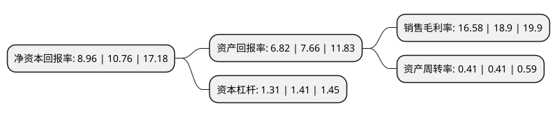

> 本页面由自动化程序生成于 2022年5月20日 01:25
> 内容可能存在错误，如有bug请提交issue至：https://github.com/Eroleice/doc-pi/issues
{.is-warning}

# 上市公司基本情况

## 基本资料

新疆伊力特实业股份有限公司（以下简称“伊力特”）成立于1999年05月27日，可克达拉市。于1999年09月16日在上交所主板上市。

伊力特注册资本47,194.963万元，主要产品:白酒，纸箱，运输，酒店，水，电，汽。以下是详细信息：

- 公司名称: 新疆伊力特实业股份有限公司
- 股票代码: 600197.SH
- 所在地: 新疆 - 可克达拉市
- 成立日期: 1999年05月27日
- 注册资本: 47,194.963万元
- 法定代表人: 陈智
- 主营业务: 主要产品:白酒，纸箱，运输，酒店，水，电，汽
- 公司官网: www.xjyilite.com
- 公司介绍: 公司是以“伊力”牌系列白酒生产、销售为主要产业，产业延伸至食品加工、野生果综合加工、印务制品、玻璃制品、铁路物流、煤化工、宾馆服务等，发展为多元发展的跨行业企业集团。“伊力”牌系列白酒是用天山雪水、伊犁河谷优质高粱、小麦、大米、玉米和豌豆五种粮食为原料，经陈年老窖发酵，长年陈酿,精心勾兑而成。它以“香气悠久、味醇厚、入口甘美、入喉净爽、诸味谐调、酒味全面”的独特风格闻名疆内外，被誉为“新疆第一酒”。公司经过近半个世纪的发展，成为中国白酒工业百强企业，中国白酒工业经济效益十佳企业。未来，白酒主业仍然是公司的重中之重，公司将继续重视主业的发展，进一步发挥主业优势，做精做强，巩固主业地位，培养和壮大核心竞争能力，稳定具有相当竞争优势的主营业务，扩展市场占有率以求规模效益最大化，把增强企业的核心竞争能力作为第一目标，并视为企业的生命。

## 股东及高管情况

上市公司第一大股东为新疆伊力特集团有限公司，持股197,363,477股，占比41.82%，为上市公司实际控制人。

截至2022年03月31日，上市公司的前十大股东中，共有2名自然人股东，2名机构股东，6个产品账户，其中5%以上大股东共有1名。上市公司前十大股东明细如下：

> 截至2022年03月31日，上市公司前十大股东信息如下：

| 股东名称 | 持股数量（股） | 持股比例 |
| --- | --- | --- |
| 新疆伊力特集团有限公司 | 197,363,477 | 41.82% |
| 中国银行股份有限公司-招商中证白酒指数分级证券投资基金 | 22,416,048 | 4.75% |
| 深圳前海无为资本管理有限公司-无为价值精选私募证券投资基金 | 4,000,078 | 0.85% |
| 全国社保基金一一六组合 | 3,958,955 | 0.84% |
| 傅瑞长 | 3,883,439 | 0.82% |
| 中国工商银行股份有限公司-海富通改革驱动灵活配置混合型证券投资基金 | 2,573,300 | 0.55% |
| 伊犁糖烟酒有限责任公司 | 2,060,200 | 0.44% |
| 中国工商银行股份有限公司-信达澳银优势价值混合型证券投资基金 | 2,015,097 | 0.43% |
| 陈波 | 1,902,658 | 0.4% |
| 中国建设银行股份有限公司-鹏华中证酒交易型开放式指数证券投资基金 | 1,873,759 | 0.4% |

## 利润表分析

上市公司2021年总收入为19.37亿元，净利润为3.21亿元，实现盈利。

## 杜邦分析

> 数据列示周期：2021年 | 2020年 | 2019年
{.is-info}

上市公司的净资产收益率在近一年有所下降，下降幅度为-16.73%，其变化情况分解如下：
- 上市公司的销售毛利率在近一年下降了-12.28%，可能是生产效率的下降、商品原材料价格上涨或商品价格的下跌所致。
- 上市公司的资产周转率在近一年下降了0%，可能是源自于更慢的销售回款或库存管理效果下降。
- 上市公司的财务杠杆比率在近一年下降了-7.09%，可能是减少负债降低财务费用。

