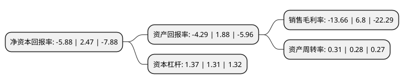

> 本页面由自动化程序生成于 2022年5月20日 01:25
> 内容可能存在错误，如有bug请提交issue至：https://github.com/Eroleice/doc-pi/issues
{.is-warning}

# 上市公司基本情况

## 基本资料

安徽金种子酒业股份有限公司（以下简称“金种子酒”）成立于1998年07月23日，阜阳市。于1998年08月12日在上交所主板上市。

金种子酒注册资本65,779.682万元，主营业务:白酒生产与销售以下是详细信息：

- 公司名称: 安徽金种子酒业股份有限公司
- 股票代码: 600199.SH
- 所在地: 安徽 - 阜阳市
- 成立日期: 1998年07月23日
- 注册资本: 65,779.682万元
- 法定代表人: 贾光明
- 主营业务: 主营业务:白酒生产与销售
- 公司官网: www.jzz.cn
- 公司介绍: 公司坚持打造中国大众名酒实力品牌，现有“金种子”、“醉三秋”两个中国驰名商标、一个“中华老字号”产品——颍州佳酿，徽蕴金种子酒荣获“中国名酒典型酒”，“种子”牌白酒荣获“苏浙皖赣沪名牌产品50佳”，“金种子”、“种子”、“醉三秋”、“颍州”等四大品牌系列白酒，荣获国家地理标志保护产品，柔和种子酒等七款产品被中国绿色食品发展中心认定为绿色产品。和泰品牌底蕴深厚，传承了中国传统文化。金种子酿酒古窖池被安徽省人民政府批准为省级重点文物保护单位，醉三秋传统酿造技艺被列入省级非物质文化遗产名录。金种子坚持科技创新，开创中国柔和型白酒，是柔和型白酒官方标准的起草单位。

## 股东及高管情况

上市公司第一大股东为安徽金种子集团有限公司，持股178,257,084股，占比27.1%，**疑似为**上市公司实际控制人。

截至2022年03月31日，上市公司的前十大股东中，共有4名自然人股东，1名机构股东，4个产品账户，1个海外主体，其中5%以上大股东共有2名。上市公司前十大股东明细如下：

> 未能通过持股比例判定出上市公司实际控制人（持股30%以上）
> 可能存在通过间接持股、联合持股、协议控制等方式拥有实际控制权的主体，具体请参考上市公司定期公告！
{.is-warning}

> 截至2022年03月31日，上市公司前十大股东信息如下：

| 股东名称 | 持股数量（股） | 持股比例 |
| --- | --- | --- |
| 安徽金种子集团有限公司 | 178,257,084 | 27.1% |
| 新华基金-工商银行-新华基金-金种子1号资产管理计划 | 33,628,318 | 5.11% |
| 中国银行股份有限公司-招商中证白酒指数分级证券投资基金 | 27,173,700 | 4.13% |
| 新华基金-工商银行-新华基金-金种子2号资产管理计划 | 17,699,115 | 2.69% |
| MORGAN STANLEY & CO. INTERNATIONAL PLC. | 7,226,303 | 1.1% |
| 付小铜 | 5,525,056 | 0.84% |
| 中国建设银行股份有限公司-鹏华中证酒交易型开放式指数证券投资基金 | 2,722,502 | 0.41% |
| 吉宁 | 2,550,000 | 0.39% |
| 林文龙 | 2,506,300 | 0.38% |
| 肖鸣 | 2,310,074 | 0.35% |

## 利润表分析

上市公司2021年总收入为12.11亿元，净利润为-1.66亿元，**未实现盈利**。

## 杜邦分析

> 数据列示周期：2021年 | 2020年 | 2019年
{.is-info}

上市公司的净资产收益率在近一年有所下降，下降幅度为-338.06%，其变化情况分解如下：
- 上市公司的销售毛利率在近一年下降了-300.88%，可能是生产效率的下降、商品原材料价格上涨或商品价格的下跌所致。
- 上市公司的资产周转率在近一年上升了10.71%，可能是源自于更快的销售回款或库存管理效果提升。
- 上市公司的财务杠杆比率在近一年上升了4.58%，可能是增加负债扩大生产规模。

