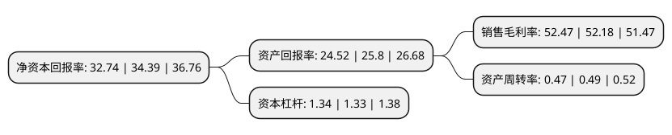

> 本页面由自动化程序生成于 2022年5月20日 01:27
> 内容可能存在错误，如有bug请提交issue至：https://github.com/Eroleice/doc-pi/issues
{.is-warning}

# 上市公司基本情况

## 基本资料

贵州茅台酒股份有限公司（以下简称“贵州茅台”）成立于1999年11月20日，遵义市。于2001年08月27日在上交所主板上市。

贵州茅台注册资本125,619.78万元，主要产品:高度茅台酒(含陈年茅台酒)，低度茅台酒。以下是详细信息：

- 公司名称: 贵州茅台酒股份有限公司
- 股票代码: 600519.SH
- 所在地: 贵州 - 遵义市
- 成立日期: 1999年11月20日
- 注册资本: 125,619.78万元
- 法定代表人: 丁雄军
- 主营业务: 主要产品:高度茅台酒(含陈年茅台酒)，低度茅台酒
- 公司官网: www.moutaichina.com
- 公司介绍: 公司是国内白酒行业的标志性企业，主要生产销售世界三大名酒之一的茅台酒，同时进行饮料、食品、包装材料的生产和销售，防伪技术开发，信息产业相关产品的研制开发。茅台酒历史悠久，源远流长，是酱香型白酒的典型代表，享有“国酒”的美称。目前，公司茅台酒年生产量已突破一万吨，43°、38°、33°茅台酒拓展了茅台酒家族低度酒的发展空间，茅台王子酒、茅台迎宾酒满足了中低档消费者的需求，15年、30年、50年、80年陈年茅台酒填补了我国极品酒、年份酒、陈年老窖的空白，在国内独创年代梯级式的产品开发模式。公司产品形成了低度、高中低档、极品三大系列70多个规格品种，全方位跻身市场，从而占据了白酒市场制高点，称雄于中国极品酒市场。

## 股东及高管情况

上市公司第一大股东为中国贵州茅台酒厂(集团)有限责任公司，持股678,291,955股，占比54%，为上市公司实际控制人。

截至2022年03月31日，上市公司的前十大股东中，共有5名机构股东，4个产品账户，1个海外主体，其中5%以上大股东共有2名。上市公司前十大股东明细如下：

> 截至2022年03月31日，上市公司前十大股东信息如下：

| 股东名称 | 持股数量（股） | 持股比例 |
| --- | --- | --- |
| 中国贵州茅台酒厂(集团)有限责任公司 | 678,291,955 | 54% |
| 香港中央结算有限公司(陆股通) | 82,059,392 | 6.53% |
| 贵州省国有资本运营有限责任公司 | 56,996,777 | 4.54% |
| 贵州茅台酒厂(集团)技术开发有限公司 | 27,812,088 | 2.21% |
| 中央汇金资产管理有限责任公司 | 10,397,104 | 0.83% |
| 中国证券金融股份有限公司 | 8,039,447 | 0.64% |
| 中国银行股份有限公司-招商中证白酒指数分级证券投资基金 | 6,722,145 | 0.54% |
| 深圳市金汇荣盛财富管理有限公司-金汇荣盛三号私募证券投资基金 | 5,929,350 | 0.47% |
| 珠海市瑞丰汇邦资产管理有限公司-瑞丰汇邦三号私募证券投资基金 | 5,677,417 | 0.45% |
| 中国工商银行-上证50交易型开放式指数证券投资基金 | 4,492,622 | 0.36% |

## 利润表分析

上市公司2021年总收入为1,094.64亿元，净利润为557.2亿元，实现盈利。

## 杜邦分析

> 数据列示周期：2021年 | 2020年 | 2019年
{.is-info}

上市公司的净资产收益率在近一年有所下降，下降幅度为-4.8%，其变化情况分解如下：
- 上市公司的销售毛利率在近一年上升了0.56%，可能是生产效率的提升、商品原材料价格下跌或商品价格的上涨所致。
- 上市公司的资产周转率在近一年下降了-4.08%，可能是源自于更慢的销售回款或库存管理效果下降。
- 上市公司的财务杠杆比率在近一年上升了0.75%，可能是增加负债扩大生产规模。

