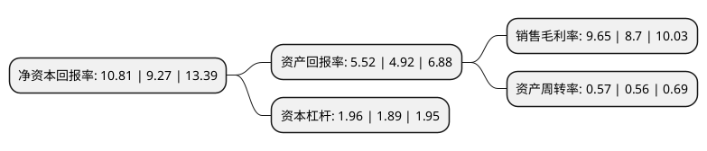

> 本页面由自动化程序生成于 2022年5月20日 01:27
> 内容可能存在错误，如有bug请提交issue至：https://github.com/Eroleice/doc-pi/issues
{.is-warning}

# 上市公司基本情况

## 基本资料

河北衡水老白干酒业股份有限公司（以下简称“老白干酒”）成立于1999年12月30日，衡水市。于2002年10月29日在上交所主板上市。

老白干酒注册资本89,728.744万元，主要产品:白酒，商品猪，种猪，饲料。以下是详细信息：

- 公司名称: 河北衡水老白干酒业股份有限公司
- 股票代码: 600559.SH
- 所在地: 河北 - 衡水市
- 成立日期: 1999年12月30日
- 注册资本: 89,728.744万元
- 法定代表人: 刘彦龙
- 主营业务: 主要产品:白酒，商品猪，种猪，饲料
- 公司官网: www.hengshuilaobaigan.net
- 公司介绍: 公司是一家主营白酒的企业，主导产业是衡水老白干酒的生产和销售、商品猪及种猪的饲养及销售，饲料的生产与销售。公司的前身衡水老白干酒厂，其主导产品衡水老白干酒有着1800多年的酿造历史。公司曾获“AAA级标准化良好行为企业”称号，衡水老白干酒的酿造技艺曾被文化部认定为“非物质文化遗产”，曾荣获上海世博会“千年金奖”。2018年公司通过重大资产重组收购丰联酒业100%股权，进一步夯实其在河北省内白酒市场的龙头地位，产品香型、产品结构、销售渠道和模式将更加多元化，实现经营规模的外延式扩张。

## 股东及高管情况

上市公司第一大股东为河北衡水老白干酿酒(集团)有限公司，持股229,964,032股，占比25.63%，**疑似为**上市公司实际控制人。

截至2022年03月31日，上市公司的前十大股东中，共有2名机构股东，7个产品账户，1个海外主体，其中5%以上大股东共有1名。上市公司前十大股东明细如下：

> 未能通过持股比例判定出上市公司实际控制人（持股30%以上）
> 可能存在通过间接持股、联合持股、协议控制等方式拥有实际控制权的主体，具体请参考上市公司定期公告！
{.is-warning}

> 截至2022年03月31日，上市公司前十大股东信息如下：

| 股东名称 | 持股数量（股） | 持股比例 |
| --- | --- | --- |
| 河北衡水老白干酿酒(集团)有限公司 | 229,964,032 | 25.63% |
| 中国银行股份有限公司-招商中证白酒指数分级证券投资基金 | 43,177,192 | 4.81% |
| 华安基金-江苏银行-华安基金-大消费精选集合资产管理计划 | 10,628,617 | 1.18% |
| 交通银行股份有限公司-汇添富中盘价值精选混合型证券投资基金 | 9,000,000 | 1% |
| 中国工商银行股份有限公司-华安安信消费服务混合型证券投资基金 | 8,157,100 | 0.91% |
| 华安基金-上海银行-华安基金-新纪元2号集合资产管理计划 | 7,259,039 | 0.81% |
| 香港中央结算有限公司(陆股通) | 6,863,760 | 0.76% |
| 招商银行股份有限公司-兴全合润混合型证券投资基金 | 6,775,646 | 0.76% |
| 衡水京安集团有限公司 | 6,465,064 | 0.72% |
| 中国银行股份有限公司-华安文体健康主题灵活配置混合型证券投资基金 | 5,521,600 | 0.62% |

## 利润表分析

上市公司2021年总收入为40.27亿元，净利润为3.88亿元，实现盈利。

## 杜邦分析

> 数据列示周期：2021年 | 2020年 | 2019年
{.is-info}

上市公司的净资产收益率在近一年有所上升，上升幅度为16.61%，其变化情况分解如下：
- 上市公司的销售毛利率在近一年上升了10.92%，可能是生产效率的提升、商品原材料价格下跌或商品价格的上涨所致。
- 上市公司的资产周转率在近一年上升了1.79%，可能是源自于更快的销售回款或库存管理效果提升。
- 上市公司的财务杠杆比率在近一年上升了3.7%，可能是增加负债扩大生产规模。

