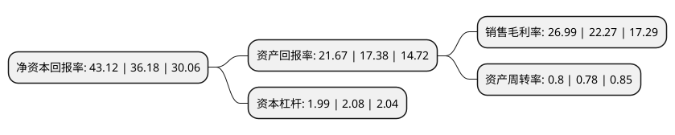

> 本页面由自动化程序生成于 2022年5月20日 01:29
> 内容可能存在错误，如有bug请提交issue至：https://github.com/Eroleice/doc-pi/issues
{.is-warning}

# 上市公司基本情况

## 基本资料

山西杏花村汾酒厂股份有限公司（以下简称“山西汾酒”）成立于1985年12月25日，吕梁市。于1994年01月06日在上交所主板上市。

山西汾酒注册资本122,011.437万元，主要产品:白酒，配制酒以下是详细信息：

- 公司名称: 山西杏花村汾酒厂股份有限公司
- 股票代码: 600809.SH
- 所在地: 山西 - 吕梁市
- 成立日期: 1985年12月25日
- 注册资本: 122,011.437万元
- 法定代表人: 袁清茂
- 主营业务: 主要产品:白酒，配制酒
- 公司官网: www.fenjiu.com.cn
- 公司介绍: 公司是生产国家名酒汾酒、竹叶青酒、玫瑰汾酒、白玉汾酒等系列产品的大型一档企业。公司主要遵循研-产-供-销一体化发展模式。根据市场需求研发新酒体并制定采购计划和生产计划，原粮实现100%基地供应。汾酒在山西市场拥有领导地位。在山西市场上，公司建立了完善的营销网络，是当之无愧的市场领袖。公司是白酒行业唯一拥有“汾”、“竹叶青”、“杏花村”三大中国驰名商标的企业。公司主导产品汾酒是中国传统的历史名酒，清香型白酒的典型代表，工艺精湛，源远流长，素以入口绵、落口甜、饮后余香、回味悠长特色而著称，在国内外消费者中享有较高的知名度、美誉度和忠诚度。公司拥有全国一流的酿酒技术队伍和酿酒勾贮设备，拥有系统完善的ISO9001：2000质量保证体系，是全国食品饮料业、全国轻工业最佳企业之一，是山西省农业产业化的龙头企业，也是山西省食品产业调整和振兴规划中的重点龙头企业，是山西省综改实验的排头兵。

## 股东及高管情况

上市公司第一大股东为山西杏花村汾酒集团有限责任公司，持股690,121,565股，占比56.56%，为上市公司实际控制人。

截至2022年03月31日，上市公司的前十大股东中，共有3名机构股东，6个产品账户，1个海外主体，其中5%以上大股东共有2名。上市公司前十大股东明细如下：

> 截至2022年03月31日，上市公司前十大股东信息如下：

| 股东名称 | 持股数量（股） | 持股比例 |
| --- | --- | --- |
| 山西杏花村汾酒集团有限责任公司 | 690,121,565 | 56.56% |
| 華創鑫睿(香港)有限公司 | 138,816,296 | 11.38% |
| 中国银行股份有限公司-招商中证白酒指数分级证券投资基金 | 41,066,458 | 3.37% |
| 香港中央结算有限公司(陆股通) | 29,032,408 | 2.38% |
| 中国农业银行股份有限公司-易方达消费行业股票型证券投资基金 | 8,590,915 | 0.7% |
| 中国建设银行股份有限公司-汇添富消费行业混合型证券投资基金 | 6,500,113 | 0.53% |
| 中国人寿保险股份有限公司-传统-普通保险产品-005L-CT001沪 | 6,357,183 | 0.52% |
| 中国建设银行股份有限公司-银华富裕主题混合型证券投资基金 | 6,265,396 | 0.51% |
| 中国工商银行股份有限公司-景顺长城新兴成长混合型证券投资基金 | 6,000,000 | 0.49% |
| 山西杏花村国际贸易有限责任公司 | 4,864,758 | 0.4% |

## 利润表分析

上市公司2021年总收入为199.7亿元，净利润为53.89亿元，实现盈利。

## 杜邦分析

> 数据列示周期：2021年 | 2020年 | 2019年
{.is-info}

上市公司的净资产收益率在近一年有所上升，上升幅度为19.18%，其变化情况分解如下：
- 上市公司的销售毛利率在近一年上升了21.19%，可能是生产效率的提升、商品原材料价格下跌或商品价格的上涨所致。
- 上市公司的资产周转率在近一年上升了2.56%，可能是源自于更快的销售回款或库存管理效果提升。
- 上市公司的财务杠杆比率在近一年下降了-4.33%，可能是减少负债降低财务费用。

