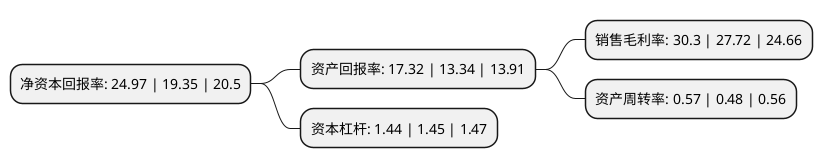

> 本页面由自动化程序生成于 2022年5月20日 01:33
> 内容可能存在错误，如有bug请提交issue至：https://github.com/Eroleice/doc-pi/issues
{.is-warning}

# 上市公司基本情况

## 基本资料

安徽迎驾贡酒股份有限公司（以下简称“迎驾贡酒”）成立于2003年11月28日，六安市。于2015年05月28日在上交所主板上市。

迎驾贡酒注册资本80,000万元，公司主要从事白酒的研发，生产和销售，公司生产的迎驾国宾系列酒，生态年份系列酒，迎驾之星系列酒，百年迎驾贡系列酒，迎驾古坊系列酒，迎驾糟坊系列酒等白酒产品主要系浓香型白酒，具有“窖香幽雅，绵甜爽口”的鲜明风格。以下是详细信息：

- 公司名称: 安徽迎驾贡酒股份有限公司
- 股票代码: 603198.SH
- 所在地: 安徽 - 六安市
- 成立日期: 2003年11月28日
- 注册资本: 80,000万元
- 法定代表人: 倪永培
- 主营业务: 公司主要从事白酒的研发，生产和销售，公司生产的迎驾国宾系列酒，生态年份系列酒，迎驾之星系列酒，百年迎驾贡系列酒，迎驾古坊系列酒，迎驾糟坊系列酒等白酒产品主要系浓香型白酒，具有“窖香幽雅，绵甜爽口”的鲜明风格
- 公司官网: www.yingjia.cn
- 公司介绍: 公司是迎驾集团的核心企业，是国家级绿色工厂中唯一的酒类企业，是全国酿酒骨干企业，是大别山革命老区的支柱产业，是北纬30度线中国名酒带上的明星企业。迎驾贡酒依托大别山自然保护区内的无污染山涧泉水，以中温包包曲为糖化发酵剂，运用多粮型传统工艺和现代科技手段精心酿造而成。公司是中国生态酿酒的倡导者与引领者，采用“生态产区、生态剐水、生态酿艺、生态循环、生态洞藏、生态消费”的全产业链生态模式，铸就了迎驾贡酒“绵、甜、醇、柔、香”的口感特征。迎驾贡酒先后获得“国家地理标志保护产品”、“中华老字号”等殊荣，迎驾酒传统酿造技艺被列入“非物质文化遗产名录”，迎驾酒厂被上海大世界基尼斯总部认定为“中国生态环境最美的酒厂”。

## 股东及高管情况

上市公司第一大股东为安徽迎驾集团股份有限公司，持股597,265,850股，占比74.66%，为上市公司实际控制人。

截至2022年03月31日，上市公司的前十大股东中，共有1名机构股东，8个产品账户，1个海外主体，其中5%以上大股东共有1名。上市公司前十大股东明细如下：

> 截至2022年03月31日，上市公司前十大股东信息如下：

| 股东名称 | 持股数量（股） | 持股比例 |
| --- | --- | --- |
| 安徽迎驾集团股份有限公司 | 597,265,850 | 74.66% |
| 中国银行股份有限公司-招商中证白酒指数分级证券投资基金 | 22,655,351 | 2.83% |
| 香港中央结算有限公司(陆股通) | 14,648,754 | 1.83% |
| 上海迎水投资管理有限公司-迎水合力14号私募证券投资基金 | 5,295,000 | 0.66% |
| 中信银行股份有限公司-交银施罗德品质增长一年持有期混合型证券投资基金 | 4,707,311 | 0.59% |
| 安徽六安市迎驾慈善基金会 | 4,593,000 | 0.57% |
| 上海迎水投资管理有限公司-迎水汇金15号私募证券投资基金 | 3,810,000 | 0.48% |
| 上海迎水投资管理有限公司-迎水月异9号私募证券投资基金 | 3,371,000 | 0.42% |
| 中国农业银行股份有限公司-交银施罗德内需增长一年持有期混合型证券投资基金 | 3,305,864 | 0.41% |
| 大家人寿保险股份有限公司-万能产品 | 3,197,510 | 0.4% |

## 利润表分析

上市公司2021年总收入为45.76亿元，净利润为13.86亿元，实现盈利。

## 杜邦分析

> 数据列示周期：2021年 | 2020年 | 2019年
{.is-info}

上市公司的净资产收益率在近一年有所上升，上升幅度为29.04%，其变化情况分解如下：
- 上市公司的销售毛利率在近一年上升了9.31%，可能是生产效率的提升、商品原材料价格下跌或商品价格的上涨所致。
- 上市公司的资产周转率在近一年上升了18.75%，可能是源自于更快的销售回款或库存管理效果提升。
- 上市公司的财务杠杆比率在近一年下降了-0.69%，可能是减少负债降低财务费用。

