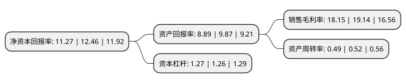

> 本页面由自动化程序生成于 2022年5月20日 01:36
> 内容可能存在错误，如有bug请提交issue至：https://github.com/Eroleice/doc-pi/issues
{.is-warning}

# 上市公司基本情况

## 基本资料

金徽酒股份有限公司（以下简称“金徽酒”）成立于2009年12月23日，陇南市。于2016年03月10日在上交所主板上市。

金徽酒注册资本50,726万元，主营业务为白酒生产及销售，主要产品为“金徽系列”，“世纪金徽星级系列”，“世纪金徽陈香系列”，“陇南春系列”等浓香型白酒。以下是详细信息：

- 公司名称: 金徽酒股份有限公司
- 股票代码: 603919.SH
- 所在地: 甘肃 - 陇南市
- 成立日期: 2009年12月23日
- 注册资本: 50,726万元
- 法定代表人: 周志刚
- 主营业务: 主营业务为白酒生产及销售，主要产品为“金徽系列”，“世纪金徽星级系列”，“世纪金徽陈香系列”，“陇南春系列”等浓香型白酒
- 公司官网: www.jinhuijiu.com
- 公司介绍: 公司前身系康庆坊、永盛源等多个徽酒老作坊基础上组建的省属国营大型白酒企业，曾用名甘肃陇南春酒厂，是国内建厂最早的中华老字号白酒酿造企业之一。目前，公司已发展成为以优质白酒酿造为主，集科技研发、物流配送、网络营销、观光旅游为一体的现代化大型白酒企业，正在着力加强以优化产能为主的基础设施建设、以提升自主创新研发能力为主的专业技术团队建设、以倡导健康绿色消费激发正能量为核心的品牌价值建设和省内外市场建设，为实现建成“中国大型白酒酿造基地，跻身中国白酒10强”的目标奠定了坚实基础。多年来，公司坚持“以人为本、追求卓越、合作共赢、服务社会”的发展理念，先后被评为“全国白酒最具竞争力品牌”、“全国白酒最具竞争力企业”、“全国五一劳动奖状”、“全国五一巾帼标兵岗”、“全国轻工行业先进集体”、“全国绿化模范单位”、“国家AAAA旅游景区”等殊荣。

## 股东及高管情况

上市公司第一大股东为上海豫园旅游商城(集团)股份有限公司，持股152,177,900股，占比30%，**疑似为**上市公司实际控制人。

截至2022年03月31日，上市公司的前十大股东中，共有7名机构股东，3个产品账户，其中5%以上大股东共有4名。上市公司前十大股东明细如下：

> 截至2022年03月31日，上市公司前十大股东信息如下：

| 股东名称 | 持股数量（股） | 持股比例 |
| --- | --- | --- |
| 上海豫园旅游商城(集团)股份有限公司 | 152,177,900 | 30% |
| 甘肃亚特投资集团有限公司 | 68,820,687 | 13.57% |
| 海南豫珠企业管理有限公司 | 40,580,800 | 8% |
| 陇南众惠投资管理中心(有限合伙) | 29,063,944 | 5.73% |
| 中国银行股份有限公司-招商中证白酒指数分级证券投资基金 | 19,006,375 | 3.75% |
| 中信兴业投资集团有限公司 | 18,418,489 | 3.63% |
| 陇南怡铭投资管理中心(有限合伙) | 15,985,203 | 3.15% |
| 陇南乾惠投资管理中心(有限合伙) | 15,985,203 | 3.15% |
| 华龙证券-农业银行-华龙证券-金徽酒正能量1号集合资产管理计划 | 9,545,714 | 1.88% |
| 金徽酒股份有限公司-第一期员工持股计划 | 6,407,142 | 1.26% |

## 利润表分析

上市公司2021年总收入为17.88亿元，净利润为3.24亿元，实现盈利。

## 杜邦分析

> 数据列示周期：2021年 | 2020年 | 2019年
{.is-info}

上市公司的净资产收益率在近一年有所下降，下降幅度为-9.55%，其变化情况分解如下：
- 上市公司的销售毛利率在近一年下降了-5.17%，可能是生产效率的下降、商品原材料价格上涨或商品价格的下跌所致。
- 上市公司的资产周转率在近一年下降了-5.77%，可能是源自于更慢的销售回款或库存管理效果下降。
- 上市公司的财务杠杆比率在近一年上升了0.79%，可能是增加负债扩大生产规模。

