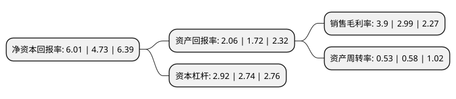

> 本页面由自动化程序生成于 2022年5月20日 01:01
> 内容可能存在错误，如有bug请提交issue至：https://github.com/Eroleice/doc-pi/issues
{.is-warning}

# 上市公司基本情况

## 基本资料

合肥百货大楼集团股份有限公司（以下简称“合肥百货”）成立于1996年07月29日，合肥市。于1996年08月12日在深交所主板上市。

合肥百货注册资本77,988.42万元，主要业务:商业(百货业，超市)。以下是详细信息：

- 公司名称: 合肥百货大楼集团股份有限公司
- 股票代码: 000417.SZ
- 所在地: 安徽 - 合肥市
- 成立日期: 1996年07月29日
- 注册资本: 77,988.42万元
- 法定代表人: 刘浩
- 主营业务: 商业(百货业，超市)
- 公司官网: www.hfbh.com.cn
- 公司介绍: 公司是安徽省首家商业零售上市公司，作为安徽区域市场的零售龙头企业，公司已经初步构建形成立足省会、辐射全省的连锁网络体系。公司目前的主营业务为百货零售业、农产品交易市场两大类业务。公司百货零售业包括百货、家电、超市连锁、电子商务等细分业态。公司百货、家电、超市三业态共有214家实体经营门店，均占据安徽省多个城市的核心商圈、次商圈的有利位置。公司连续多年入围中国企业500强，中国服务业500强，位列中国零售百强，中国连锁百强。享有“全国文明单位”、“安徽第一店”、“中华老字号”、“徽商典范”、中国质量效益型先进企业等美誉，并荣膺中国商业服务业改革开放30周年功勋企业等荣誉称号。

## 股东及高管情况

上市公司第一大股东为合肥市建设投资控股(集团)有限公司，持股296,390,467股，占比38%，为上市公司实际控制人。

截至2022年03月31日，上市公司的前十大股东中，共有5名自然人股东，5名机构股东，其中5%以上大股东共有1名。上市公司前十大股东明细如下：

> 截至2022年03月31日，上市公司前十大股东信息如下：

| 股东名称 | 持股数量（股） | 持股比例 |
| --- | --- | --- |
| 合肥市建设投资控股(集团)有限公司 | 296,390,467 | 38% |
| 西安顺时来百货有限公司 | 35,588,059 | 4.56% |
| 中央汇金资产管理有限责任公司 | 12,326,500 | 1.58% |
| 颐和银丰天元(天津)集团有限公司 | 12,135,850 | 1.56% |
| 殷立锋 | 4,927,666 | 0.63% |
| 崔铭 | 3,060,900 | 0.39% |
| 彭朵花 | 3,000,000 | 0.38% |
| 戴建青 | 2,817,500 | 0.36% |
| 陈社新 | 2,810,000 | 0.36% |
| 北京方顺科技有限公司 | 2,495,095 | 0.32% |

## 利润表分析

上市公司2021年总收入为63.37亿元，净利润为2.46亿元，实现盈利。

## 杜邦分析

> 数据列示周期：2021年 | 2020年 | 2019年
{.is-info}

上市公司的净资产收益率在近一年有所上升，上升幅度为27.06%，其变化情况分解如下：
- 上市公司的销售毛利率在近一年上升了30.43%，可能是生产效率的提升、商品原材料价格下跌或商品价格的上涨所致。
- 上市公司的资产周转率在近一年下降了-8.62%，可能是源自于更慢的销售回款或库存管理效果下降。
- 上市公司的财务杠杆比率在近一年上升了6.57%，可能是增加负债扩大生产规模。

