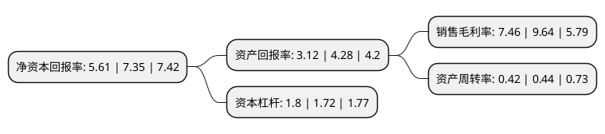

> 本页面由自动化程序生成于 2022年5月20日 01:01
> 内容可能存在错误，如有bug请提交issue至：https://github.com/Eroleice/doc-pi/issues
{.is-warning}

# 上市公司基本情况

## 基本资料

长沙通程控股股份有限公司（以下简称“通程控股”）成立于1996年08月10日，长沙市。于1996年08月16日在深交所主板上市。

通程控股注册资本54,358.266万元，主要业务:现代商贸，旅游酒店产业。以下是详细信息：

- 公司名称: 长沙通程控股股份有限公司
- 股票代码: 000419.SZ
- 所在地: 湖南 - 长沙市
- 成立日期: 1996年08月10日
- 注册资本: 54,358.266万元
- 法定代表人: 周兆达
- 主营业务: 现代商贸，旅游酒店产业
- 公司官网: www.e-tongcheng.com
- 公司介绍: 公司是湖南省第一家商业上市公司，上市多年始终秉持“专业立足，创新求存，阳光规范，个性适应，机制能动，增长稳健，发展可持，品牌成型”的发展定位，深化管理转型，深耕专业市场，在区域内已形成了极高的品牌知名度和公信力，受到市场和消费者的广泛认可和信赖。公司从事的主要业务包括商业零售业、综合投资业及旅游酒店业。其中商业零售经营业态包括购物中心、百货、电器连锁经营、奥特莱斯折扣店、名品折扣店以及线上专业平台，是区域内综合功能最全的大型商业集团；酒店业已经形成了以商务型、会议型、度假休闲型为代表的组合丰富的经营格局，同时辅以及区域内酒店管理品牌输出；综合投资领域，公司依托典当业为基础，目前已形成了聚合保理、寄卖、投资等多业态、分层次的综合投资产业。

## 股东及高管情况

上市公司第一大股东为长沙通程实业(集团)有限公司，持股240,972,484股，占比44.33%，为上市公司实际控制人。

截至2022年03月31日，上市公司的前十大股东中，共有5名自然人股东，4名机构股东，1个产品账户，其中5%以上大股东共有1名。上市公司前十大股东明细如下：

> 截至2022年03月31日，上市公司前十大股东信息如下：

| 股东名称 | 持股数量（股） | 持股比例 |
| --- | --- | --- |
| 长沙通程实业(集团)有限公司 | 240,972,484 | 44.33% |
| 湖南天辰建设有限责任公司 | 7,305,090 | 1.34% |
| 邝发红 | 6,954,601 | 1.28% |
| 李志鹤 | 6,286,745 | 1.16% |
| 湖南星电集团有限责任公司 | 5,887,499 | 1.08% |
| 闵凡国 | 5,193,000 | 0.96% |
| 丁碧霞 | 4,951,907 | 0.91% |
| 长沙水业集团有限公司 | 3,748,290 | 0.69% |
| 李怡名 | 3,658,984 | 0.67% |
| 上海珠池资产管理有限公司-珠池量化对冲多策略基金3期私募基金 | 3,626,432 | 0.67% |

## 利润表分析

上市公司2021年总收入为23.28亿元，净利润为1.6亿元，实现盈利。

## 杜邦分析

> 数据列示周期：2021年 | 2020年 | 2019年
{.is-info}

上市公司的净资产收益率在近一年有所下降，下降幅度为-23.67%，其变化情况分解如下：
- 上市公司的销售毛利率在近一年下降了-22.61%，可能是生产效率的下降、商品原材料价格上涨或商品价格的下跌所致。
- 上市公司的资产周转率在近一年下降了-4.55%，可能是源自于更慢的销售回款或库存管理效果下降。
- 上市公司的财务杠杆比率在近一年上升了4.65%，可能是增加负债扩大生产规模。

