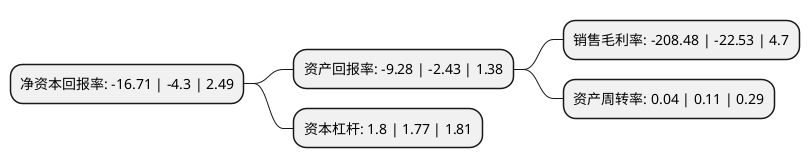

> 本页面由自动化程序生成于 2022年5月20日 01:02
> 内容可能存在错误，如有bug请提交issue至：https://github.com/Eroleice/doc-pi/issues
{.is-warning}

# 上市公司基本情况

## 基本资料

供销大集集团股份有限公司（以下简称“*ST大集”）成立于1996年12月05日，西安市。于1994年01月10日在深交所主板上市。

*ST大集注册资本1,916,377.734万元，主要业务:国内商业。以下是详细信息：

- 公司名称: 供销大集集团股份有限公司
- 股票代码: 000564.SZ
- 所在地: 陕西 - 西安市
- 成立日期: 1996年12月05日
- 注册资本: 1,916,377.734万元
- 法定代表人: 尚多旭
- 主营业务: 国内商业
- 公司官网: www.gongxiaodaji.com
- 公司介绍: 公司是陕西省西安市一家以经营百货零售业为主的大型商贸企业集团。是“全国大型百货零售企业贸易联合会”成员单位，为西北地区的商业龙头。公司紧跟国家“一带一路”倡议，将以航空货运为核心按照“集、铺、网、链、投”的发展战略，“四产一投”互为一体，形成全新的“供、销”商业模式，利用互联网、现代物流、现代金融等手段，并将依托优势航线资源整合优势商品，统筹规划城乡实体经销网、城乡电子商务网、城乡物流配送网“三网”布局。目前旗下公司主要业务涵盖中国集、酷铺商贸、掌合天下、大集供销链、大集金服及民生百货。公司连续多年保持省级文明单位，被陕西省委省政府，西安市委市政府分别授予“陕西省文明示范单位”、“创先争优先进集体”。

## 股东及高管情况

上市公司第一大股东为供销大集集团股份有限公司破产企业财产处置专用账户，持股8,306,213,539股，占比43.34%，为上市公司实际控制人。

截至2022年03月31日，上市公司的前十大股东中，共有8名机构股东，2个产品账户，其中5%以上大股东共有1名。上市公司前十大股东明细如下：

> 截至2022年03月31日，上市公司前十大股东信息如下：

| 股东名称 | 持股数量（股） | 持股比例 |
| --- | --- | --- |
| 供销大集集团股份有限公司破产企业财产处置专用账户 | 8,306,213,539 | 43.34% |
| 海航商业控股有限公司 | 920,048,318 | 4.8% |
| 中融国际信托有限公司-中融-日进斗金14号证券投资集合资金信托计划 | 427,411,834 | 2.23% |
| 海航投资控股有限公司 | 390,526,891 | 2.04% |
| 新合作商贸连锁集团有限公司 | 380,136,306 | 1.98% |
| 湖南新合作实业投资有限公司 | 342,604,379 | 1.79% |
| 海航实业集团有限公司 | 310,468,878 | 1.62% |
| 安信乾盛财富-广州农商银行-重庆中新融辉投资中心(有限合伙) | 307,108,471 | 1.6% |
| 西安银行股份有限公司 | 291,197,982 | 1.52% |
| 哈尔滨嘉悦投资有限公司 | 287,521,554 | 1.5% |

## 利润表分析

上市公司2021年总收入为16.69亿元，净利润为-7.21亿元，**未实现盈利**。

## 杜邦分析

> 数据列示周期：2020年 | 2019年 | 2018年
{.is-info}

上市公司的净资产收益率在近一年有所上升，上升幅度为288.6%，其变化情况分解如下：
- 上市公司的销售毛利率在近一年上升了825.34%，可能是生产效率的提升、商品原材料价格下跌或商品价格的上涨所致。
- 上市公司的资产周转率在近一年下降了-63.64%，可能是源自于更慢的销售回款或库存管理效果下降。
- 上市公司的财务杠杆比率在近一年上升了1.69%，可能是增加负债扩大生产规模。

