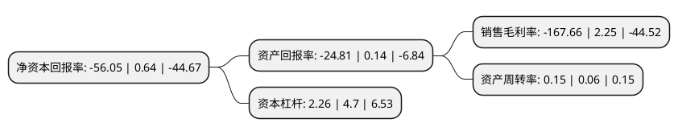

> 本页面由自动化程序生成于 2022年5月20日 01:03
> 内容可能存在错误，如有bug请提交issue至：https://github.com/Eroleice/doc-pi/issues
{.is-warning}

# 上市公司基本情况

## 基本资料

大连友谊(集团)股份有限公司（以下简称“大连友谊”）成立于1992年07月28日，大连市。于1997年01月24日在深交所主板上市。

大连友谊注册资本35,640万元，主要业务:百货零售，酒店服务，房地产开发及销售。以下是详细信息：

- 公司名称: 大连友谊(集团)股份有限公司
- 股票代码: 000679.SZ
- 所在地: 辽宁 - 大连市
- 成立日期: 1992年07月28日
- 注册资本: 35,640万元
- 法定代表人: 熊强
- 主营业务: 百货零售，酒店服务，房地产开发及销售
- 公司官网: www.sz000679.com
- 公司介绍: 公司是以零售百货、酒店管理、房地产开发为主业，以其他策略性投资为补充的大型综合性商贸企业集团。零售和酒店属于公司传统产业，发展态势平稳。房地产业务是2003年新涉足的行业，经过时间的积累，已经进入快速发展阶段，公司房地产业主要涉及住宅和商业地产的开发与销售。当前公司在建、在售房地产项目主要为商业地产，分布在大连、沈阳和邯郸。公司以效益最大化为发展核心，实施产业投资发展坚持有进有退，长短结合，做强主业，优势互补，资源共享，多元发展的长期发展战略。坚持以房地产业为龙头，以零售业、酒店业为基础，各业态均衡协调发展产业新模式。

## 股东及高管情况

上市公司第一大股东为武信投资控股(深圳)股份有限公司，持股100,000,000股，占比28.06%，**疑似为**上市公司实际控制人。

截至2022年03月31日，上市公司的前十大股东中，共有8名自然人股东，2名机构股东，其中5%以上大股东共有1名。上市公司前十大股东明细如下：

> 未能通过持股比例判定出上市公司实际控制人（持股30%以上）
> 可能存在通过间接持股、联合持股、协议控制等方式拥有实际控制权的主体，具体请参考上市公司定期公告！
{.is-warning}

> 截至2022年03月31日，上市公司前十大股东信息如下：

| 股东名称 | 持股数量（股） | 持股比例 |
| --- | --- | --- |
| 武信投资控股(深圳)股份有限公司 | 100,000,000 | 28.06% |
| 大连友谊集团有限公司 | 11,907,894 | 3.34% |
| 柏云禄 | 5,450,272 | 1.53% |
| 宋淑艳 | 2,907,650 | 0.82% |
| 乔宏 | 2,516,557 | 0.71% |
| 曲俊锋 | 2,389,800 | 0.67% |
| 王诞 | 2,139,800 | 0.6% |
| 张伟萍 | 2,048,370 | 0.57% |
| 王小红 | 1,849,575 | 0.52% |
| 陈秋萍 | 1,464,600 | 0.41% |

## 利润表分析

上市公司2021年总收入为1.76亿元，净利润为-2.96亿元，**未实现盈利**。

## 杜邦分析

> 数据列示周期：2021年 | 2020年 | 2019年
{.is-info}

上市公司的净资产收益率在近一年有所下降，下降幅度为-8857.81%，其变化情况分解如下：
- 上市公司的销售毛利率在近一年下降了-7551.56%，可能是生产效率的下降、商品原材料价格上涨或商品价格的下跌所致。
- 上市公司的资产周转率在近一年上升了150%，可能是源自于更快的销售回款或库存管理效果提升。
- 上市公司的财务杠杆比率在近一年下降了-51.91%，可能是减少负债降低财务费用。

