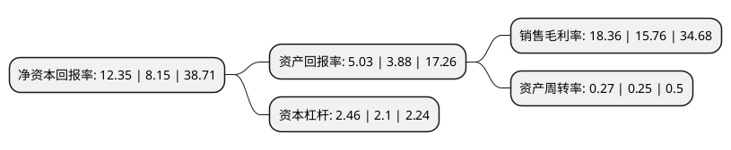

> 本页面由自动化程序生成于 2022年5月20日 01:03
> 内容可能存在错误，如有bug请提交issue至：https://github.com/Eroleice/doc-pi/issues
{.is-warning}

# 上市公司基本情况

## 基本资料

居然之家新零售集团股份有限公司（以下简称“居然之家”）成立于1990年04月25日，武汉市。于1997年07月11日在深交所主板上市。

居然之家注册资本652,903.69万元，主要业务:商业零售和批发业务。以下是详细信息：

- 公司名称: 居然之家新零售集团股份有限公司
- 股票代码: 000785.SZ
- 所在地: 湖北 - 武汉市
- 成立日期: 1990年04月25日
- 注册资本: 652,903.69万元
- 法定代表人: 汪林朋
- 主营业务: 商业零售和批发业务
- 公司官网: www.juran.com.cn
- 公司介绍: 公司(简称“居然之家”)由北京居然之家投资控股集团、阿里巴巴集团、泰康人寿保险集团等投资人共同投资设立。一方面，居然之家以“大家居”为主业，开展家居卖场实体店经营和连锁，以品牌和管理输出形式加快三四线城市及县域的连锁发展；另一方面，居然之家正在发力拓展自营和IP业务赛道，全链路地提升行业交付和服务能力，打造数字化时代下家居行业第一产业服务平台。

## 股东及高管情况

上市公司第一大股东为北京居然之家投资控股集团有限公司，持股2,569,147,817股，占比39.35%，为上市公司实际控制人。

截至2022年03月31日，上市公司的前十大股东中，共有1名自然人股东，8名机构股东，1个产品账户，其中5%以上大股东共有4名。上市公司前十大股东明细如下：

> 截至2022年03月31日，上市公司前十大股东信息如下：

| 股东名称 | 持股数量（股） | 持股比例 |
| --- | --- | --- |
| 北京居然之家投资控股集团有限公司 | 2,569,147,817 | 39.35% |
| 霍尔果斯慧鑫达建材有限公司 | 764,686,721 | 11.71% |
| 阿里巴巴(中国)网络技术有限公司 | 576,860,841 | 8.84% |
| 汪林朋 | 397,633,787 | 6.09% |
| 杭州瀚云新领股权投资基金合伙企业(有限合伙) | 288,430,465 | 4.42% |
| 上海云锋新创投资管理有限公司-上海云锋五新投资中心(有限合伙) | 288,430,420 | 4.42% |
| 泰康人寿保险有限责任公司 | 273,237,262 | 4.19% |
| 天津睿通投资管理合伙企业(有限合伙) | 230,744,345 | 3.53% |
| 青岛好荣兴多商业资产投资中心(有限合伙) | 111,949,751 | 1.71% |
| 武汉商联(集团)股份有限公司 | 103,627,794 | 1.59% |

## 利润表分析

上市公司2021年总收入为130.71亿元，净利润为23.99亿元，实现盈利。

## 杜邦分析

> 数据列示周期：2021年 | 2020年 | 2019年
{.is-info}

上市公司的净资产收益率在近一年有所上升，上升幅度为51.53%，其变化情况分解如下：
- 上市公司的销售毛利率在近一年上升了16.5%，可能是生产效率的提升、商品原材料价格下跌或商品价格的上涨所致。
- 上市公司的资产周转率在近一年上升了8%，可能是源自于更快的销售回款或库存管理效果提升。
- 上市公司的财务杠杆比率在近一年上升了17.14%，可能是增加负债扩大生产规模。

