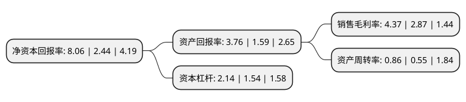

> 本页面由自动化程序生成于 2022年5月20日 01:06
> 内容可能存在错误，如有bug请提交issue至：https://github.com/Eroleice/doc-pi/issues
{.is-warning}

# 上市公司基本情况

## 基本资料

广州市广百股份有限公司（以下简称“广百股份”）成立于1990年08月27日，广州市。于2007年11月22日在深交所中小板上市。

广百股份注册资本70,403.893万元，主营业务:百货零售以下是详细信息：

- 公司名称: 广州市广百股份有限公司
- 股票代码: 002187.SZ
- 所在地: 广东 - 广州市
- 成立日期: 1990年08月27日
- 注册资本: 70,403.893万元
- 法定代表人: 冯凯芸
- 主营业务: 主营业务:百货零售
- 公司官网: www.grandbuy.com.cn
- 公司介绍: 公司是一家经营规模化、管理现代化、主业特色鲜明的百货零售企业，主营业务为百货零售。公司已从原来的国有大型百货零售企业改制成为国有控股、多元化投资主体的股份公司，实现了由传统百货公司向多业态多元化经营，由单店经营向连锁经营的重大转变，成为华南百货零售服务业的市场引领者。公司旗下有广百百货、广百电器公司、家广超市等十几家连锁店。公司是广东省百货连锁龙头企业，在广州市及广东省内享有较高的知名度，公司连续多年被评为“广东省守合同重信用企业”，公司所属多家门店被商务部评定为“金鼎”百货店，深受消费者信赖。

## 股东及高管情况

上市公司第一大股东为广州商贸投资控股集团有限公司，持股200,025,169股，占比28.4111%，**疑似为**上市公司实际控制人。

截至2022年04月14日，上市公司的前十大股东中，共有7名机构股东，3个产品账户，其中5%以上大股东共有6名。上市公司前十大股东明细如下：

> 未能通过持股比例判定出上市公司实际控制人（持股30%以上）
> 可能存在通过间接持股、联合持股、协议控制等方式拥有实际控制权的主体，具体请参考上市公司定期公告！
{.is-warning}

> 截至2022年04月14日，上市公司前十大股东信息如下：

| 股东名称 | 持股数量（股） | 持股比例 |
| --- | --- | --- |
| 广州商贸投资控股集团有限公司 | 200,025,169 | 28.4111% |
| 广州商贸投资控股集团有限公司 | 200,025,169 | 28.41% |
| 广州市广商资本管理有限公司 | 123,878,934 | 17.6% |
| 广州广商鑫石产业投资基金合伙企业(有限合伙) | 63,049,032 | 8.96% |
| 中银金融资产投资有限公司 | 63,049,032 | 8.96% |
| 中银金融资产投资有限公司 | 63,049,032 | 8.96% |
| 建投华文投资有限责任公司 | 25,219,613 | 3.58% |
| 中国人寿保险(集团)公司-传统-普通保险产品-港股通(创新策略) | 24,691,358 | 3.51% |
| 广州交投私募基金管理有限公司 | 18,518,518 | 2.63% |
| 广州市汽车贸易有限公司 | 10,800,000 | 1.53% |

## 利润表分析

上市公司2021年总收入为59.76亿元，净利润为2.61亿元，实现盈利。

## 杜邦分析

> 数据列示周期：2021年 | 2020年 | 2019年
{.is-info}

上市公司的净资产收益率在近一年有所上升，上升幅度为230.33%，其变化情况分解如下：
- 上市公司的销售毛利率在近一年上升了52.26%，可能是生产效率的提升、商品原材料价格下跌或商品价格的上涨所致。
- 上市公司的资产周转率在近一年上升了56.36%，可能是源自于更快的销售回款或库存管理效果提升。
- 上市公司的财务杠杆比率在近一年上升了38.96%，可能是增加负债扩大生产规模。

