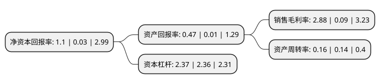

> 本页面由自动化程序生成于 2022年5月20日 01:07
> 内容可能存在错误，如有bug请提交issue至：https://github.com/Eroleice/doc-pi/issues
{.is-warning}

# 上市公司基本情况

## 基本资料

湖南友谊阿波罗商业股份有限公司（以下简称“友阿股份”）成立于2004年06月07日，长沙市。于2009年07月17日在深交所中小板上市。

友阿股份注册资本139,417.28万元，百货零售，超市及家电销售业务。以下是详细信息：

- 公司名称: 湖南友谊阿波罗商业股份有限公司
- 股票代码: 002277.SZ
- 所在地: 湖南 - 长沙市
- 成立日期: 2004年06月07日
- 注册资本: 139,417.28万元
- 法定代表人: 胡子敬
- 主营业务: 百货零售，超市及家电销售业务
- 公司官网: www.your-mart.cn
- 公司介绍: 公司是由湖南省商业龙头企业湖南友谊阿波罗控股股份有限公司发起设立的区域性(湖南)百货零售企业公司。公司的经营业态包括百货商场、奥特莱斯(折扣店)、购物中心、专业店、网络购物平台。公司积极实施线上线下融合的020全渠道百货零售转型的战略，重点打造“友阿海外购”、“友阿微店”等线上购物平台。经过多年的积累，公司已拥有良好的信誉优势，成为长沙乃至湖南消费者心目中的购物首选，先后被授予国家级“诚信单位”、“物价计量信得过单位”、“全国用户满意企业”、“消费者信得过单位”、“消费者满意企业”、“百城万店创品牌活动先进企业”、“全国五一劳动奖状”等诸多殊荣。在致力于百货零售主业发展的同时，公司积极对金融板块进行探索，成立了控股子公司长沙市芙蓉区友阿小额贷款有限公司和湖南友阿投资担保有限公司，很好地执行了公司“两条腿走路，商业和金融业同步发展”的战略规划。

## 股东及高管情况

上市公司第一大股东为湖南友谊阿波罗控股股份有限公司，持股446,448,740股，占比32.02%，为上市公司实际控制人。

截至2022年03月31日，上市公司的前十大股东中，共有7名自然人股东，2名机构股东，1个产品账户，其中5%以上大股东共有1名。上市公司前十大股东明细如下：

> 截至2022年03月31日，上市公司前十大股东信息如下：

| 股东名称 | 持股数量（股） | 持股比例 |
| --- | --- | --- |
| 湖南友谊阿波罗控股股份有限公司 | 446,448,740 | 32.02% |
| 湖南友谊阿波罗商业股份有限公司-第一期员工持股计划 | 31,609,062 | 2.27% |
| 中央汇金资产管理有限责任公司 | 30,852,200 | 2.21% |
| 周绍军 | 19,313,300 | 1.39% |
| 蔡国忠 | 14,800,000 | 1.06% |
| 刘秋蓉 | 14,041,000 | 1.01% |
| 钟康鹏 | 13,156,698 | 0.94% |
| 闫晓鹏 | 11,451,811 | 0.82% |
| 李军 | 9,593,784 | 0.69% |
| 李泓瑞 | 8,560,000 | 0.61% |

## 利润表分析

上市公司2021年总收入为25.84亿元，净利润为0.73亿元，实现盈利。

## 杜邦分析

> 数据列示周期：2021年 | 2020年 | 2019年
{.is-info}

上市公司的净资产收益率在近一年有所上升，上升幅度为3566.67%，其变化情况分解如下：
- 上市公司的销售毛利率在近一年上升了3100%，可能是生产效率的提升、商品原材料价格下跌或商品价格的上涨所致。
- 上市公司的资产周转率在近一年上升了14.29%，可能是源自于更快的销售回款或库存管理效果提升。
- 上市公司的财务杠杆比率在近一年上升了0.42%，可能是增加负债扩大生产规模。

