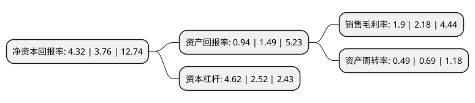

> 本页面由自动化程序生成于 2022年5月20日 01:09
> 内容可能存在错误，如有bug请提交issue至：https://github.com/Eroleice/doc-pi/issues
{.is-warning}

# 上市公司基本情况

## 基本资料

天虹数科商业股份有限公司（以下简称“天虹股份”）成立于1984年05月02日，深圳市。于2010年06月01日在深交所中小板上市。

天虹股份注册资本116,884.775万元，本公司一直从事以百货为主的商品零售业务，经营组织方式从单体商场经营发展为连锁经营。以下是详细信息：

- 公司名称: 天虹数科商业股份有限公司
- 股票代码: 002419.SZ
- 所在地: 广东 - 深圳市
- 成立日期: 1984年05月02日
- 注册资本: 116,884.775万元
- 法定代表人: 高书林
- 主营业务: 本公司一直从事以百货为主的商品零售业务，经营组织方式从单体商场经营发展为连锁经营
- 公司官网: www.rainbow.cn
- 公司介绍: 公司是中外合资的连锁零售企业，其控股股东是中国航空工业集团下属的中国航空技术深圳有限公司。公司根据目标顾客需求的不同，以百货店、大型购物中心、超市、便利店的实体零售业态，打造以“亲和、信赖、享受生活”为核心价值的品牌，旗下拥有天虹、君尚、sp@ce、微喔等零售品牌。公司在行业内率先突破传统百货购物模式，从实体店走向线上线下融合的数字化，率先打造出全国首家拥有“自定义菜单”的零售微信服务号“天虹”，随后逐步创新，在实体门店的基础上增加了购物中心与便利店的一大一小业态，并通过官方天虹APP、天虹微信形成线上线下融合的数字化、多业态战略发展格局。公司连续多年入围中国连锁百强企业。

## 股东及高管情况

上市公司第一大股东为中航国际实业控股有限公司，持股520,885,500股，占比44.56%，为上市公司实际控制人。

截至2022年04月29日，上市公司的前十大股东中，共有2名自然人股东，5名机构股东，2个产品账户，1个海外主体，其中5%以上大股东共有4名。上市公司前十大股东明细如下：

> 截至2022年04月29日，上市公司前十大股东信息如下：

| 股东名称 | 持股数量（股） | 持股比例 |
| --- | --- | --- |
| 中航国际实业控股有限公司 | 520,885,500 | 44.56% |
| 中航国际实业控股有限公司 | 520,885,500 | 44.56% |
| 五龙贸易有限公司 | 265,849,908 | 22.74% |
| 五龙贸易有限公司 | 245,649,908 | 21.0164% |
| 共青城奥轩投资合伙企业(有限合伙) | 17,909,964 | 1.53% |
| 香港中央结算有限公司(陆股通) | 8,457,535 | 0.72% |
| 沈东容 | 3,814,644 | 0.33% |
| 基本养老保险基金一零零六组合 | 3,542,700 | 0.3% |
| 翁树祥 | 2,930,000 | 0.25% |
| 天虹商场股份有限公司-第二期员工持股计划 | 2,862,234 | 0.24% |

## 利润表分析

上市公司2021年总收入为122.68亿元，净利润为2.33亿元，实现盈利。

## 杜邦分析

> 数据列示周期：2021年 | 2020年 | 2019年
{.is-info}

上市公司的净资产收益率在近一年有所上升，上升幅度为14.89%，其变化情况分解如下：
- 上市公司的销售毛利率在近一年下降了-12.84%，可能是生产效率的下降、商品原材料价格上涨或商品价格的下跌所致。
- 上市公司的资产周转率在近一年下降了-28.99%，可能是源自于更慢的销售回款或库存管理效果下降。
- 上市公司的财务杠杆比率在近一年上升了83.33%，可能是增加负债扩大生产规模。

