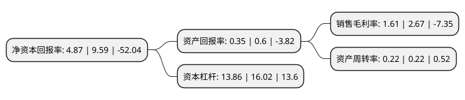

> 本页面由自动化程序生成于 2022年5月20日 01:25
> 内容可能存在错误，如有bug请提交issue至：https://github.com/Eroleice/doc-pi/issues
{.is-warning}

# 上市公司基本情况

## 基本资料

南京中央商场(集团)股份有限公司（以下简称“中央商场”）成立于1991年06月22日，南京市。于2000年09月26日在上交所主板上市。

中央商场注册资本113,833.482万元，主要业务:百货，食品，针织服装，五金交电化工等商品的零售，批发等。以下是详细信息：

- 公司名称: 南京中央商场(集团)股份有限公司
- 股票代码: 600280.SH
- 所在地: 江苏 - 南京市
- 成立日期: 1991年06月22日
- 注册资本: 113,833.482万元
- 法定代表人: 祝珺
- 主营业务: 百货，食品，针织服装，五金交电化工等商品的零售，批发等
- 公司官网: www.njzsgroup.com
- 公司介绍: 公司是一家老字号综合商场，地处江苏省首府南京市，主营百货和仓储超市。公司旗下现有多家连锁百货店、仓储超市以及房地产开发项目等。除本部南京之外，公司旗下百货业务已经拓展到连云港、济宁、徐州等地，基本形成了连锁百货的格局；公司控股的中商金润发超市主营仓储超市，目前仓储超市业务主要依赖与中国台湾大润发超市的合作，经营中主要利用了大润发的供应链。公司荣获“全国百城万店无假货示范店”、“全国用户满意企业”、“中国商业信誉企业”、“全国商业诚信AAA企业”、“中华老字号”等多项荣誉称号，已通过ISO9001：2008质量认证体系。在商务部开展的“分等定级”评选活动中，荣获首批“金鼎百货品牌店”称号。

## 股东及高管情况

上市公司第一大股东为祝义财，持股476,687,416股，占比41.88%，为上市公司实际控制人。

截至2022年03月31日，上市公司的前十大股东中，共有9名自然人股东，1名机构股东，其中5%以上大股东共有2名。上市公司前十大股东明细如下：

> 截至2022年03月31日，上市公司前十大股东信息如下：

| 股东名称 | 持股数量（股） | 持股比例 |
| --- | --- | --- |
| 祝义财 | 476,687,416 | 41.88% |
| 江苏地华实业集团有限公司 | 166,500,000 | 14.63% |
| 张龙梅 | 8,521,200 | 0.75% |
| 吴庆洪 | 8,110,300 | 0.71% |
| 夏重阳 | 5,630,000 | 0.49% |
| 郑娜珊 | 4,934,376 | 0.43% |
| 张培英 | 4,129,000 | 0.36% |
| 史孝义 | 3,942,900 | 0.35% |
| 史巧兰 | 3,715,900 | 0.33% |
| 周仁瑀 | 3,539,980 | 0.31% |

## 利润表分析

上市公司2021年总收入为28.8亿元，净利润为0.46亿元，实现盈利。

## 杜邦分析

> 数据列示周期：2021年 | 2020年 | 2019年
{.is-info}

上市公司的净资产收益率在近一年有所下降，下降幅度为-49.22%，其变化情况分解如下：
- 上市公司的销售毛利率在近一年下降了-39.7%，可能是生产效率的下降、商品原材料价格上涨或商品价格的下跌所致。
- 上市公司的资产周转率在近一年下降了0%，可能是源自于更慢的销售回款或库存管理效果下降。
- 上市公司的财务杠杆比率在近一年下降了-13.48%，可能是减少负债降低财务费用。

