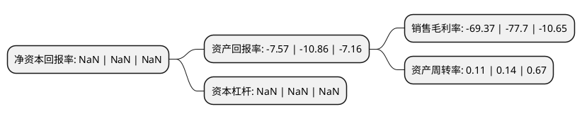

> 本页面由自动化程序生成于 2022年5月20日 01:25
> 内容可能存在错误，如有bug请提交issue至：https://github.com/Eroleice/doc-pi/issues
{.is-warning}

# 上市公司基本情况

## 基本资料

沈阳商业城股份有限公司（以下简称“ST商城”）成立于1999年07月26日，沈阳市。于2000年12月26日在上交所主板上市。

ST商城注册资本23,157.492万元，主要产品:服装，鞋帽，家电，针织，以百货业经营为主，同时向物流业，酒店业，房地产开发等多领域延伸。以下是详细信息：

- 公司名称: 沈阳商业城股份有限公司
- 股票代码: 600306.SH
- 所在地: 辽宁 - 沈阳市
- 成立日期: 1999年07月26日
- 注册资本: 23,157.492万元
- 法定代表人: 陈快主
- 主营业务: 主要产品:服装，鞋帽，家电，针织，以百货业经营为主，同时向物流业，酒店业，房地产开发等多领域延伸
- 公司官网: www.sysyc.cn
- 公司介绍: 公司是一家主营百货零售的企业，以百货业经营为主，同时向物流业、酒店业、房地产开发等多领域延伸。公司改扩建后的全新商业城涵盖了百货、超市、餐饮、酒店、滑冰场、物流配送等多种功能，实现了传统百货向现代综合百货的跨越。公司始终坚持“务实为民，创新报国”的企业价值观和“优质服务，品牌经营，多元开发，规模膨胀，企业形象”五大发展战略，以诚信经营为核心，以网络技术为支撑，不断推进企业改革创新，积极创建了一套适应现代百货发展需求的经营机制、管理模式和服务体系，精心打造了“沈阳商业城、城中求诚”的企业品牌。企业先后荣获“全国文明单位”、“全国百城万店无假货示范店先进单位”、“全国守合同重信用单位”、“全国企业文化实践创新奖”、“全国模范职工之家”和西班牙国际商业创先公司颁发的“国际白金星质量管理大奖”等多项国家、省、市级以上的荣誉称号。

## 股东及高管情况

上市公司第一大股东为深圳市领先半导体产投有限公司，持股53,436,000股，占比23.08%，**疑似为**上市公司实际控制人。

截至2022年03月31日，上市公司的前十大股东中，共有3名自然人股东，7名机构股东，其中5%以上大股东共有3名。上市公司前十大股东明细如下：

> 未能通过持股比例判定出上市公司实际控制人（持股30%以上）
> 可能存在通过间接持股、联合持股、协议控制等方式拥有实际控制权的主体，具体请参考上市公司定期公告！
{.is-warning}

> 截至2022年03月31日，上市公司前十大股东信息如下：

| 股东名称 | 持股数量（股） | 持股比例 |
| --- | --- | --- |
| 深圳市领先半导体产投有限公司 | 53,436,000 | 23.08% |
| 中兆投资管理有限公司 | 43,141,624 | 18.63% |
| 王强 | 13,600,340 | 5.87% |
| 深圳市旅游(集团)股份有限公司 | 10,820,195 | 4.67% |
| 深圳市西丽湖度假村有限公司 | 5,014,021 | 2.17% |
| 深圳市深之旅投资管理有限公司 | 4,777,093 | 2.06% |
| 李欣立 | 4,600,000 | 1.99% |
| 沈阳中兴商业集团有限公司 | 4,243,483 | 1.83% |
| 深圳市琪创能商贸有限公司 | 4,105,640 | 1.77% |
| 王四海 | 3,464,840 | 1.5% |

## 利润表分析

上市公司2021年总收入为1.52亿元，净利润为-1.06亿元，**未实现盈利**。

## 杜邦分析

> 数据列示周期：2021年 | 2020年 | 2019年
{.is-info}

上市公司的净资产收益率在近一年有所下降，下降幅度为NaN%，其变化情况分解如下：
- 上市公司的销售毛利率在近一年下降了-10.72%，可能是生产效率的下降、商品原材料价格上涨或商品价格的下跌所致。
- 上市公司的资产周转率在近一年下降了-21.43%，可能是源自于更慢的销售回款或库存管理效果下降。
- 上市公司的财务杠杆比率在近一年下降了NaN%，可能是减少负债降低财务费用。

