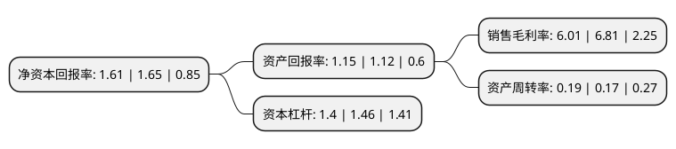

> 本页面由自动化程序生成于 2022年5月20日 01:27
> 内容可能存在错误，如有bug请提交issue至：https://github.com/Eroleice/doc-pi/issues
{.is-warning}

# 上市公司基本情况

## 基本资料

上海新世界股份有限公司（以下简称“新世界”）成立于1996年11月08日，上海市。于1993年01月19日在上交所主板上市。

新世界注册资本64,687.538万元，主营业务一直为商业。以下是详细信息：

- 公司名称: 上海新世界股份有限公司
- 股票代码: 600628.SH
- 所在地: 上海 - 上海市
- 成立日期: 1996年11月08日
- 注册资本: 64,687.538万元
- 法定代表人: 陈湧
- 主营业务: 主营业务一直为商业
- 公司官网: www.newworld-china.com
- 公司介绍: 公司是座落于上海市全国著名的南京路步行街上的一家集现代百货、旅游休闲和娱乐综合消费相融一体的购物中心，集聚了一大批在国内、亚洲甚至世界独具特色的知名品牌。主要业务为百货零售。公司投资兴建的新世界城，是一座集购物、娱乐、宾馆、餐饮、休闲于一体的生活茂，由新世界购物广场、新世界娱乐广场、新世界丽笙大酒店、新世界美食休闲广场、新世界立体停车场等板块组成。公司先后荣获“中国商业信用企业”、上海零售风云榜商业地标奖、上海购物节十周年“杰出贡献单位”和“杰出贡献个人”和“上海守合同重信用”、“上海市真牌真品优秀案例”等荣誉称号，公司经营者被评为“全国优秀诚信企业家”。

## 股东及高管情况

上市公司第一大股东为上海市黄浦区国有资产监督管理委员会，持股134,074,446股，占比20.73%，**疑似为**上市公司实际控制人。

截至2022年03月31日，上市公司的前十大股东中，共有3名自然人股东，6名机构股东，1名其他股东，其中5%以上大股东共有3名。上市公司前十大股东明细如下：

> 未能通过持股比例判定出上市公司实际控制人（持股30%以上）
> 可能存在通过间接持股、联合持股、协议控制等方式拥有实际控制权的主体，具体请参考上市公司定期公告！
{.is-warning}

> 截至2022年03月31日，上市公司前十大股东信息如下：

| 股东名称 | 持股数量（股） | 持股比例 |
| --- | --- | --- |
| 上海市黄浦区国有资产监督管理委员会 | 134,074,446 | 20.73% |
| 上海综艺控股有限公司 | 84,524,934 | 13.07% |
| 国华人寿保险股份有限公司-万能三号 | 53,179,970 | 8.22% |
| 沈国军 | 30,810,887 | 4.76% |
| 浙江国俊有限公司 | 24,979,670 | 3.86% |
| 昝圣达 | 23,600,000 | 3.65% |
| 中央汇金资产管理有限责任公司 | 12,732,700 | 1.97% |
| 上海新世界(集团)有限公司 | 10,000,000 | 1.55% |
| 沈军燕 | 6,530,000 | 1.01% |
| 老凤祥股份有限公司 | 6,155,001 | 0.95% |

## 杜邦分析

> 数据列示周期：2021年 | 2020年 | 2019年
{.is-info}

上市公司的净资产收益率在近一年有所下降，下降幅度为-2.42%，其变化情况分解如下：
- 上市公司的销售毛利率在近一年下降了-11.75%，可能是生产效率的下降、商品原材料价格上涨或商品价格的下跌所致。
- 上市公司的资产周转率在近一年上升了11.76%，可能是源自于更快的销售回款或库存管理效果提升。
- 上市公司的财务杠杆比率在近一年下降了-4.11%，可能是减少负债降低财务费用。

