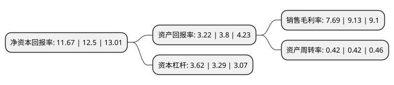

> 本页面由自动化程序生成于 2022年5月20日 01:28
> 内容可能存在错误，如有bug请提交issue至：https://github.com/Eroleice/doc-pi/issues
{.is-warning}

# 上市公司基本情况

## 基本资料

上海豫园旅游商城(集团)股份有限公司（以下简称“豫园股份”）成立于1987年11月25日，上海市。于1992年09月02日在上交所主板上市。

豫园股份注册资本389,038.297万元，黄金饰品，百货，饮食，食品，进出口，医药，工艺品，房产。以下是详细信息：

- 公司名称: 上海豫园旅游商城(集团)股份有限公司
- 股票代码: 600655.SH
- 所在地: 上海 - 上海市
- 成立日期: 1987年11月25日
- 注册资本: 389,038.297万元
- 法定代表人: 黄震
- 主营业务: 黄金饰品，百货，饮食，食品，进出口，医药，工艺品，房产
- 公司官网: www.yuyuantm.com.cn
- 公司介绍: 公司地处上海中心商业区，是一家集黄金珠宝、餐饮、医药、工艺品、百货、食品、旅游、房地产、金融和进出口贸易等产业为一体，多元化发展的国内一流的综合性商业集团。公司旗下拥有众多以中国驰名商标、中华老字号、上海市著名商标和百年老店等为核心的产业品牌资源，包括“老庙黄金”、“亚一金店”、“南翔小笼”等。公司业务主体-豫园商城，起源于清同治年间的老城隍庙市场，集邑庙、园林、建筑、商铺、美食、旅游等为一体，从而构成了上海700年历史文脉的物化展示和上海城市文明的视觉演绎，丰厚的文化底蕴、浓郁的民俗风情、鲜明的经营特色更使豫园商城成为全上海最中国的地方而享誉海内外。2018年，公司通过重大资产重组，拥有上海星泓、闵祥地产等24家公司的全部或部分股权以及新元房产100%股权，上市公司的主营业务注入新的元素，有助于实现“快乐、时尚”业务的战略升级。

## 股东及高管情况

上市公司第一大股东为上海复地投资管理有限公司，持股1,023,403,904股，占比26.31%，**疑似为**上市公司实际控制人。

截至2022年03月31日，上市公司的前十大股东中，共有9名机构股东，1个海外主体，其中5%以上大股东共有3名。上市公司前十大股东明细如下：

> 未能通过持股比例判定出上市公司实际控制人（持股30%以上）
> 可能存在通过间接持股、联合持股、协议控制等方式拥有实际控制权的主体，具体请参考上市公司定期公告！
{.is-warning}

> 截至2022年03月31日，上市公司前十大股东信息如下：

| 股东名称 | 持股数量（股） | 持股比例 |
| --- | --- | --- |
| 上海复地投资管理有限公司 | 1,023,403,904 | 26.31% |
| 浙江复星商业发展有限公司 | 365,163,041 | 9.39% |
| 上海复星产业投资有限公司 | 247,745,078 | 6.37% |
| 上海复川投资有限公司 | 190,210,308 | 4.89% |
| 上海黄房实业有限公司 | 164,276,968 | 4.22% |
| 上海复星高科技(集团)有限公司 | 141,156,338 | 3.63% |
| SPREAD GRAND LIMITED | 131,841,042 | 3.39% |
| 上海艺中投资有限公司 | 120,966,012 | 3.11% |
| 上海豫园(集团)有限公司 | 95,808,678 | 2.46% |
| 重庆润江置业有限公司 | 89,257,789 | 2.29% |

## 利润表分析

上市公司2021年总收入为510.63亿元，净利润为39.26亿元，实现盈利。

## 杜邦分析

> 数据列示周期：2021年 | 2020年 | 2019年
{.is-info}

上市公司的净资产收益率在近一年有所下降，下降幅度为-6.64%，其变化情况分解如下：
- 上市公司的销售毛利率在近一年下降了-15.77%，可能是生产效率的下降、商品原材料价格上涨或商品价格的下跌所致。
- 上市公司的资产周转率在近一年下降了0%，可能是源自于更慢的销售回款或库存管理效果下降。
- 上市公司的财务杠杆比率在近一年上升了10.03%，可能是增加负债扩大生产规模。

