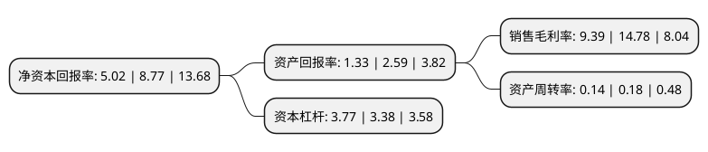

> 本页面由自动化程序生成于 2022年5月20日 01:28
> 内容可能存在错误，如有bug请提交issue至：https://github.com/Eroleice/doc-pi/issues
{.is-warning}

# 上市公司基本情况

## 基本资料

福建东百集团股份有限公司（以下简称“东百集团”）成立于1981年10月31日，福州市。于1993年11月22日在上交所主板上市。

东百集团注册资本89,822.915万元，主要业务:商业零售业，进出口贸易，房地产开发。以下是详细信息：

- 公司名称: 福建东百集团股份有限公司
- 股票代码: 600693.SH
- 所在地: 福建 - 福州市
- 成立日期: 1981年10月31日
- 注册资本: 89,822.915万元
- 法定代表人: 施文义
- 主营业务: 商业零售业，进出口贸易，房地产开发
- 公司官网: www.dongbai.com
- 公司介绍: 公司已发展成为集多产业为一体的跨地区、多功能、外向型的大型商业企业集团，是福建省最大的商业龙头企业之一。公司目前以商业零售、商业地产开发为主业，重点发展物流仓储业务，同时经营供应链管理服务、房产租赁，辅以物业管理、酒店餐饮和广告信息。如今已取得佛山乐平、东莞沙田、北京亦庄、天津潘庄等项目的仓储物流用地。“东百”商标被评为福建老字号，荣获“达标百货店”、“福建100强”、“全国五一劳动奖状”、“全国百家最大规模零售商店”、“全国百家最佳效益零售商店”、“全国无假冒伪劣商品商场”、“全国商业信誉企业”、“全国百城万店无假货活动示范单位”、福建省商业明星企业等全国及省、市各级荣誉称号多项。

## 股东及高管情况

上市公司第一大股东为福建丰琪投资有限公司，持股463,611,503股，占比51.61%，为上市公司实际控制人。

截至2022年03月31日，上市公司的前十大股东中，共有7名自然人股东，3名机构股东，其中5%以上大股东共有2名。上市公司前十大股东明细如下：

> 截至2022年03月31日，上市公司前十大股东信息如下：

| 股东名称 | 持股数量（股） | 持股比例 |
| --- | --- | --- |
| 福建丰琪投资有限公司 | 463,611,503 | 51.61% |
| 施章峰 | 62,837,338 | 7% |
| 深圳钦舟实业发展有限公司 | 30,137,140 | 3.36% |
| 施霞 | 21,410,758 | 2.38% |
| 姚建华 | 15,200,000 | 1.69% |
| 郎华军 | 6,000,000 | 0.67% |
| 郑承振 | 4,460,978 | 0.5% |
| 华建栋 | 4,324,900 | 0.48% |
| 深圳市中瑞投资发展有限公司 | 4,286,700 | 0.48% |
| 李立勇 | 4,000,096 | 0.45% |

## 利润表分析

上市公司2021年总收入为18.94亿元，净利润为1.77亿元，实现盈利。

## 杜邦分析

> 数据列示周期：2021年 | 2020年 | 2019年
{.is-info}

上市公司的净资产收益率在近一年有所下降，下降幅度为-42.76%，其变化情况分解如下：
- 上市公司的销售毛利率在近一年下降了-36.47%，可能是生产效率的下降、商品原材料价格上涨或商品价格的下跌所致。
- 上市公司的资产周转率在近一年下降了-22.22%，可能是源自于更慢的销售回款或库存管理效果下降。
- 上市公司的财务杠杆比率在近一年上升了11.54%，可能是增加负债扩大生产规模。

